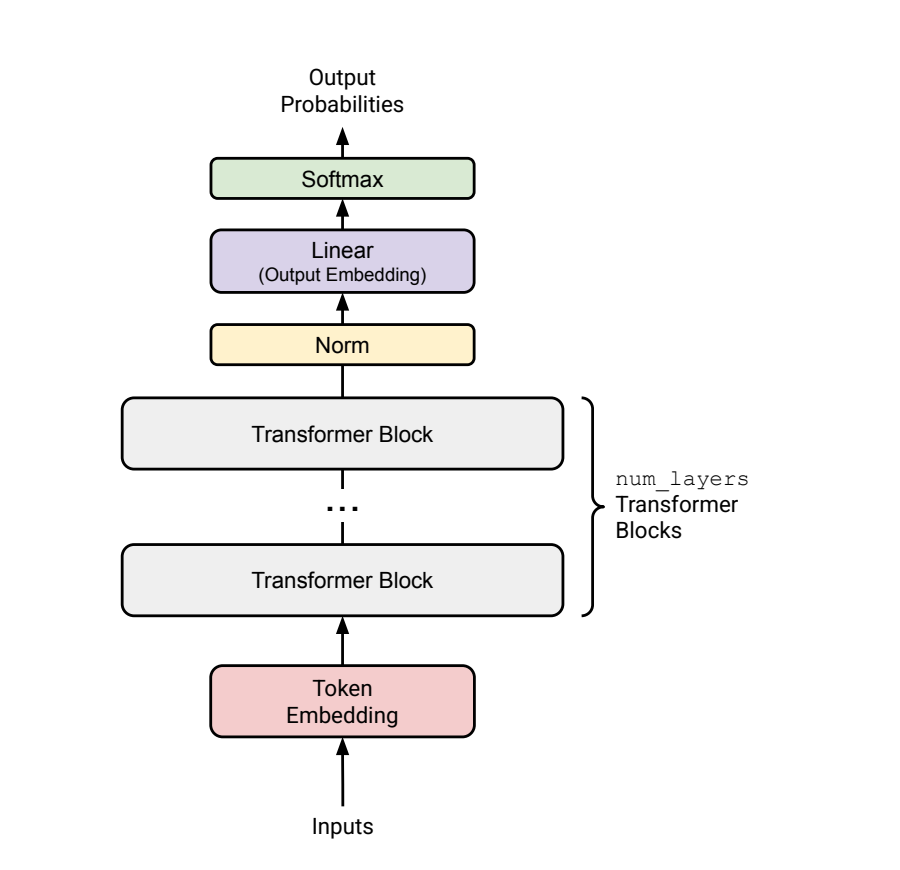
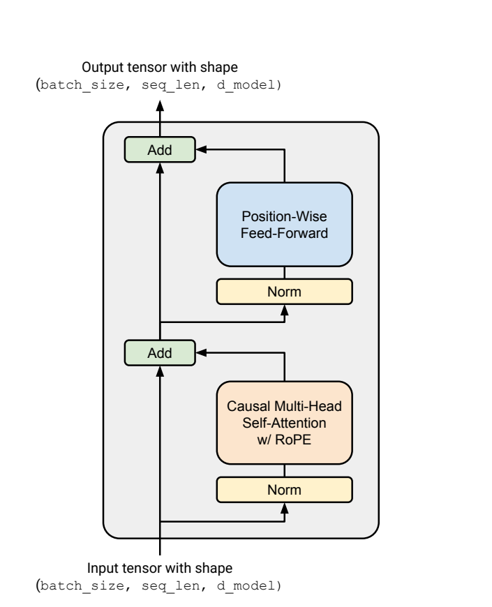
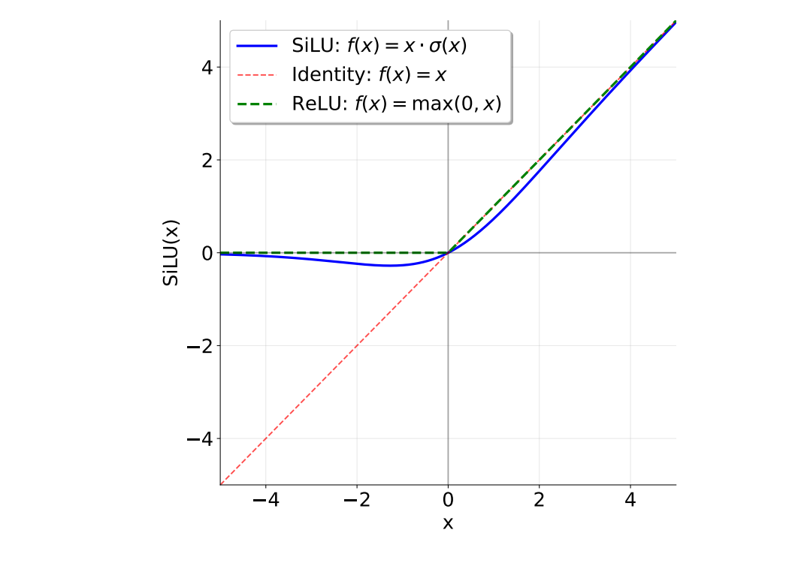

# CS336 作业 1（基础篇）：构建 Transformer 语言模型

版本 1.0.6  
CS336 课程组  
2025 年春季

# 1 作业概览

在本次作业中，你将从零开始构建训练标准 Transformer 语言模型（LM）所需的全部组件，并训练若干模型。

## 你将实现的内容

1. 字节对编码（BPE）分词器（§ 2）
2. Transformer 语言模型（LM）（§ 3）
3. 交叉熵损失函数与 AdamW 优化器（§ 4）
4. 支持序列化与加载模型和优化器状态的训练循环（§ 5）

## 你将运行的内容

1. 在 TinyStories 数据集上训练一个 BPE 分词器。
2. 在该数据集上运行你训练好的分词器，将其转换为整数 ID 序列。
3. 在 TinyStories 数据集上训练一个 Transformer LM。
4. 使用训练好的 Transformer LM 生成样本并评估困惑度。
5. 在 OpenWebText 上训练模型，并将你达到的困惑度提交到排行榜。

## 你可以使用的内容

我们期望你从零开始实现这些组件。特别地，除以下内容外，你不得使用 `torch.nn`、`torch.nn.functional` 或 `torch.optim` 中的任何定义：

- `torch.nn.Parameter`
- `torch.nn` 中的容器类（例如 `Module`、`ModuleList`、`Sequential` 等）[^1]
- `torch.optim.Optimizer` 基类

你可以使用任何其他 PyTorch 定义。如果你想使用某个函数或类，但不确定是否被允许，欢迎在 Slack 上提问。拿不准时，可以考虑：使用它是否违背了本作业“从零实现”的精神。

[^1]: 完整列表见 <https://pytorch.org/docs/stable/nn.html#containers>。

## 关于 AI 工具的声明

允许向 ChatGPT 等大语言模型提问底层编程问题，或关于语言模型的高层概念问题，但禁止直接使用它来完成题目本身。

我们强烈建议你在完成作业时关闭 IDE 中的 AI 自动补全功能（例如 Cursor Tab、GitHub Copilot）。不过，非 AI 自动补全功能，例如函数名自动补全，完全可以使用。根据我们的经验，AI 自动补全会让你更难深入理解作业内容。

## 代码内容说明

本次作业的全部代码以及本文档都可在 GitHub 上获取：

`github.com/stanford-cs336/assignment1-basics`

请先 `git clone` 该仓库。如果后续有更新，我们会通知你，以便你通过 `git pull` 获取最新版本。

1. `cs336_basics/*`：这是你编写代码的地方。这里面没有现成代码，你可以完全从零开始自由实现。
2. `adapters.py`：这里列出了你的代码必须具备的一组功能。对于每一项功能（例如 scaled dot product attention），只需通过调用你自己的代码来补全其实现（例如 `run_scaled_dot_product_attention`）。注意：你对 `adapters.py` 的修改不应包含任何实质性逻辑；它只是胶水代码。
3. `test_*.py`：这里包含你必须通过的全部测试（例如 `test_scaled_dot_product_attention`），这些测试会调用 `adapters.py` 中定义的 hook。不要修改测试文件。

## 如何提交

你需要向 Gradescope 提交以下文件：

- `writeup.pdf`：回答所有书面问题。请将你的回答排版整理好。
- `code.zip`：包含你编写的全部代码。

若要提交到排行榜，请向以下仓库提交 PR：

`github.com/stanford-cs336/assignment1-basics-leaderboard`

详细提交说明见排行榜仓库中的 `README.md`。

## 数据集获取位置

本次作业将使用两个预处理好的数据集：TinyStories [Eldan and Li, 2023] 和 OpenWebText [Gokaslan et al., 2019]。这两个数据集都是单个的大型纯文本文件。如果你是在课程环境中完成本作业，可以在任意非 head node 机器的 `/data` 目录下找到这些文件。

如果你是在本地跟做，可以使用 `README.md` 中的命令下载这些文件。

> **低资源 / 缩放降配提示：总述**
>
> 在本课程的作业讲义中，我们会持续提供一些建议，帮助你在 GPU 资源较少甚至没有 GPU 的情况下完成作业。例如，我们有时会建议缩小数据集规模或模型规模，或者解释如何在 MacOS 集成 GPU 或 CPU 上运行训练代码。
>
> 你会在蓝色提示框中看到这些“低资源提示”（就像这个框一样）。即使你是 Stanford 的注册学生、可以使用课程机器，这些提示也可能帮助你更快迭代、节省时间，因此我们建议你阅读它们。

> **低资源 / 缩放降配提示：在 Apple Silicon 或 CPU 上完成作业 1**
>
> 使用课程组参考实现时，我们可以在配备 36 GB RAM 的 Apple M3 Max 芯片上，借助 Metal GPU（MPS）在 5 分钟内完成 LM 训练，并生成相当流畅的文本；如果使用 CPU，则大约需要 30 分钟。
>
> 如果这些术语你不太熟悉，也不用担心。你只需要知道：如果你的笔记本比较新，并且你的实现正确且高效，那么你将能够训练出一个小型 LM，它可以生成简单的儿童故事，并具有不错的流畅度。
>
> 在后文中，我们会解释如果你使用的是 CPU 或 MPS，需要做哪些改动。

# 2 字节对编码（BPE）分词器

在本次作业的第一部分中，我们将训练并实现一个字节级的字节对编码（Byte-Pair Encoding, BPE）分词器 [Sennrich et al., 2016; Wang et al., 2019]。具体来说，我们会把任意的 Unicode 字符串表示为一个字节序列，并在这个字节序列上训练 BPE 分词器。之后，我们会使用这个分词器将文本（字符串）编码为 token（整数序列），以用于语言模型训练。

## 2.1 Unicode 标准

Unicode 是一种文本编码标准，它将字符映射为整数码点（code point）。截至 Unicode 16.0（发布于 2024 年 9 月），该标准在 168 种书写系统中定义了 154,998 个字符。例如，字符 `"s"` 的码点是 115（通常记作 `U+0073`，其中 `U+` 是惯用前缀，`0073` 是 115 的十六进制表示），而字符 `"୤"` 的码点是 29275。在 Python 中，你可以使用 `ord()` 函数将单个 Unicode 字符转换为其整数表示。`chr()` 函数则会将一个整数 Unicode 码点转换为对应字符组成的字符串。

```python
>>> ord("୤")
29275
>>> chr(29275)
'୤'
```

### 题目（`unicode1`）：理解 Unicode（1 分）

(a) `chr(0)` 返回的是什么 Unicode 字符？

`Deliverable`：一句话回答。

(b) 这个字符的字符串表示（`__repr__()`）与其打印表示有什么不同？

`Deliverable`：一句话回答。

(c) 当这个字符出现在文本中时会发生什么？你可以在 Python 解释器中试试下面这些语句，看看结果是否符合你的预期：

```python
>>> chr(0)
>>> print(chr(0))
>>> "this is a test" + chr(0) + "string"
>>> print("this is a test" + chr(0) + "string")
```

`Deliverable`：一句话回答。

## 2.2 Unicode 编码

尽管 Unicode 标准定义了从字符到码点（整数）的映射，但直接在 Unicode 码点上训练分词器并不现实，因为词表会大得难以处理（大约 15 万项），而且会非常稀疏（因为很多字符都相当罕见）。因此，我们将使用 Unicode 编码（encoding），它会把一个 Unicode 字符转换为一个字节序列。Unicode 标准本身定义了三种编码：UTF-8、UTF-16 和 UTF-32，其中 UTF-8 是互联网中的主流编码（超过 98% 的网页都使用它）。

要将 Unicode 字符串编码为 UTF-8，我们可以使用 Python 中的 `encode()` 函数。要访问 Python `bytes` 对象底层的字节值，我们可以对其进行迭代（例如调用 `list()`）。最后，我们可以使用 `decode()` 函数将 UTF-8 字节串解码回 Unicode 字符串。

```python
>>> test_string = "hello! こんにちは!"
>>> utf8_encoded = test_string.encode("utf-8")
>>> print(utf8_encoded)
b'hello! \xe3\x81\x93\xe3\x82\x93\xe3\x81\xab\xe3\x81\xa1\xe3\x81\xaf!'
>>> print(type(utf8_encoded))
<class 'bytes'>
>>> # 获取编码后字符串的字节值（0 到 255 的整数）。
>>> list(utf8_encoded)
[104, 101, 108, 108, 111, 33, 32, 227, 129, 147, 227, 130, 147, 227, 129, 171, 227, 129, 161, 227, 129, 175, 33]
>>> # 一个字节不一定对应一个 Unicode 字符！
>>> print(len(test_string))
13
>>> print(len(utf8_encoded))
23
>>> print(utf8_encoded.decode("utf-8"))
hello! こんにちは!
```

通过把 Unicode 码点转换成字节序列（例如通过 UTF-8 编码），本质上我们是把一个码点序列（取值范围为 0 到 154,997 的整数）转换成一个字节值序列（取值范围为 0 到 255 的整数）。长度为 256 的字节词表要容易处理得多。使用字节级分词时，我们不需要担心词表外（out-of-vocabulary）token，因为任何输入文本都一定可以表示为一个由 0 到 255 之间整数组成的序列。

### 题目（`unicode2`）：Unicode 编码（3 分）

(a) 相比基于 UTF-16 或 UTF-32 编码的字节，在 UTF-8 编码的字节上训练分词器有哪些理由更好？你可以对若干输入字符串比较这些编码的输出结果。

`Deliverable`：用一到两句话回答。

(b) 请考虑下面这个错误的函数。它本意是将一个 UTF-8 字节串解码为 Unicode 字符串。为什么这个函数是错的？请给出一个会产生错误结果的输入字节串示例。

```python
def decode_utf8_bytes_to_str_wrong(bytestring: bytes):
    return "".join([bytes([b]).decode("utf-8") for b in bytestring])

>>> decode_utf8_bytes_to_str_wrong("hello".encode("utf-8"))
'hello'
```

`Deliverable`：给出一个会让 `decode_utf8_bytes_to_str_wrong` 产生错误输出的输入字节串示例，并用一句话解释该函数为什么不正确。

(c) 给出一个无法解码为任何 Unicode 字符的两个字节的序列。

`Deliverable`：给出一个示例，并用一句话解释。

## 2.3 子词分词

虽然字节级分词可以缓解词级分词器面临的词表外问题，但把文本分成字节会导致输入序列极长。这会拖慢模型训练，因为一个包含 10 个单词的句子，在词级语言模型中可能只有 10 个 token，但在字符级模型中可能会有 50 个甚至更多 token（取决于单词长度）。处理这些更长的序列需要模型在每一步做更多计算。此外，在字节序列上做语言建模也更困难，因为更长的输入序列会在数据中形成更长程的依赖关系。

子词分词处于词级分词器和字节级分词器之间。注意，字节级分词器的词表大小为 256（字节值范围是 0 到 255）。子词分词器会用更大的词表规模换取对输入字节序列更好的压缩。例如，如果字节序列 `b'the'` 在我们的原始训练文本中经常出现，那么将它作为一个词表项，就可以把这个原本长度为 3 的 token 序列压缩成单个 token。

我们应如何选择要加入词表的这些子词单元呢？Sennrich et al. [2016] 提出了使用字节对编码（BPE；Gage, 1994），这是一种压缩算法：它会迭代地将出现频率最高的一对字节替换（“合并”）为一个新的、此前未使用的索引。注意，这个算法向词表中添加子词 token 的目标，是尽可能压缩输入序列；如果某个词在输入文本中出现得足够频繁，它最终就会被表示为一个单独的子词单元。

通过 BPE 构造词表的子词分词器通常被称为 BPE 分词器。在本次作业中，我们将实现一个字节级 BPE 分词器，其中词表项要么是单个字节，要么是多个字节合并后的序列。这样我们可以同时兼顾词表外处理能力与可管理的输入序列长度。构造 BPE 分词器词表的过程被称为“训练”BPE 分词器。

## 2.4 BPE 分词器训练

BPE 分词器的训练过程由三个主要步骤组成。

**词表初始化。** 分词器词表是从字节串 token 到整数 ID 的一一映射。由于我们训练的是字节级 BPE 分词器，初始词表就是全部字节的集合。因为一共有 256 个可能的字节值，所以初始词表大小为 256。

**预分词。** 一旦有了词表，原则上你可以统计文本中相邻出现的字节对频率，并从最高频字节对开始合并。然而，这样做的计算代价很高，因为每做一次合并，都得重新完整遍历一遍语料。此外，直接在整个语料上跨位置合并字节，可能会产生仅在标点上不同的 token（例如 `dog!` 与 `dog.`）。这些 token 会获得完全不同的 token ID，尽管它们在语义上很可能非常接近（因为只差了标点）。

为避免这种情况，我们会先对语料做预分词。你可以把它理解为一种对语料进行的粗粒度分词，它能帮助我们统计字符对的出现频率。例如，单词 `'text'` 可能作为一个预分词单元出现了 10 次。在这种情况下，当我们统计字符 `'t'` 和 `'e'` 相邻出现的次数时，就会看到单词 `'text'` 中这两个字符是相邻的，于是可以直接把它们的计数加 10，而不必再去遍历整个语料。由于我们训练的是字节级 BPE 模型，每个预分词单元都会表示为 UTF-8 字节序列。

Sennrich et al. [2016] 的原始 BPE 实现仅通过按空白符切分来进行预分词（即 `s.split(" ")`）。相比之下，我们将使用一个基于正则表达式的预分词器（GPT-2 使用；Radford et al., 2019），其模式来自：

`github.com/openai/tiktoken/pull/234/files`

```python
>>> PAT = r"""'(?:[sdmt]|ll|ve|re)| ?\p{L}+| ?\p{N}+| ?[^\s\p{L}\p{N}]+|\s+(?!\S)|\s+"""
```

为了更好理解它的行为，你可能会想在交互环境中对一些文本做切分：

```python
>>> # 需要安装 `regex` 包
>>> import regex as re
>>> re.findall(PAT, "some text that i'll pre-tokenize")
['some', ' text', ' that', ' i', "'ll", ' pre', '-', 'tokenize']
```

不过，在你的代码里实现时，应使用 `re.finditer`，以避免在构造“预分词单元到其计数”这一映射的过程中，把所有预分词结果全部存入内存。

**计算 BPE 合并。** 现在我们已经将输入文本转换为预分词单元，并把每个预分词单元表示为 UTF-8 字节序列，就可以计算 BPE 合并（也就是训练 BPE 分词器）了。高层来看，BPE 算法会迭代地统计每一对字节出现的次数，找出频率最高的那一对（`"A"`、`"B"`）。随后，将这个最高频字节对（`"A"`、`"B"`）的每一次出现都合并，即替换为一个新 token `"AB"`。这个新合并 token 会加入词表；因此，BPE 训练结束后的最终词表大小，等于初始词表大小（在这里为 256）加上训练中执行的 BPE 合并操作次数。为了在 BPE 训练中提高效率，我们不考虑跨预分词单元边界的字节对。[^2] 在计算合并时，如果多个字节对频率并列最高，应通过优先选择按字典序更大的那一对来确定性地打破平局。例如，如果字节对 `("A", "B")`、`("A", "C")`、`("B", "ZZ")` 和 `("BA", "A")` 的频率都并列最高，那么我们会合并 `("BA", "A")`：

```python
>>> max([("A", "B"), ("A", "C"), ("B", "ZZ"), ("BA", "A")])
('BA', 'A')
```

**特殊 token。** 在实际中，一些字符串（例如 `<|endoftext|>`）常被用来编码元数据（例如文档边界）。在编码文本时，我们通常希望把某些字符串作为“特殊 token”处理，使其永远不会被拆分成多个 token（也就是说，它总是会被保留为单个 token）。例如，序列结束字符串 `<|endoftext|>` 应始终保持为单个 token（即单个整数 ID），这样我们才知道何时该停止从语言模型继续生成。这些特殊 token 必须加入词表，以便它们拥有固定的 token ID。

Sennrich et al. [2016] 的算法 1 给出了一个低效的 BPE 分词器训练实现（本质上就是遵循上面概述的步骤）。作为第一个练习，你不妨先实现并测试这个函数，以检验你对整个过程的理解。

[^2]: 注意，原始 BPE 公式 [Sennrich et al., 2016] 会加入一个词尾标记（end-of-word token）。在训练字节级 BPE 模型时，我们不加入词尾标记，因为所有字节（包括空白符和标点）都已经包含在模型词表中。由于我们显式表示空格和标点，学习到的 BPE 合并会自然地反映这些词边界。

### 示例（`bpe_example`）：BPE 训练示例

下面给出一个来自 Sennrich et al. [2016] 的风格化示例。设语料由以下文本组成：

```text
low low low low low
lower lower widest widest widest
newest newest newest newest newest newest
```

并且词表中有一个特殊 token `<|endoftext|>`。

**词表。** 我们使用特殊 token `<|endoftext|>` 以及 256 个字节值来初始化词表。

**预分词。** 为了简化示例并聚焦于合并过程，我们在本例中假设预分词只是简单地按空白符切分。完成预分词与计数后，我们得到如下频率表：

```text
{low: 5, lower: 2, widest: 3, newest: 6}
```

将其表示成 `dict[tuple[bytes], int]` 的形式会更方便，例如 `{(l, o, w): 5, ...}`。注意，即使是单个字节，在 Python 中也是一个 `bytes` 对象。Python 里并不存在专门表示单个字节的 `byte` 类型，就像也不存在专门表示单个字符的 `char` 类型一样。

**合并。** 首先，我们查看所有相邻字节对，并累加它们所在单词的频率，得到：

```text
{lo: 7, ow: 7, we: 8, er: 2, wi: 3, id: 3, de: 3, es: 9, st: 9, ne: 6, ew: 6}
```

字节对 `('es')` 和 `('st')` 频率并列，因此我们选择字典序更大的 `('st')`。于是，我们会合并这些预分词单元，得到：

```text
{(l, o, w): 5, (l, o, w, e, r): 2, (w, i, d, e, st): 3, (n, e, w, e, st): 6}
```

在第二轮中，我们会发现 `(e, st)` 是最常见的字节对（计数为 9），因此继续合并，得到：

```text
{(l, o, w): 5, (l, o, w, e, r): 2, (w, i, d, est): 3, (n, e, w, est): 6}
```

继续执行下去，最终会得到如下合并序列：

```python
['s t', 'e st', 'o w', 'l ow', 'w est', 'n e', 'ne west', 'w i', 'wi d', 'wid est', 'low e', 'lowe r']
```

如果我们只取前 6 次合并，那么就有：

```python
['s t', 'e st', 'o w', 'l ow', 'w est', 'n e']
```

此时词表元素为：

```text
[<|endoftext|>, [...256 BYTE CHARS], st, est, ow, low, west, ne]
```

有了这个词表和这组 merges，单词 `newest` 会被分词为 `[ne, west]`。

## 2.5 BPE 分词器训练实验

下面让我们在 TinyStories 数据集上训练一个字节级 BPE 分词器。关于如何找到 / 下载该数据集的说明见第 1 节。在开始之前，我们建议你先看一看 TinyStories 数据集，感受一下数据的大致内容。

**并行化预分词。** 你会发现一个主要瓶颈是预分词步骤。你可以使用内置库 `multiprocessing` 对代码进行并行化，从而加速预分词。具体来说，我们建议在并行实现预分词时，对语料进行分块，并确保每个块的边界都位于某个特殊 token 的开头。你可以逐字照搬下面链接中的 starter code 来获取这些块边界，然后将工作分发给多个进程：

<https://github.com/stanford-cs336/assignment1-basics/blob/main/cs336_basics/pretokenization_example.py>

这种分块方式始终是合法的，因为我们本来就不希望跨文档边界进行合并。对本次作业来说，你总可以按这种方式切分。无需担心这样一种边界情况：收到一个非常大的语料，但其中根本不包含 `<|endoftext|>`。

**在预分词前移除特殊 token。** 在使用正则模式（通过 `re.finditer`）执行预分词之前，你应当先从语料（若使用并行实现，则是从每个块）中剥离出所有特殊 token。务必按这些特殊 token 进行切分，这样就不会跨它们所分隔的文本边界发生合并。例如，如果你的语料（或某个块）是 `[Doc 1]<|endoftext|>[Doc 2]`，你应当按特殊 token `<|endoftext|>` 切开，并分别对 `[Doc 1]` 和 `[Doc 2]` 进行预分词，这样就不会跨文档边界发生合并。可以使用 `re.split` 并以 `"|".join(special_tokens)` 作为分隔符来实现（同时要谨慎使用 `re.escape`，因为特殊 token 中可能出现 `|`）。测试 `test_train_bpe_special_tokens` 会检查这一点。

**优化合并步骤。** 上述风格化示例中的朴素 BPE 训练实现之所以慢，是因为每次合并时，它都要遍历所有字节对以找出频率最高者。然而，在每次合并后，真正会改变计数的只有那些与被合并字节对重叠的字节对。因此，可以通过为所有字节对的计数建立索引并进行增量更新，来提高 BPE 训练速度，而不是每次都显式遍历每个字节对重新统计频率。使用这种缓存过程可以显著提速；不过需要注意，BPE 训练中的合并部分在 Python 中是无法并行化的。

> **低资源 / 缩放降配提示：性能分析**
>
> 你应当使用 `cProfile` 或 `scalene` 之类的性能分析工具来定位实现中的瓶颈，并重点优化这些部分。

> **低资源 / 缩放降配提示：“降配”**
>
> 与其一开始就直接在完整 TinyStories 数据集上训练分词器，我们建议你先在数据的一个小子集上训练，也就是一个“调试数据集（debug dataset）”。例如，你可以先在 TinyStories 的验证集上训练分词器；该集合只有 2.2 万篇文档，而不是 212 万篇。这体现了一种通用的开发加速策略：只要可能，就进行降配，例如使用更小的数据集、更小的模型规模等。调试数据集的大小或超参数配置需要仔细权衡：你希望调试集足够大，以保留与完整配置相同的瓶颈（这样你做出的优化才能泛化），但又不能大到运行时间过长。

### 题目（`train_bpe`）：BPE 分词器训练（15 分）

`Deliverable`：编写一个函数，该函数接收输入文本文件路径并训练一个（字节级）BPE 分词器。你的 BPE 训练函数至少应处理以下输入参数：

`input_path: str`：包含 BPE 分词器训练数据的文本文件路径。  
`vocab_size: int`：一个正整数，用于定义最终词表大小上限（包括初始字节词表、合并产生的词表项以及任何特殊 token）。  
`special_tokens: list[str]`：一个要加入词表的字符串列表。这些特殊 token 除此之外不会影响 BPE 训练过程。

你的 BPE 训练函数应返回得到的词表和 merges：

`vocab: dict[int, bytes]`：分词器词表，即从 `int`（词表中的 token ID）到 `bytes`（token 的字节串）的映射。  
`merges: list[tuple[bytes, bytes]]`：训练过程中产生的 BPE merges 列表。列表中的每一项都是一个 `tuple[bytes(<token1>), bytes(<token2>)]`，表示 `<token1>` 与 `<token2>` 被合并。这个列表应按创建顺序排列。

要使用我们提供的测试来检查你的 BPE 训练函数，你首先需要实现 [adapters.run_train_bpe](C:\Users\YOUNG\Desktop\workplace\CS336\study\A-1\tests\adapters.py)。然后运行 `uv run pytest tests/test_train_bpe.py`。

你的实现应当能够通过所有测试。作为可选项（但这可能会投入大量时间），你也可以使用某种系统语言来实现训练方法中的关键部分，例如 C++（可考虑 `cppyy`）或 Rust（使用 `PyO3`）。如果你这样做，请注意哪些操作会发生拷贝、哪些操作可以直接读取 Python 内存，并确保你留下构建说明，或者确保它仅使用 `pyproject.toml` 就能构建。还要注意，GPT-2 使用的正则表达式在大多数正则引擎中支持并不好，而且在即便支持的引擎中通常也太慢。我们确认 Oniguruma 的速度还算合理，并且支持 negative lookahead；不过 Python 中的 `regex` 包即使相比之下，也还要更快一些。

### 题目（`train_bpe_tinystories`）：在 TinyStories 上训练 BPE（2 分）

(a) 在 TinyStories 数据集上训练一个字节级 BPE 分词器，最大词表大小设为 10,000。务必将 TinyStories 的 `<|endoftext|>` 特殊 token 加入词表。把得到的词表和 merges 序列化保存到磁盘，便于后续检查。训练耗时多少小时、占用多少内存？词表中最长的 token 是什么？这合理吗？

`Resource requirements`：不超过 30 分钟（无 GPU），不超过 30 GB RAM

`Hint`：如果在预分词阶段使用 `multiprocessing`，并利用以下两点事实，你应当能够把 BPE 训练时间压到 2 分钟以内：

(a) `<|endoftext|>` token 在数据文件中用于分隔文档。  
(b) `<|endoftext|>` token 会在应用 BPE merges 之前作为特殊情况单独处理。

`Deliverable`：用一到两句话回答。

(b) 对你的代码做性能分析。分词器训练过程中的哪个部分最耗时？

`Deliverable`：用一到两句话回答。

接下来，我们将尝试在 OpenWebText 数据集上训练一个字节级 BPE 分词器。和之前一样，我们建议你先看看这个数据集，以更好理解它的内容。

### 题目（`train_bpe_expts_owt`）：在 OpenWebText 上训练 BPE（2 分）

(a) 在 OpenWebText 数据集上训练一个字节级 BPE 分词器，最大词表大小设为 32,000。把得到的词表和 merges 序列化保存到磁盘，便于后续检查。词表中最长的 token 是什么？这合理吗？

`Resource requirements`：不超过 12 小时（无 GPU），不超过 100 GB RAM

`Deliverable`：用一到两句话回答。

(b) 对比你在 TinyStories 和 OpenWebText 上训练得到的分词器，并说明异同。

`Deliverable`：用一到两句话回答。

## 2.6 BPE 分词器：编码与解码

在作业前一部分中，我们实现了一个在输入文本上训练 BPE 分词器的函数，以得到一个分词器词表和一组 BPE merges。现在，我们将实现一个 BPE 分词器，它加载给定的词表和 merges 列表，并使用它们在文本与 token ID 之间进行编码和解码。

### 2.6.1 编码文本

用 BPE 对文本进行编码的过程，与我们训练 BPE 词表时的流程是对应的。主要分为以下几步。

**第 1 步：预分词。** 首先，我们像训练 BPE 时那样，对序列进行预分词，并将每个预分词单元表示为 UTF-8 字节序列。接下来我们会在每个预分词单元内部将这些字节合并成词表元素，并且每个预分词单元都独立处理（不会跨预分词边界进行合并）。

**第 2 步：应用 merges。** 然后，我们取训练 BPE 时生成的词表元素合并序列，并严格按照其创建顺序将这些 merges 应用于预分词单元。

### 示例（`bpe_encoding`）：BPE 编码示例

例如，假设输入字符串是 `'the cat ate'`，词表为：

```python
{0: b' ', 1: b'a', 2: b'c', 3: b'e', 4: b'h', 5: b't', 6: b'th', 7: b' c', 8: b' a', 9: b'the', 10: b' at'}
```

而学到的 merges 为：

```python
[(b't', b'h'), (b' ', b'c'), (b' ', b'a'), (b'th', b'e'), (b' a', b't')]
```

首先，预分词器会把这个字符串拆成 `['the', ' cat', ' ate']`。然后，我们对每个预分词单元依次应用 BPE merges。

第一个预分词单元 `'the'` 初始表示为 `[b't', b'h', b'e']`。查看 merges 列表后，我们发现第一个可应用的 merge 是 `(b't', b'h')`，于是将该预分词单元变换为 `[b'th', b'e']`。然后，我们再回到 merges 列表中，发现下一个可应用的 merge 是 `(b'th', b'e')`，于是它进一步变成 `[b'the']`。最后，再次查看 merges 列表，我们会发现没有更多 merge 可以应用于这个字符串了（因为整个预分词单元已经合并成一个 token），所以合并结束。其对应的整数序列是 `[9]`。

对剩余的预分词单元重复这一过程，可以看到预分词单元 `' cat'` 在应用 BPE merges 后表示为 `[b' c', b'a', b't']`，对应整数序列 `[7, 1, 5]`。最后一个预分词单元 `' ate'` 在应用 BPE merges 后为 `[b' at', b'e']`，对应整数序列 `[10, 3]`。因此，整个输入字符串编码后的最终结果为 `[9, 7, 1, 5, 10, 3]`。

**特殊 token。** 你的分词器在编码文本时，应当能够正确处理用户定义的特殊 token（它们在构造分词器时提供）。

**内存方面的考虑。** 假设我们想对一个大到无法完整放入内存的文本文件进行分词。为了高效地对这类大文件（或任何其他数据流）分词，我们需要把它拆成可管理的块，并逐块处理，这样内存复杂度就是常数级，而不是随着文本大小线性增长。在这样做时，我们必须确保 token 不会跨越块边界，否则得到的分词结果就会与“把整个序列一次性读入内存后再分词”的朴素方法不同。

### 2.6.2 解码文本

要把一个整数 token ID 序列解码回原始文本，我们只需查找每个 ID 在词表中对应的条目（一个字节序列），把它们拼接起来，然后再将这些字节解码为 Unicode 字符串。需要注意的是，输入的 ID 不保证一定能映射为合法的 Unicode 字符串（因为用户可能输入任意整数 ID 序列）。如果输入的 token ID 无法生成有效的 Unicode 字符串，你应当用官方的 Unicode 替换字符 `U+FFFD` 来替换损坏的字节。[^3] `bytes.decode` 的 `errors` 参数控制 Unicode 解码错误的处理方式，使用 `errors='replace'` 会自动把损坏的数据替换为该替换标记。

### 题目（`tokenizer`）：实现分词器（15 分）

`Deliverable`：实现一个 `Tokenizer` 类，该类给定词表和 merges 列表后，能够把文本编码成整数 ID，并把整数 ID 解码为文本。你的分词器还应支持用户提供的特殊 token（如果它们尚未在词表中，则追加到词表中）。我们建议采用以下接口：

```python
def __init__(self, vocab, merges, special_tokens=None)
```

从给定词表、merges 列表以及（可选的）特殊 token 列表构造一个分词器。该函数应接受以下参数：

`vocab: dict[int, bytes]`  
`merges: list[tuple[bytes, bytes]]`  
`special_tokens: list[str] | None = None`

```python
def from_files(cls, vocab_filepath, merges_filepath, special_tokens=None)
```

类方法：从序列化保存的词表和 merges 列表中构造并返回一个 `Tokenizer`（格式与你的 BPE 训练代码输出的格式相同），并可选地接收一组特殊 token。该方法应额外接受以下参数：

`vocab_filepath: str`  
`merges_filepath: str`  
`special_tokens: list[str] | None = None`

```python
def encode(self, text: str) -> list[int]
```

将输入文本编码为 token ID 序列。

```python
def encode_iterable(self, iterable: Iterable[str]) -> Iterator[int]
```

给定一个字符串可迭代对象（例如 Python 文件句柄），返回一个惰性生成 token ID 的生成器。这一接口是实现对无法完整读入内存的大文件进行内存高效分词所必需的。

```python
def decode(self, ids: list[int]) -> str
```

将 token ID 序列解码为文本。

要使用我们提供的测试来检查你的 `Tokenizer`，你首先需要实现 [adapters.get_tokenizer](C:\Users\YOUNG\Desktop\workplace\CS336\study\A-1\tests\adapters.py)。然后运行 `uv run pytest tests/test_tokenizer.py`。你的实现应当能够通过所有测试。

[^3]: 更多关于 Unicode 替换字符的信息见 <https://en.wikipedia.org/wiki/Specials_(Unicode_block)#Replacement_character>。

## 2.7 实验

### 题目（`tokenizer_experiments`）：分词器实验（4 分）

(a) 从 TinyStories 和 OpenWebText 中各抽样 10 篇文档。使用你先前训练好的 TinyStories 与 OpenWebText 分词器（词表大小分别为 10K 和 32K），将这些抽样文档编码为整数 ID。每个分词器的压缩率（bytes/token）是多少？

`Deliverable`：用一到两句话回答。

(b) 如果你用 TinyStories 分词器去分词你的 OpenWebText 样本，会发生什么？比较压缩率，并 / 或定性描述发生的情况。

`Deliverable`：用一到两句话回答。

(c) 估计你的分词器吞吐量（例如，以 bytes/second 为单位）。对整个 Pile 数据集（825GB 文本）完成分词需要多长时间？

`Deliverable`：用一到两句话回答。

(d) 使用你的 TinyStories 和 OpenWebText 分词器，把各自的训练集和开发集编码成整数 token ID 序列。我们稍后会用它们来训练语言模型。我们建议把 token ID 序列序列化为数据类型为 `uint16` 的 NumPy 数组。为什么 `uint16` 是合适的选择？

`Deliverable`：用一到两句话回答。

# 3 Transformer 语言模型架构



*图 1：我们的 Transformer 语言模型概览。*



*图 2：一个 pre-norm Transformer block。*

语言模型以一个批量化的整数 token ID 序列作为输入（即形状为 `(batch_size, sequence_length)` 的 `torch.Tensor`），并返回一个关于词表的（批量化）归一化概率分布（即形状为 `(batch_size, sequence_length, vocab_size)` 的 PyTorch Tensor），其中每个输入 token 对应的预测分布表示“下一个词”的概率。训练语言模型时，我们用这些 next-word predictions 来计算真实下一个词与预测下一个词之间的交叉熵损失。在推理阶段从语言模型生成文本时，我们取最后一个时间步（即序列中的最后一个位置）的 next-word 预测分布来生成下一个 token（例如取最高概率 token、从分布中采样等），将该生成 token 追加到输入序列中，然后重复这一过程。

在本节中，你将从零开始构建这个 Transformer 语言模型。我们会先给出模型的高层描述，再逐步详细说明各个组件。

## 3.1 Transformer LM

给定一个 token ID 序列，Transformer 语言模型会先使用输入嵌入（input embedding）将 token ID 转换为稠密向量，然后将这些嵌入后的 token 送入 `num_layers` 个 Transformer block 中，最后应用一个可学习的线性投影（“输出嵌入”或 “LM head”）来产生预测下一个 token 的 logits。其示意图见图 1。

### 3.1.1 Token Embeddings

在第一步中，Transformer 会将（批量化的）token ID 序列嵌入为一个向量序列，其中编码了 token 的身份信息（见图 1 中的红色模块）。

更具体地说，给定一个 token ID 序列，Transformer 语言模型使用 token embedding 层产生一个向量序列。每个 embedding 层接收一个形状为 `(batch_size, sequence_length)` 的整数张量，并输出一个形状为 `(batch_size, sequence_length, d_model)` 的向量序列。

### 3.1.2 Pre-norm Transformer Block

在嵌入之后，激活会经过若干结构相同的神经网络层处理。一个标准的 decoder-only Transformer 语言模型由 `num_layers` 个相同层组成（通常称为 Transformer “blocks”）。每个 Transformer block 接收一个形状为 `(batch_size, sequence_length, d_model)` 的输入，并返回一个形状同样为 `(batch_size, sequence_length, d_model)` 的输出。每个 block 都会在序列维度上聚合信息（通过 self-attention），并进行非线性变换（通过前馈层）。

## 3.2 输出归一化与输出嵌入

经过 `num_layers` 个 Transformer block 后，我们将取最终激活，并将其转换为词表上的一个分布。

我们将实现 “pre-norm” Transformer block（详见 § 3.5），这还要求在最后一个 Transformer block 之后额外使用一次层归一化（下文详细说明），以确保其输出被正确缩放。

在归一化之后，我们将使用一个标准的可学习线性变换，将 Transformer blocks 的输出转换为预测下一个 token 的 logits（例如可参考 Radford et al. [2018] 的公式 2）。

## 3.3 说明：Batching、`einsum` 与高效计算

在整个 Transformer 中，我们会对许多类似 batch 的输入反复应用相同的计算。以下是几个例子：

- `batch` 中的元素：我们对每个 batch 元素应用相同的 Transformer 前向运算。
- 序列长度维：像 RMSNorm 和 feed-forward 这样的 “position-wise” 运算，会对序列中的每个位置执行完全相同的操作。
- 注意力头：在 multi-headed attention 中，attention 运算会跨多个 attention head 进行批处理。

我们需要一种既符合人体工学、又能充分利用 GPU、同时还容易阅读和理解的方式来执行这些运算。许多 PyTorch 运算都可以接收额外的“类 batch”前置维度，并在这些维度上高效地重复 / 广播该运算。

例如，假设我们在做一个按位置进行的批量运算。我们有一个形状为 `(batch_size, sequence_length, d_model)` 的 “数据张量” `D`，并希望将其与一个形状为 `(d_model, d_model)` 的矩阵 `A` 做批量向量-矩阵乘法。在这种情况下，`D @ A` 会执行一个 PyTorch 中高效的 batch matrix multiply，其中 `(batch_size, sequence_length)` 这两个维度会被当作 batch 维度。

正因为如此，最好假设你的函数可能会收到额外的类 batch 维度，并将这些维度始终放在 PyTorch shape 的前面。为了让张量能够以这种方式被 batch 化，有时你需要用许多 `view`、`reshape` 与 `transpose` 操作来重排张量形状。这会比较繁琐，而且代码很快就会变得难以读懂，你也不容易一眼看出张量的形状到底是什么。

一种更符合人体工学的替代方案，是使用 `torch.einsum` 的 `einsum` 记号，或者更进一步，使用框架无关的库，比如 `einops` 或 `einx`。其中两个关键操作是：

- `einsum`：可以执行任意维度的张量收缩（tensor contraction）。
- `rearrange`：可以对任意维度做重排、拼接和切分。

事实证明，机器学习中的几乎所有运算，都可以看成“维度重排 + 张量收缩 + 偶尔再加一个（通常是逐点的）非线性函数”的组合。这意味着，使用 `einsum` 记号时，你的大量代码都会更可读，也更灵活。

我们强烈建议你在这门课中学习并使用 `einsum` 记号。如果你此前没有接触过 `einsum` 记号，建议使用 `einops`（文档见原文链接）；如果你已经熟悉 `einops`，则可以进一步学习更一般化的 `einx`（文档见原文链接）。[^4] 这两个包都已经安装在我们提供的环境中。

这里给出一些 `einsum` 记号的使用示例。它们是对 `einops` 文档的补充，而你应该先阅读官方文档。

### 示例（`einstein_example1`）：使用 `einops.einsum` 进行批量矩阵乘法

```python
import torch
from einops import rearrange, einsum

## 基础实现
Y = D @ A.T
# 很难看出输入和输出的形状，以及它们各自的含义。
# D 和 A 可以是什么形状？其中是否存在意料之外的行为？

## Einsum 自带文档性，而且更稳健
# D A -> Y
Y = einsum(D, A, "batch sequence d_in, d_out d_in -> batch sequence d_out")

## 或者，更通用的批量版本：D 可以有任意前置维度，而 A 的形状保持约束。
Y = einsum(D, A, "... d_in, d_out d_in -> ... d_out")
```

### 示例（`einstein_example2`）：使用 `einops.rearrange` 进行广播运算

我们有一批图像，并且希望对每张图像生成 10 个变暗版本，每个版本对应不同的缩放系数：

```python
images = torch.randn(64, 128, 128, 3)  # (batch, height, width, channel)
dim_by = torch.linspace(start=0.0, end=1.0, steps=10)

## 先重排，再相乘
dim_value = rearrange(dim_by, "dim_value -> 1 dim_value 1 1 1")
images_rearr = rearrange(images, "b height width channel -> b 1 height width channel")
dimmed_images = images_rearr * dim_value

## 或者一步完成：
dimmed_images = einsum(
    images, dim_by,
    "batch height width channel, dim_value -> batch dim_value height width channel"
)
```

### 示例（`einstein_example3`）：使用 `einops.rearrange` 做像素混合

假设我们有一批图像，表示为形状 `(batch, height, width, channel)` 的张量。我们想对图像中的所有像素执行一个线性变换，但这一变换应当对每个通道独立进行。这个线性变换由一个形状为 `(height × width, height × width)` 的矩阵 `B` 表示。

```python
channels_last = torch.randn(64, 32, 32, 3)  # (batch, height, width, channel)
B = torch.randn(32 * 32, 32 * 32)

## 重排图像张量，以便跨所有像素进行混合
channels_last_flat = channels_last.view(
    -1, channels_last.size(1) * channels_last.size(2), channels_last.size(3)
)
channels_first_flat = channels_last_flat.transpose(1, 2)
channels_first_flat_transformed = channels_first_flat @ B.T
channels_last_flat_transformed = channels_first_flat_transformed.transpose(1, 2)
channels_last_transformed = channels_last_flat_transformed.view(*channels_last.shape)
```

使用 `einops` 则可以写成：

```python
height = width = 32

## Rearrange 替代笨重的 torch view + transpose
channels_first = rearrange(
    channels_last,
    "batch height width channel -> batch channel (height width)"
)
channels_first_transformed = einsum(
    channels_first, B,
    "batch channel pixel_in, pixel_out pixel_in -> batch channel pixel_out"
)
channels_last_transformed = rearrange(
    channels_first_transformed,
    "batch channel (height width) -> batch height width channel",
    height=height, width=width
)
```

如果你比较激进，也可以一步完成，使用 `einx.dot`（`einx` 中对应 `einops.einsum` 的等价物）：

```python
height = width = 32
channels_last_transformed = einx.dot(
    "batch row_in col_in channel, (row_out col_out) (row_in col_in)"
    "-> batch row_out col_out channel",
    channels_last, B,
    col_in=width, col_out=width
)
```

上面第一种实现当然可以通过在前后写注释来标明输入输出形状，但这既繁琐，又容易引入 bug。而使用 `einsum` 记号时，文档就是实现本身。

`einsum` 记号可以处理任意输入 batch 维度，而且它还有一个关键优势：自带文档性。使用 `einsum` 记号的代码能更清楚地表明输入与输出张量的相关形状。对于剩余张量，你还可以考虑使用 Tensor 类型标注，例如使用 `jaxtyping` 库（这并非 JAX 专属）。

关于 `einsum` 记号对性能的影响，我们会在作业 2 中讨论更多内容；不过目前你只需要知道，它几乎总是优于替代方案。

### 3.3.1 数学记号与内存布局

许多机器学习论文在记号中使用行向量，这样的表示方式与 NumPy 和 PyTorch 默认采用的 row-major 内存布局更贴合。使用行向量时，线性变换写成：

$$
y = xW^\top \tag{1}
$$

其中，`row-major` 的 $W \in \mathbb{R}^{d_{\text{out}} \times d_{\text{in}}}$，而 $x \in \mathbb{R}^{1 \times d_{\text{in}}}$ 是行向量。

在线性代数里，更常见的是使用列向量，此时线性变换写成：

$$
y = Wx \tag{2}
$$

其中，`row-major` 的 $W \in \mathbb{R}^{d_{\text{out}} \times d_{\text{in}}}$，而 $x \in \mathbb{R}^{d_{\text{in}}}$ 是列向量。本次作业的数学记号将统一采用列向量，因为这样通常更容易跟随数学推导。不过你需要记住：如果你想在代码中直接使用普通矩阵乘法记号，那么由于 PyTorch 使用 `row-major` 内存布局，你将不得不按照行向量约定来应用矩阵。如果你在矩阵运算中使用 `einsum`，这通常就不是问题。

## 3.4 基础构件：Linear 与 Embedding 模块

### 3.4.1 参数初始化

有效训练神经网络通常需要仔细初始化模型参数；糟糕的初始化会导致诸如梯度消失或梯度爆炸等不良行为。Pre-norm Transformer 对初始化异常鲁棒，但初始化方式仍可能显著影响训练速度与收敛情况。由于本次作业已经很长，我们会把这些细节留到作业 3 中讲，因此这里只给出一组近似初始化方案，它们在大多数情况下都工作良好。现在，请使用：

- Linear 权重：$N\!\left(\mu = 0, \sigma^2 = \frac{2}{d_{\text{in}} + d_{\text{out}}}\right)$，并截断到 $[-3\sigma, 3\sigma]$。
- Embedding：$N(\mu = 0, \sigma^2 = 1)$，并截断到 $[-3, 3]$。
- RMSNorm：初始化为 1。

你应当使用 `torch.nn.init.trunc_normal_` 来初始化这些截断高斯权重。

### 3.4.2 Linear 模块

Linear 层是 Transformer 和一般神经网络中的基本构件。首先，你将实现自己的 `Linear` 类，它继承自 `torch.nn.Module` 并执行如下线性变换：

$$
y = Wx \tag{3}
$$

注意，我们不包含 bias 项，这与大多数现代 LLM 的做法一致。

### 题目（`linear`）：实现 Linear 模块（1 分）

`Deliverable`：实现一个继承自 `torch.nn.Module` 的 `Linear` 类，并执行线性变换。你的实现应遵循 PyTorch 内置 `nn.Linear` 模块的接口，但不包含 `bias` 参数或 `bias` 权重。我们建议采用以下接口：

```python
def __init__(self, in_features, out_features, device=None, dtype=None)
```

构造一个线性变换模块。该函数应接收以下参数：

`in_features: int`：输入的最后一个维度。  
`out_features: int`：输出的最后一个维度。  
`device: torch.device | None = None`：参数所存放的设备。  
`dtype: torch.dtype | None = None`：参数的数据类型。

```python
def forward(self, x: torch.Tensor) -> torch.Tensor
```

对输入应用线性变换。

务必确保：

- 继承 `nn.Module`
- 调用父类构造函数
- 由于内存布局原因，将参数以 `W` 的形式存储（而不是 `W^\top`），并放进 `nn.Parameter`
- 当然，不要使用 `nn.Linear` 或 `nn.functional.linear`

初始化请使用上文给出的设置，并用 `torch.nn.init.trunc_normal_` 初始化权重。

要测试你的 `Linear` 模块，请实现 [adapters.run_linear](C:\Users\YOUNG\Desktop\workplace\CS336\study\A-1\tests\adapters.py) 这个测试适配器。该适配器应把给定权重加载到你的 `Linear` 模块中。你可以为此使用 `Module.load_state_dict`。然后运行 `uv run pytest -k test_linear`。

### 3.4.3 Embedding 模块

如上所述，Transformer 的第一层是 embedding 层，它将整数 token ID 映射到一个 `d_model` 维向量空间中。我们将实现一个自定义 `Embedding` 类，它继承自 `torch.nn.Module`（因此你不应使用 `nn.Embedding`）。`forward` 方法应当接收一个形状为 `(batch_size, sequence_length)` 的 `torch.LongTensor` token ID 张量，并通过索引一个形状为 `(vocab_size, d_model)` 的 embedding 矩阵，为每个 token ID 取出对应的 embedding 向量。

### 题目（`embedding`）：实现 Embedding 模块（1 分）

`Deliverable`：实现继承自 `torch.nn.Module` 的 `Embedding` 类，并完成 embedding lookup。你的实现应遵循 PyTorch 内置 `nn.Embedding` 模块的接口。我们建议采用以下接口：

```python
def __init__(self, num_embeddings, embedding_dim, device=None, dtype=None)
```

构造一个 embedding 模块。该函数应接收以下参数：

`num_embeddings: int`：词表大小。  
`embedding_dim: int`：embedding 向量维度，也即 `d_model`。  
`device: torch.device | None = None`：参数所存放的设备。  
`dtype: torch.dtype | None = None`：参数的数据类型。

```python
def forward(self, token_ids: torch.Tensor) -> torch.Tensor
```

为给定 token ID 查询 embedding 向量。

务必确保：

- 继承 `nn.Module`
- 调用父类构造函数
- 将 embedding 矩阵初始化为 `nn.Parameter`
- 以 `d_model` 作为 embedding 矩阵的最后一个维度
- 当然，不要使用 `nn.Embedding` 或 `nn.functional.embedding`

同样，请使用上文给出的初始化设置，并用 `torch.nn.init.trunc_normal_` 初始化权重。

要测试你的实现，请实现 [adapters.run_embedding](C:\Users\YOUNG\Desktop\workplace\CS336\study\A-1\tests\adapters.py)。然后运行 `uv run pytest -k test_embedding`。

## 3.5 Pre-Norm Transformer Block

每个 Transformer block 都包含两个子层：multi-head self-attention 机制，以及 position-wise feed-forward network（Vaswani et al., 2017，第 3.1 节）。

在原始 Transformer 论文中，模型会在这两个子层中的每一个周围加上一个 residual connection，然后再做 layer normalization。这种架构通常被称为 “post-norm” Transformer，因为层归一化施加在子层输出上。然而，大量工作发现，将层归一化从每个子层的输出移到每个子层的输入（并在最后一个 Transformer block 之后再增加一次层归一化）可以提高 Transformer 训练稳定性 [Nguyen and Salazar, 2019; Xiong et al., 2020]。图 2 展示了这种 “pre-norm” Transformer block。此时，每个 Transformer block 子层的输出都会通过 residual connection 与该子层输入相加（Vaswani et al., 2017，第 5.4 节）。对 pre-norm 的一种直觉是：从输入 embedding 到 Transformer 最终输出之间，存在一条没有任何归一化打断的“残差流（residual stream）”，据称这有助于梯度传播。如今，这种 pre-norm Transformer 已经成为语言模型中的标准做法（例如 GPT-3、LLaMA、PaLM 等），因此我们也会实现这一变体。接下来，我们将逐个介绍 pre-norm Transformer block 的各个组成部分，并按顺序实现它们。

### 3.5.1 均方根层归一化（RMSNorm）

Vaswani et al. [2017] 的原始 Transformer 使用 layer normalization [Ba et al., 2016] 来对激活进行归一化。按照 Touvron et al. [2023] 的做法，我们将使用均方根层归一化（root mean square layer normalization, RMSNorm；Zhang and Sennrich, 2019，公式 4）来执行层归一化。给定激活向量 $a \in \mathbb{R}^{d_{\text{model}}}$，RMSNorm 会按如下方式缩放每个激活 $a_i$：

$$
\operatorname{RMSNorm}(a_i) = \frac{a_i}{\operatorname{RMS}(a)} g_i \tag{4}
$$

其中：

$$
\operatorname{RMS}(a) = \sqrt{\frac{1}{d_{\text{model}}}\sum_{i=1}^{d_{\text{model}}} a_i^2 + \varepsilon}
$$

这里，$g_i$ 是一个可学习的 “gain” 参数（总共有 `d_model` 个这样的参数），而 $\varepsilon$ 是一个超参数，通常固定为 `1e-5`。

你应当先将输入 upcast 到 `torch.float32`，以防止在对输入平方时发生溢出。总体而言，你的 `forward` 方法应形如：

```python
in_dtype = x.dtype
x = x.to(torch.float32)
# 在这里编写执行 RMSNorm 的代码
...
result = ...
# 以原始 dtype 返回结果
return result.to(in_dtype)
```

### 题目（`rmsnorm`）：均方根层归一化（1 分）

`Deliverable`：将 RMSNorm 实现为一个 `torch.nn.Module`。我们建议采用以下接口：

```python
def __init__(self, d_model: int, eps: float = 1e-5, device=None, dtype=None)
```

构造 RMSNorm 模块。该函数应接收以下参数：

`d_model: int`：模型隐藏维度。  
`eps: float = 1e-5`：数值稳定性所用的 epsilon。  
`device: torch.device | None = None`：参数所存放的设备。  
`dtype: torch.dtype | None = None`：参数的数据类型。

```python
def forward(self, x: torch.Tensor) -> torch.Tensor
```

处理一个形状为 `(batch_size, sequence_length, d_model)` 的输入张量，并返回相同形状的张量。

注意：记得先将输入 upcast 到 `torch.float32` 再执行归一化（之后再 downcast 回原始 dtype），如上文所述。

要测试你的实现，请实现 [adapters.run_rmsnorm](C:\Users\YOUNG\Desktop\workplace\CS336\study\A-1\tests\adapters.py)。然后运行 `uv run pytest -k test_rmsnorm`。

### 3.5.2 位置前馈网络（Position-Wise Feed-Forward Network）



*图 3：对比 SiLU（也称 Swish）与 ReLU 激活函数。*

在原始 Transformer 论文中（Vaswani et al. [2017] 第 3.3 节），Transformer 的前馈网络由两个线性变换组成，中间夹着一个 ReLU 激活（$ReLU(x) = \max(0, x)$）。其内部前馈层的维度通常是输入维度的 4 倍。

不过，现代语言模型相较于这一原始设计通常有两点变化：它们使用另一种激活函数，并引入门控机制。具体来说，我们将实现像 Llama 3 [Grattafiori et al., 2024] 和 Qwen 2.5 [Yang et al., 2024] 这样的 LLM 所采用的 “SwiGLU” 激活函数，它将 SiLU（通常也叫 Swish）激活与一种称为 Gated Linear Unit（GLU）的门控机制结合起来。与此同时，我们也将像自 PaLM [Chowdhery et al., 2022] 和 LLaMA [Touvron et al., 2023] 以来的大多数现代 LLM 一样，省略线性层中有时会使用的 bias 项。

SiLU 或 Swish 激活函数 [Hendrycks and Gimpel, 2016; Elfwing et al., 2017] 定义如下：

$$
\operatorname{SiLU}(x) = x \cdot \sigma(x) = \frac{x}{1 + e^{-x}} \tag{5}
$$

从图 3 可以看出，SiLU 激活函数与 ReLU 有些相似，但它在 0 点处是光滑的。

Gated Linear Units（GLU）最初由 Dauphin et al. [2017] 定义为：一个经 sigmoid 函数后的线性变换，与另一个线性变换的逐元素乘积：

$$
\operatorname{GLU}(x, W_1, W_2) = \sigma(W_1x) \odot W_2x \tag{6}
$$

其中 $\odot$ 表示逐元素乘法。论文认为，GLU 能“通过为梯度提供一条线性路径，同时保留非线性能力，从而减轻深层架构中的梯度消失问题。”

将 SiLU / Swish 与 GLU 结合起来，就得到我们将在前馈网络中使用的 SwiGLU：

$$
\operatorname{FFN}(x) = \operatorname{SwiGLU}(x, W_1, W_2, W_3) = W_2(\operatorname{SiLU}(W_1x) \odot W_3x) \tag{7}
$$

其中，$x \in \mathbb{R}^{d_{\text{model}}}$，$W_1, W_3 \in \mathbb{R}^{d_{\text{ff}} \times d_{\text{model}}}$，$W_2 \in \mathbb{R}^{d_{\text{model}} \times d_{\text{ff}}}$，并且规范上，$d_{\text{ff}} = \frac{8}{3}d_{\text{model}}$。

Shazeer [2020] 首次提出将 SiLU / Swish 与 GLU 结合，并通过实验表明，在语言建模任务上，SwiGLU 优于 ReLU 和单纯 SiLU（无 gating）等基线。稍后在本作业中，你将比较 SwiGLU 与 SiLU。尽管我们前面提到了一些关于这些组件的启发式理由（而且原论文也提供了更多支撑证据），但最好始终保持经验主义视角：Shazeer 的论文中有一句后来非常著名的话是：

> 对于这些架构为何看起来有效，我们不给出解释；我们把它们的成功，以及其他一切，都归因于神的仁慈。

### 题目（`positionwise_feedforward`）：实现位置前馈网络（2 分）

`Deliverable`：实现由 SiLU 激活函数和 GLU 组成的 SwiGLU 前馈网络。

注意：在这一特定场景下，出于数值稳定性的考虑，你可以自由使用 `torch.sigmoid` 来实现。

在实现中，你应将 `d_ff` 设为大约 $\frac{8}{3} \times d_{\text{model}}$，同时确保内部前馈层维度是 64 的倍数，以便更好地利用硬件。要使用我们提供的测试来检查你的实现，你需要先实现 [adapters.run_swiglu](C:\Users\YOUNG\Desktop\workplace\CS336\study\A-1\tests\adapters.py)。然后运行 `uv run pytest -k test_swiglu`。

### 3.5.3 相对位置嵌入

为了向模型中注入位置信息，我们将实现旋转位置嵌入（Rotary Position Embeddings）[Su et al., 2021]，通常称为 RoPE。对于位于 token 位置 $i$ 的 query token：

$$
q^{(i)} = W_q x^{(i)} \in \mathbb{R}^{d}
$$

我们将应用一个成对旋转矩阵 $R_i$，得到：

$$
q'^{(i)} = R_i q^{(i)} = R_i W_q x^{(i)}
$$

这里，$R_i$ 会把 embedding 中成对的元素 $q^{(i)}_{2k-1:2k}$ 视为二维向量，并以角度

$$
\theta_{i,k} = \frac{i}{\Theta^{(2k-2)/d}}
$$

进行旋转，其中 $k \in \{1, \ldots, d/2\}$，$\Theta$ 是某个常数。因此，我们可以将 $R_i$ 看作一个大小为 $d \times d$ 的块对角矩阵，由若干个 $R_i^k$ 组成，其中：

$$
R_i^k =
\begin{bmatrix}
\cos(\theta_{i,k}) & -\sin(\theta_{i,k}) \\
\sin(\theta_{i,k}) & \cos(\theta_{i,k})
\end{bmatrix} \tag{8}
$$

于是，完整旋转矩阵为：

$$
R_i =
\begin{bmatrix}
R_i^1 & 0 & 0 & \cdots & 0 \\
0 & R_i^2 & 0 & \cdots & 0 \\
0 & 0 & R_i^3 & \cdots & 0 \\
\vdots & \vdots & \vdots & \ddots & \vdots \\
0 & 0 & 0 & \cdots & R_i^{d/2}
\end{bmatrix} \tag{9}
$$

其中的 `0` 表示大小为 `2 × 2` 的零矩阵。虽然你当然可以显式构造整个 `d × d` 矩阵，但一个好的实现应当利用其结构性质，更高效地实现这一变换。由于我们只关心同一序列中 token 之间的相对旋转，所以你在不同层、不同 batch 间都可以复用你计算出的 $\cos(\theta_{i,k})$ 和 $\sin(\theta_{i,k})$ 值。如果你想进一步优化，可以让所有层共用一个 RoPE 模块，并在 `__init__` 中通过 `self.register_buffer(persistent=False)` 创建一个预计算好的二维 `sin` / `cos` buffer，而不是 `nn.Parameter`（因为我们并不希望学习这些固定的正余弦值）。对 $q^{(i)}$ 做的完全相同的旋转过程，也应应用在 $k^{(j)}$ 上，只是使用相应的 $R_j$。注意，这一层没有任何可学习参数。

### 题目（`rope`）：实现 RoPE（2 分）

`Deliverable`：实现一个 `RotaryPositionalEmbedding` 类，对输入张量施加 RoPE。推荐接口如下：

```python
def __init__(self, theta: float, d_k: int, max_seq_len: int, device=None)
```

构造 RoPE 模块，并在需要时创建 buffer。

`theta: float`：RoPE 中的 $\Theta$ 值。  
`d_k: int`：query 与 key 向量维度。  
`max_seq_len: int`：输入序列可能达到的最大长度。  
`device: torch.device | None = None`：buffer 所存放的设备。

```python
def forward(self, x: torch.Tensor, token_positions: torch.Tensor) -> torch.Tensor
```

处理一个形状为 `(..., seq_len, d_k)` 的输入张量，并返回相同形状的张量。注意，你应当允许 `x` 具有任意数量的 batch 维度。你还应假设 `token_positions` 是一个形状为 `(..., seq_len)` 的张量，用来指定 `x` 在序列维上的 token 位置。

你应使用 `token_positions` 在序列维度上切片你（可能预先计算好的）`cos` 与 `sin` 张量。

要测试你的实现，请完成 [adapters.run_rope](C:\Users\YOUNG\Desktop\workplace\CS336\study\A-1\tests\adapters.py)，并确保它通过 `uv run pytest -k test_rope`。

### 3.5.4 缩放点积注意力

现在，我们来实现 Vaswani et al. [2017]（第 3.2.1 节）所描述的 scaled dot-product attention。作为预备步骤，Attention 的定义会用到 softmax，这个操作会把一个未归一化的分数向量转换为一个归一化分布：

$$
\operatorname{softmax}(v)_i = \frac{\exp(v_i)}{\sum_{j=1}^{n} \exp(v_j)} \tag{10}
$$

注意，当数值很大时，$\exp(v_i)$ 可能会溢出为 `inf`（随后 `inf / inf = NaN`）。我们可以利用 softmax 对“给所有输入加上同一个常数 $c$”保持不变这一性质来规避这个问题。具体而言，我们通常会从 $o_i$ 的所有元素中减去其中最大的那个值，使得新的最大值变成 0。你现在将使用这一数值稳定性技巧来实现 softmax。

### 题目（`softmax`）：实现 softmax（1 分）

`Deliverable`：编写一个函数，对张量应用 softmax。你的函数应接收两个参数：一个张量，以及一个维度 `i`，并在输入张量的第 `i` 个维度上应用 softmax。输出张量的形状应与输入张量相同，但第 `i` 个维度现在应构成一个归一化的概率分布。请使用“从第 `i` 个维度的所有元素中减去该维最大值”的技巧，以避免数值稳定性问题。

要测试你的实现，请完成 [adapters.run_softmax](C:\Users\YOUNG\Desktop\workplace\CS336\study\A-1\tests\adapters.py)，并确保它通过 `uv run pytest -k test_softmax_matches_pytorch`。

现在我们可以在数学上将 Attention 定义如下：

$$
\operatorname{Attention}(Q, K, V) = \operatorname{softmax}\left(\frac{Q^\top K}{\sqrt{d_k}}\right)V \tag{11}
$$

其中，$Q \in \mathbb{R}^{n \times d_k}$，$K \in \mathbb{R}^{m \times d_k}$，$V \in \mathbb{R}^{m \times d_v}$。这里的 $Q$、$K$ 和 $V$ 都是这个运算的输入，注意它们不是可学习参数。如果你在想为什么这里不是 $QK^\top$，请参见 § 3.3.1。

**Masking。** 有时我们希望对 attention 运算的输出进行 mask。mask 的形状应为 $M \in \{\text{True}, \text{False}\}^{n \times m}$，这个布尔矩阵的每一行 $i$ 表示 query $i$ 可以关注哪些 key。按惯例（也有点让人困惑），位置 $(i, j)$ 上的值为 `True` 表示 query $i$ 的确可以关注 key $j$，而 `False` 表示该 query 不能关注该 key。换句话说，只有在值为 `True` 的 $(i, j)$ 位置上，“信息才会流动”。例如，考虑一个 `1 × 3` 的 mask 矩阵 `[[True, True, False]]`。这个唯一的 query 向量将只关注前两个 key。

从计算上讲，与对每个子序列分别计算 attention 相比，masking 会高效得多。我们可以通过在 softmax 之前的分数矩阵 $\left(\frac{Q^\top K}{\sqrt{d_k}}\right)$ 中，将 mask 值为 `False` 的位置加上 $-\infty$ 来实现这一点。

### 题目（`scaled_dot_product_attention`）：实现缩放点积注意力（5 分）

`Deliverable`：实现 scaled dot-product attention 函数。你的实现应能够处理形状为 `(batch_size, ..., seq_len, d_k)` 的 key 与 query，以及形状为 `(batch_size, ..., seq_len, d_v)` 的 value，其中 `...` 表示任意数量的其他类 batch 维度（如果提供）。实现应返回形状为 `(batch_size, ..., seq_len, d_v)` 的输出。关于类 batch 维度的讨论见 § 3.3。

你的实现还应支持一个可选的、用户提供的布尔 mask，其形状为 `(seq_len, seq_len)`。mask 值为 `True` 的位置对应的注意力概率总和应为 1，而 mask 值为 `False` 的位置对应的注意力概率应为 0。

要使用我们提供的测试来检查你的实现，你需要先实现 [adapters.run_scaled_dot_product_attention](C:\Users\YOUNG\Desktop\workplace\CS336\study\A-1\tests\adapters.py)。

`uv run pytest -k test_scaled_dot_product_attention` 会在三阶输入张量上测试你的实现，而 `uv run pytest -k test_4d_scaled_dot_product_attention` 会在四阶输入张量上测试你的实现。

### 3.5.5 因果多头自注意力

我们将实现 Vaswani et al. [2017] 第 3.2.2 节中描述的 multi-head self-attention。回忆一下，从数学上，multi-head attention 运算定义如下：

$$
\operatorname{MultiHead}(Q, K, V) = \operatorname{Concat}(\text{head}_1, \ldots, \text{head}_h) \tag{12}
$$

其中：

$$
\text{head}_i = \operatorname{Attention}(Q_i, K_i, V_i) \tag{13}
$$

这里 $Q_i$、$K_i$、$V_i$ 分别是 $Q$、$K$、$V$ 在 embedding 维度上切出来的第 $i \in \{1, \ldots, h\}$ 个大小为 $d_k$ 或 $d_v$ 的切片，其中 `Attention` 就是 § 3.5.4 中定义的 scaled dot-product attention。由此可以形成 multi-head self-attention 运算：

$$
\operatorname{MultiHeadSelfAttention}(x) = W_O \operatorname{MultiHead}(W_Qx, W_Kx, W_Vx) \tag{14}
$$

这里，可学习参数为 $W_Q \in \mathbb{R}^{hd_k \times d_{\text{model}}}$、$W_K \in \mathbb{R}^{hd_k \times d_{\text{model}}}$、$W_V \in \mathbb{R}^{hd_v \times d_{\text{model}}}$、$W_O \in \mathbb{R}^{d_{\text{model}} \times hd_v}$。由于在 multi-head attention 中，$Q$、$K$、$V$ 都会按 head 切分，因此你也可以把 $W_Q$、$W_K$ 和 $W_V$ 看作在输出维度上为每个 head 单独分开的参数。当你把它实现正确后，计算 key、value 与 query 投影总共应只需要 3 次矩阵乘法。[^5]

**因果 masking。** 你的实现应阻止模型关注序列中的未来 token。换句话说，如果模型收到 token 序列 $t_1, \ldots, t_n$，并且我们希望计算前缀 $t_1, \ldots, t_i$（其中 $i < n$）的 next-word predictions，那么模型就不应能够访问（关注）位置 $t_{i+1}, \ldots, t_n$ 上的 token 表示，因为在推理生成文本时，它并不会看到这些未来 token（而这些未来 token 又会泄露真实下一个词的身份，从而使语言模型预训练目标变得过于简单）。对于输入 token 序列 $t_1, \ldots, t_n$，我们当然可以通过运行 $n$ 次 multi-head self-attention（对应于序列中的 $n$ 个不同前缀）来朴素地避免访问未来 token。但我们将使用 causal attention masking：它允许序列中位置 $i$ 的 token 关注所有满足 $j \le i$ 的位置。你可以用 `torch.triu` 或一个广播式的索引比较来构造这个 mask，并且应充分利用你在 § 3.5.4 中已经支持 attention masking 的 scaled dot-product attention 实现。

**应用 RoPE。** RoPE 应应用于 query 和 key 向量，但不应应用于 value 向量。此外，head 维度应被视作一个 batch 维度，因为在 multi-head attention 中，attention 是对每个 head 独立施加的。这意味着：对每个 head，query 与 key 都应应用完全相同的 RoPE 旋转。

### 题目（`multihead_self_attention`）：实现因果多头自注意力（5 分）

`Deliverable`：将 causal multi-head self-attention 实现为一个 `torch.nn.Module`。你的实现至少应接收以下参数：

`d_model: int`：Transformer block 输入维度。  
`num_heads: int`：multi-head self-attention 中的 head 数量。

遵循 Vaswani et al. [2017]，令 $d_k = d_v = d_{\text{model}} / h$。要使用我们提供的测试来检查你的实现，请实现 [adapters.run_multihead_self_attention](C:\Users\YOUNG\Desktop\workplace\CS336\study\A-1\tests\adapters.py)。然后运行 `uv run pytest -k test_multihead_self_attention`。

## 3.6 完整的 Transformer LM

现在开始把整个 Transformer block 组装起来（回看图 2 会很有帮助）。一个 Transformer block 含有两个 “子层”：第一个用于 multi-head self-attention，第二个用于 feed-forward network。在每个子层中，我们都先执行 RMSNorm，再执行主要运算（MHA / FF），最后再加上 residual connection。

更具体地说，Transformer block 的前半部分（第一个 “子层”）应当实现以下更新：对输入 $x$ 产生输出 $y$：

$$
y = x + \operatorname{MultiHeadSelfAttention}(\operatorname{RMSNorm}(x)) \tag{15}
$$

### 题目（`transformer_block`）：实现 Transformer block（3 分）

实现 § 3.5 中描述并在图 2 中展示的 pre-norm Transformer block。你的 Transformer block 至少应接收以下参数：

`d_model: int`：Transformer block 输入维度。  
`num_heads: int`：multi-head self-attention 中使用的 head 数量。  
`d_ff: int`：position-wise feed-forward 内部层维度。

要测试你的实现，请实现 [adapters.run_transformer_block](C:\Users\YOUNG\Desktop\workplace\CS336\study\A-1\tests\adapters.py)。然后运行 `uv run pytest -k test_transformer_block`。

`Deliverable`：能够通过给定测试的 Transformer block 代码。

现在我们把这些 block 组合起来，遵循图 1 中的高层结构。按照 § 3.1.1 中对 embedding 的描述，先做输入 embedding，再送入 `num_layers` 个 Transformer block，最后经过三个输出层，得到词表上的分布。

### 题目（`transformer_lm`）：实现 Transformer LM（3 分）

`Deliverable`：现在把所有部分组合起来。按照 § 3.1 中的描述并参考图 1，实现整个 Transformer 语言模型。至少来说，你的实现应接收前面提到的所有 Transformer block 构造参数，以及以下额外参数：

`vocab_size: int`：词表大小，用于确定 token embedding 矩阵的维度。  
`context_length: int`：最大上下文长度，用于确定位置嵌入矩阵的维度。  
`num_layers: int`：Transformer block 的数量。

要使用我们提供的测试来检查你的实现，你首先需要实现 [adapters.run_transformer_lm](C:\Users\YOUNG\Desktop\workplace\CS336\study\A-1\tests\adapters.py)。然后运行 `uv run pytest -k test_transformer_lm`。

`Deliverable`：一个能够通过上述测试的 Transformer LM 模块。

**资源核算。** 能够理解 Transformer 各部分如何消耗计算与内存是很有用的。我们将通过一些基础 “FLOPs 核算” 来完成这一点。Transformer 中绝大多数 FLOPs 都来自矩阵乘法，因此我们的核心思路很简单：

1. 写出 Transformer 一次前向传播中涉及的所有矩阵乘法。
2. 把每个矩阵乘法换算成所需 FLOPs。

对于第二步，下面这个事实会很有用：

规则：给定 $A \in \mathbb{R}^{m \times n}$ 和 $B \in \mathbb{R}^{n \times p}$，矩阵乘法 $AB$ 需要 `2mnp` FLOPs。

要理解这一点，注意到 $(AB)[i, j] = A[i, :] \cdot B[:, j]$，而这个点积需要 `n` 次加法与 `n` 次乘法，也就是 `2n` FLOPs。由于矩阵乘积 $AB$ 一共有 `m × p` 个元素，因此总 FLOPs 为 `2mnp`。

因此，在做下面这道题之前，你不妨先逐个检查你的 Transformer block 与 Transformer LM 中的每个组件，并列出所有矩阵乘法及其对应 FLOPs 成本。

### 题目（`transformer_accounting`）：Transformer LM 资源核算（5 分）

(a) 考虑 GPT-2 XL，其配置如下：

`vocab_size`：50,257  
`context_length`：1,024  
`num_layers`：48  
`d_model`：1,600  
`num_heads`：25  
`d_ff`：6,400

假设我们按这个配置构造模型。该模型总共有多少个可训练参数？如果每个参数都使用单精度浮点数表示，仅加载这个模型本身需要多少内存？

`Deliverable`：用一到两句话回答。

(b) 列出完成这个 GPT-2 XL 形状模型一次前向传播所需的矩阵乘法。总共需要多少 FLOPs？假设输入序列长度为 `context_length` 个 token。

`Deliverable`：给出矩阵乘法列表（并附简要说明），以及总 FLOPs。

(c) 根据你上面的分析，模型的哪些部分消耗了最多 FLOPs？

`Deliverable`：用一到两句话回答。

(d) 对 GPT-2 small（12 层、768 维 `d_model`、12 个 heads）、GPT-2 medium（24 层、1024 维 `d_model`、16 个 heads）和 GPT-2 large（36 层、1280 维 `d_model`、20 个 heads）重复你的分析。随着模型规模增大，Transformer LM 的哪些部分在总 FLOPs 中所占比例变得更大或更小？

`Deliverable`：对每个模型，给出模型组件及其对应 FLOPs 占总 FLOPs 的比例；另外，再用一到两句话描述模型规模变化如何改变各组件的 FLOPs 占比。

(e) 以 GPT-2 XL 为基础，将上下文长度增加到 16,384。一次前向传播的总 FLOPs 会怎样变化？模型各组件 FLOPs 的相对贡献又会怎样变化？

`Deliverable`：用一到两句话回答。

[^4]: 值得一提的是，虽然 `einops` 已经有很成熟的支持，但 `einx` 还没有那么经受实战检验。如果你在 `einx` 中遇到限制或 bug，完全可以退回到 `einops` 配合一些更普通的 PyTorch 写法。

[^5]: 作为一个拓展目标，你可以尝试将 key、query 和 value 的投影合并成单个权重矩阵，这样你就只需要一次矩阵乘法。

# 4 训练一个 Transformer LM

现在，我们已经有了预处理数据的步骤（通过 tokenizer）和模型本身（Transformer）。剩下要做的，就是构建所有支持训练的代码。它包括以下部分：

- `Loss`：我们需要定义损失函数（cross-entropy）。
- `Optimizer`：我们需要定义一个用于最小化该损失的优化器（AdamW）。
- `Training loop`：我们需要所有支持基础设施，包括加载数据、保存 checkpoint，以及管理训练过程。

## 4.1 交叉熵损失

回忆一下：对于每个长度为 $m + 1$ 的序列 $x$，以及每个位置 $i = 1, \ldots, m$，Transformer 语言模型都会定义一个分布 $p_\theta(x_{i+1} \mid x_{1:i})$。给定一个由长度为 $m$ 的序列组成的训练集 $D$，我们定义标准的交叉熵（负对数似然）损失函数为：

$$
\ell(\theta; D) = \frac{1}{|D|m} \sum_{x \in D} \sum_{i=1}^{m} -\log p_\theta(x_{i+1} \mid x_{1:i}) \tag{16}
$$

（注意：Transformer 的一次前向传播会同时产生所有 $i = 1, \ldots, m$ 对应的 $p_\theta(x_{i+1} \mid x_{1:i})$。）

更具体地说，Transformer 会为每个位置 $i$ 计算一个 logits 向量 $o_i \in \mathbb{R}^{\text{vocab\_size}}$，从而有：[^6]

$$
p(x_{i+1} \mid x_{1:i}) = \operatorname{softmax}(o_i)[x_{i+1}] = \frac{\exp(o_i[x_{i+1}])}{\sum_{a=1}^{\text{vocab\_size}} \exp(o_i[a])} \tag{17}
$$

交叉熵损失通常就是相对于 logits 向量 $o_i \in \mathbb{R}^{\text{vocab\_size}}$ 和目标 $x_{i+1}$ 来定义的。[^7]

实现交叉熵损失时，和 softmax 一样，也需要小心处理数值稳定性问题。

### 题目（`cross_entropy`）：实现 Cross Entropy

`Deliverable`：编写一个函数来计算交叉熵损失。该函数接收预测 logits（$o_i$）和目标值（$x_{i+1}$），并计算交叉熵

$$
\ell_i = -\log \operatorname{softmax}(o_i)[x_{i+1}]
$$

你的函数应处理以下几点：

- 出于数值稳定性的考虑，先减去最大元素。
- 在可能时尽量约掉 `log` 和 `exp`。
- 支持任意额外的类 batch 维度，并返回跨 batch 的平均值。与 § 3.3 一样，我们假设类 batch 维度总是位于最前面，词表维度位于最后。

实现 [adapters.run_cross_entropy](C:\Users\YOUNG\Desktop\workplace\CS336\study\A-1\tests\adapters.py)，然后运行 `uv run pytest -k test_cross_entropy` 来测试你的实现。

**Perplexity。** 交叉熵足以用于训练，但在评估模型时，我们通常还会报告 perplexity。对于一个长度为 $m$ 的序列，若各位置交叉熵损失为 $\ell_1, \ldots, \ell_m$，则：

$$
\operatorname{perplexity} = \exp\left(\frac{1}{m}\sum_{i=1}^{m}\ell_i\right) \tag{18}
$$

## 4.2 SGD 优化器

现在我们已经有了损失函数，可以开始探索优化器。最简单的基于梯度的优化器是随机梯度下降（Stochastic Gradient Descent, SGD）。我们从随机初始化的参数 $\theta_0$ 开始。然后对每一步 $t = 0, \ldots, T - 1$，执行如下更新：

$$
\theta_{t+1} \leftarrow \theta_t - \alpha_t \nabla L(\theta_t; B_t) \tag{19}
$$

其中 $B_t$ 是从数据集 $D$ 中采样得到的一个随机 batch，学习率 $\alpha_t$ 和 batch 大小 $|B_t|$ 都是超参数。

### 4.2.1 在 PyTorch 中实现 SGD

为了实现我们的优化器，我们将继承 PyTorch 的 `torch.optim.Optimizer` 类。一个 `Optimizer` 子类必须实现两个方法：

```python
def __init__(self, params, ...)
```

这个方法应初始化你的优化器。这里 `params` 是需要被优化的参数集合（或者 parameter groups，如果用户希望对模型不同部分使用不同超参数，比如不同学习率）。请确保把 `params` 传给基类的 `__init__` 方法，这样它们才能被保存下来供 `step` 使用。根据优化器不同，你还可以接收其他参数（例如学习率），并将它们以字典形式传给基类构造函数，其中键是你自己选定的参数名称字符串。

```python
def step(self)
```

这个方法应执行一次参数更新。在训练循环中，它会在 backward pass 之后被调用，因此你能访问最近一个 batch 对应的梯度。该方法应遍历每个参数张量 `p`，并根据梯度 `p.grad`（如果存在）原地修改这些参数，也就是设置 `p.data`；`p.data` 保存了该参数对应的张量，而 `p.grad` 保存的是损失对该参数的梯度张量。

PyTorch 的优化器 API 有一些细节，因此最容易的解释方式是直接给一个例子。为了让例子更丰富，我们来实现一个 SGD 的变体，其中学习率会随训练衰减：起始学习率为 $\alpha$，并随着时间推移逐渐减小步长：

$$
\theta_{t+1} = \theta_t - \frac{\alpha}{\sqrt{t+1}} \nabla L(\theta_t; B_t) \tag{20}
$$

下面是这个版本的 SGD 作为一个 PyTorch `Optimizer` 的实现方式：

```python
from collections.abc import Callable, Iterable
from typing import Optional
import torch
import math

class SGD(torch.optim.Optimizer):
    def __init__(self, params, lr=1e-3):
        if lr < 0:
            raise ValueError(f"Invalid learning rate: {lr}")
        defaults = {"lr": lr}
        super().__init__(params, defaults)

    def step(self, closure: Optional[Callable] = None):
        loss = None if closure is None else closure()
        for group in self.param_groups:
            lr = group["lr"]  # 获取学习率。
            for p in group["params"]:
                if p.grad is None:
                    continue
                state = self.state[p]  # 获取与 p 相关联的状态。
                t = state.get("t", 0)  # 从状态中读取迭代次数，若不存在则用初值。
                grad = p.grad.data  # 获取损失对 p 的梯度。
                p.data -= lr / math.sqrt(t + 1) * grad  # 原地更新权重张量。
                state["t"] = t + 1  # 迭代次数加一。
        return loss
```

在 `__init__` 中，我们把参数以及默认超参数传给优化器基类构造函数（参数也可能是多个组，每组对应不同超参数）。如果参数只是一个普通的 `torch.nn.Parameter` 集合，那么基类构造器会自动创建一个参数组，并为其赋上默认超参数。随后，在 `step` 中，我们先遍历每个 parameter group，再遍历组内每个参数，并应用公式 (20)。这里，我们将迭代次数作为与每个参数关联的状态保存下来：先读出它、在梯度更新中使用它，然后再更新该值。

API 规定用户可能会传入一个可调用的 `closure`，用于在优化器 step 之前重新计算损失。对于我们会使用的优化器来说，这个机制并不需要，但为了遵守 API，我们仍然把它保留下来。

为了看清这一点如何工作，我们可以使用下面这个训练循环的极简例子：

```python
weights = torch.nn.Parameter(5 * torch.randn((10, 10)))
opt = SGD([weights], lr=1)
for t in range(100):
    opt.zero_grad()  # 重置所有可学习参数的梯度。
    loss = (weights ** 2).mean()  # 计算一个标量损失值。
    print(loss.cpu().item())
    loss.backward()  # 执行 backward pass，计算梯度。
    opt.step()  # 执行优化器更新。
```

这就是训练循环的典型结构：每次迭代中，我们计算损失并执行一次优化器 step。训练语言模型时，可学习参数来自模型本身（在 PyTorch 中，`m.parameters()` 会给出这一集合）。损失将是在采样得到的一批数据上计算的，但训练循环的基本结构是相同的。

### 题目（`learning_rate_tuning`）：调学习率（1 分）

正如我们将看到的，最影响训练效果的超参数之一就是学习率。让我们在上面的 toy example 中亲自观察这一点。将上面的 SGD 示例用另外三个学习率值运行：`1e1`、`1e2` 和 `1e3`，每个只跑 10 次训练迭代。对于每个学习率，损失会发生什么？它衰减得更快、更慢，还是会发散（即随着训练进行反而变大）？

`Deliverable`：用一到两句话总结你观察到的行为。

## 4.3 AdamW

现代语言模型通常不再使用像 SGD 这样简单的优化器，而是采用更复杂的优化器。近期使用的大多数优化器都是 Adam 优化器 [Kingma and Ba, 2015] 的变体。我们将使用 AdamW [Loshchilov and Hutter, 2019]，它在近年的工作中被广泛采用。AdamW 对 Adam 做了一个修改：通过添加 weight decay（每次迭代都把参数往 0 拉一点）来改进正则化，而且这种 weight decay 与梯度更新是解耦的。我们将按照 Loshchilov and Hutter [2019] 的算法 2 来实现 AdamW。

AdamW 是有状态（stateful）的：对每个参数，它都会维护一阶矩和二阶矩的运行估计。因此，AdamW 会用更多内存来换取更好的稳定性与收敛性。

除了学习率 $\alpha$ 之外，AdamW 还有一对超参数 $(\beta_1, \beta_2)$ 来控制矩估计的更新，以及一个 weight decay 率 $\lambda$。典型应用中常把 $(\beta_1, \beta_2)$ 设为 $(0.9, 0.999)$，但像 LLaMA [Touvron et al., 2023] 和 GPT-3 [Brown et al., 2020] 这样的较大语言模型通常使用 $(0.9, 0.95)$。算法可以写成如下形式，其中 $\epsilon$ 是一个较小的值（例如 $10^{-8}$），用于在 $v$ 取得极小值时提升数值稳定性：

### 算法 1：AdamW 优化器

```text
init(θ)                      （初始化可学习参数）
m ← 0                        （一阶矩向量的初始值；形状与 θ 相同）
v ← 0                        （二阶矩向量的初始值；形状与 θ 相同）
for t = 1, ..., T do
    采样一批数据 B_t
    g ← ∇_θ ℓ(θ; B_t)        （计算当前时刻的损失梯度）
    m ← β_1 m + (1 - β_1)g   （更新一阶矩估计）
    v ← β_2 v + (1 - β_2)g^2 （更新二阶矩估计）
    α_t ← α * sqrt(1-(β_2)^t) / (1-(β_1)^t)  （计算第 t 次迭代的调整后 α）
    θ ← θ - α_t m / (sqrt(v) + ϵ)            （更新参数）
    θ ← θ - α λ θ                            （施加权重衰减）
end for
```

注意，这里的 $t$ 从 1 开始。现在你将实现这个优化器。

### 题目（`adamw`）：实现 AdamW（2 分）

`Deliverable`：将 AdamW 优化器实现为 `torch.optim.Optimizer` 的一个子类。你的类应在 `__init__` 中接收学习率 $\alpha$，以及超参数 $\beta$、$\epsilon$ 和 $\lambda$。为了帮助你保存状态，基类 `Optimizer` 提供了一个字典 `self.state`，它将 `nn.Parameter` 对象映射到另一个字典，后者可以存储你为该参数所需的任何信息（对于 AdamW，这就是矩估计）。

实现 [adapters.get_adamw_cls](C:\Users\YOUNG\Desktop\workplace\CS336\study\A-1\tests\adapters.py)，并确保它通过 `uv run pytest -k test_adamw`。

### 题目（`adamwAccounting`）：使用 AdamW 训练时的资源核算（2 分）

让我们计算运行 AdamW 需要多少内存与计算。假设我们对所有 tensor 都使用 `float32`。

(a) 运行 AdamW 时的峰值内存需要多少？请将你的答案按参数、激活、梯度和优化器状态的内存占用来拆分。请用 `batch_size` 以及模型超参数（`vocab_size`、`context_length`、`num_layers`、`d_model`、`num_heads`）表示你的答案。假设 `d_ff = 4 × d_model`。

为简化起见，在计算激活内存时，只考虑以下组件：

- Transformer block
- RMSNorm(s)
- multi-head self-attention 子层：QKV 投影、$Q^\top K$ 矩阵乘法、softmax、对 values 的加权求和、输出投影
- position-wise feed-forward：$W_1$ 矩阵乘法、SiLU、$W_2$ 矩阵乘法
- 最终 RMSNorm
- 输出 embedding
- logits 上的 cross-entropy

`Deliverable`：分别给出参数、激活、梯度和优化器状态的代数表达式，以及总和。

(b) 将你上面的答案代入 GPT-2 XL 形状模型，使其变成仅依赖 `batch_size` 的表达式。在 80GB 显存限制下，你最多可以使用多大的 batch size？

`Deliverable`：给出一个形如 `a · batch_size + b` 的表达式，其中 `a` 与 `b` 是数值常量，并给出最大可用 batch size。

(c) 运行一步 AdamW 需要多少 FLOPs？

`Deliverable`：给出一个代数表达式，并简要说明理由。

(d) Model FLOPs utilization（MFU）被定义为：观测到的吞吐量（tokens per second）相对于硬件理论峰值 FLOP 吞吐量的比率 [Chowdhery et al., 2022]。NVIDIA A100 GPU 对 float32 运算的理论峰值为 19.5 teraFLOP/s。假设你能达到 50% 的 MFU，那么在单张 A100 上，以 batch size 1024 训练一个 GPT-2 XL 共 400K steps，需要多长时间？按照 Kaplan et al. [2020] 和 Hoffmann et al. [2022] 的做法，假设 backward pass 的 FLOPs 是 forward pass 的两倍。

`Deliverable`：给出训练所需天数，并简要说明理由。

## 4.4 学习率调度

导致损失下降最快的学习率，在训练过程中往往并不是恒定不变的。在训练 Transformer 时，通常会使用学习率调度：开始时用较大的学习率，以便在前期进行更快更新；随后随着模型训练推进，再逐渐把学习率衰减到较小的值。[^8] 在本次作业中，我们将实现训练 LLaMA [Touvron et al., 2023] 所使用的 cosine annealing 调度。

Scheduler 本质上就是一个函数：它接收当前 step $t$ 和其他相关参数（例如初始学习率、最终学习率），并返回在第 $t$ 步梯度更新时应使用的学习率。最简单的调度器就是常数函数，无论输入什么 $t$，都返回相同学习率。

Cosine annealing 学习率调度接收以下参数：

- 当前迭代数 $t$
- 最大学习率 $\alpha_{\max}$
- 最小（最终）学习率 $\alpha_{\min}$
- warm-up 迭代数 $T_w$
- cosine annealing 迭代数 $T_c$

第 $t$ 次迭代的学习率定义为：

**Warm-up。** 如果 $t < T_w$，则：

$$
\alpha_t = \frac{t}{T_w}\alpha_{\max}
$$

**Cosine annealing。** 如果 $T_w \le t \le T_c$，则：

$$
\alpha_t = \alpha_{\min} + \frac{1}{2}\left(1 + \cos\left(\frac{t - T_w}{T_c - T_w}\pi\right)\right)(\alpha_{\max} - \alpha_{\min})
$$

**Post-annealing。** 如果 $t > T_c$，则：

$$
\alpha_t = \alpha_{\min}
$$

### 题目（`learning_rate_schedule`）：实现带 warmup 的 cosine 学习率调度

编写一个函数，接收 `t`、$\alpha_{\max}$、$\alpha_{\min}$、$T_w$ 和 $T_c$，并按照上面的调度定义返回学习率 $\alpha_t$。然后实现 [adapters.get_lr_cosine_schedule](C:\Users\YOUNG\Desktop\workplace\CS336\study\A-1\tests\adapters.py)，并确保它通过 `uv run pytest -k test_get_lr_cosine_schedule`。

## 4.5 梯度裁剪

训练过程中，我们有时会遇到一些样本，它们会产生很大的梯度，从而破坏训练稳定性。为了缓解这个问题，实践中常用的一种技术是梯度裁剪（gradient clipping）。它的思想是：在每次 backward pass 之后、执行优化器更新之前，对梯度的范数强制施加上限。

给定所有参数的梯度 $g$，我们先计算它的 $\ell_2$ 范数 $\|g\|_2$。如果该范数小于某个最大值 $M$，则保持 $g$ 不变；否则，就按比例

$$
\frac{M}{\|g\|_2 + \epsilon}
$$

对 $g$ 做缩放，其中会加入一个较小的 $\epsilon$（例如 $10^{-6}$）来增强数值稳定性。注意，缩放后的范数会略小于 $M$。

### 题目（`gradient_clipping`）：实现梯度裁剪（1 分）

编写一个函数来实现梯度裁剪。你的函数应接收一个参数列表以及一个最大的 $\ell_2$ 范数，并原地修改每个参数的梯度。请使用 $\epsilon = 10^{-6}$（PyTorch 默认值）。然后实现 [adapters.run_gradient_clipping](C:\Users\YOUNG\Desktop\workplace\CS336\study\A-1\tests\adapters.py)，并确保它通过 `uv run pytest -k test_gradient_clipping`。

[^6]: 注意，$o_i[k]$ 表示向量 $o_i$ 在索引 $k$ 处的值。

[^7]: 这对应于：目标 $x_{i+1}$ 的 Dirac delta 分布，与预测 softmax$(o_i)$ 分布之间的交叉熵。

[^8]: 有时也会使用学习率重新升高（restart）的调度，以帮助模型跳出局部极小值。

# 5 训练循环

现在，我们终于要把迄今为止构建的几个主要组件组合起来了：已经分词后的数据、模型，以及优化器。

## 5.1 Data Loader

已经分词好的数据（例如你在 `tokenizer_experiments` 中准备的那些）可以看作是单个 token 序列

$$
x = (x_1, \ldots, x_n)
$$

尽管原始数据可能由多个独立文档组成（例如不同网页或不同源代码文件），但一种常见做法是将它们全部拼接成一个单一的 token 序列，并在文档之间加入一个分隔符（例如 `<|endoftext|>` token）。

Data loader 会把这个大序列变成一个批次流，其中每个 batch 由 $B$ 个长度为 $m$ 的序列组成，并与相应的“下一个 token”目标配对，目标序列长度同样为 $m$。例如，当 $B = 1$ 且 $m = 3$ 时，`([x2, x3, x4], [x3, x4, x5])` 就可以是一个可能的 batch。

以这种方式加载数据有几个好处。首先，任何满足 $1 \le i < n - m$ 的位置都能生成一个合法训练序列，因此采样训练样本非常直接。其次，由于所有训练序列长度都相同，我们就不需要对输入序列做 padding，这会提升硬件利用率（同时也有助于增大 batch size $B$）。最后，我们也不需要把整个完整数据集一次性全部加载进内存才能采样训练数据，因此更容易处理那些本来放不进内存的大型数据集。

### 题目（`data_loading`）：实现数据加载（2 分）

`Deliverable`：编写一个函数，它接收一个 numpy 数组 `x`（其中是 token ID 的整数数组）、`batch_size`、`context_length` 以及一个 PyTorch device 字符串（例如 `'cpu'` 或 `'cuda:0'`），并返回一对张量：采样得到的输入序列，以及对应的 next-token targets。这两个张量都应具有形状 `(batch_size, context_length)`，都包含 token ID，并且都应被放置在指定 device 上。

要使用我们提供的测试来检查你的实现，你首先需要实现 [adapters.run_get_batch](C:\Users\YOUNG\Desktop\workplace\CS336\study\A-1\tests\adapters.py) 这个测试适配器。然后运行 `uv run pytest -k test_get_batch` 来测试你的实现。

> **低资源 / 缩放降配提示：在 CPU 或 Apple Silicon 上加载数据**
>
> 如果你计划在 CPU 或 Apple Silicon 上训练语言模型，你需要把数据移动到正确的设备上（同样地，之后模型也应使用同一设备）。
>
> 如果你在 CPU 上，可以使用 `'cpu'` 这个 device 字符串；如果你在 Apple Silicon（M* 芯片）上，可以使用 `'mps'` 这个 device 字符串。
>
> 关于 MPS，可以参考以下资源：
>
> - <https://developer.apple.com/metal/pytorch/>
> - <https://pytorch.org/docs/main/notes/mps.html>

如果数据集太大，无法全部载入内存怎么办？我们可以使用一个名为 `mmap` 的 Unix 系统调用，它会把磁盘上的文件映射到虚拟内存中，并在访问对应内存位置时延迟加载文件内容。因此，你可以“假装”整个数据集都在内存里。Numpy 通过 `np.memmap`（或者当你最初是用 `np.save` 保存数组时，使用 `np.load(..., mmap_mode='r')`）来支持这一点，这会返回一个类似 numpy 数组的对象，它会在你访问元素时按需加载数据。

在训练中从数据集（即一个 numpy 数组）采样时，请务必以 memory-mapped 模式加载数据集（即使用 `np.memmap`，或者根据你的保存方式使用 `np.load(..., mmap_mode='r')`）。同时也要确保你显式指定与待加载数组匹配的 `dtype`。显式检查 memory-mapped 数据看起来是否正确，通常也会很有帮助（例如确认其中没有超出预期词表大小范围的值）。

## 5.2 Checkpointing

除了加载数据之外，我们在训练过程中还需要保存模型。当运行训练任务时，我们常常希望能够恢复一个中途停止的训练过程（例如由于任务超时、机器故障等原因）。即便训练一切顺利，之后我们也常常希望能访问中间阶段的模型（例如研究训练动态、对不同训练阶段的模型进行采样等）。

一个 checkpoint 应当包含我们恢复训练所需的全部状态。至少，我们当然希望能够恢复模型权重。如果使用的是有状态优化器（例如 AdamW），我们还需要保存优化器状态（例如在 AdamW 中，就是各参数的矩估计）。最后，为了恢复学习率调度，我们还需要知道训练停在了哪一个 iteration。

PyTorch 让这一切都相当容易：

- 每个 `nn.Module` 都有一个 `state_dict()` 方法，它会返回包含所有可学习权重的字典；之后可以通过配套方法 `load_state_dict()` 恢复这些权重。
- 对任意 `nn.optim.Optimizer` 来说也是一样。
- 最后，`torch.save(obj, dest)` 可以把一个对象（例如一个字典，其中一些值是 tensor，也可以有普通 Python 对象如整数）写到一个文件（路径）或 file-like object 中；之后再通过 `torch.load(src)` 把它重新加载回来。

### 题目（`checkpointing`）：实现模型 checkpointing（1 分）

实现下面两个函数，用于保存和加载 checkpoint：

```python
def save_checkpoint(model, optimizer, iteration, out)
```

这个函数应把前三个参数中的全部状态转储到 file-like object `out` 中。你可以使用 model 和 optimizer 的 `state_dict` 方法来取得各自相关状态，再使用 `torch.save(obj, out)` 将 `obj` 写入 `out`（PyTorch 这里支持路径或 file-like object）。一个常见选择是让 `obj` 成为一个字典，但只要你后续能正确加载回 checkpoint，具体格式由你决定。

这个函数应接收以下参数：

`model: torch.nn.Module`  
`optimizer: torch.optim.Optimizer`  
`iteration: int`  
`out: str | os.PathLike | typing.BinaryIO | typing.IO[bytes]`

```python
def load_checkpoint(src, model, optimizer)
```

这个函数应从 `src`（路径或 file-like object）加载 checkpoint，然后从中恢复 model 和 optimizer 的状态。函数应返回保存于 checkpoint 中的 iteration number。你可以用 `torch.load(src)` 恢复你在 `save_checkpoint` 实现中保存的内容，再用 model 和 optimizer 的 `load_state_dict` 方法把它们恢复到之前的状态。

这个函数应接收以下参数：

`src: str | os.PathLike | typing.BinaryIO | typing.IO[bytes]`  
`model: torch.nn.Module`  
`optimizer: torch.optim.Optimizer`

实现 [adapters.run_save_checkpoint](C:\Users\YOUNG\Desktop\workplace\CS336\study\A-1\tests\adapters.py) 和 [adapters.run_load_checkpoint](C:\Users\YOUNG\Desktop\workplace\CS336\study\A-1\tests\adapters.py) 这两个适配器，并确保它们通过 `uv run pytest -k test_checkpointing`。

## 5.3 训练循环

现在，终于到了把你实现的所有组件整合进主训练脚本的时候了。把不同超参数配置的训练运行做得容易启动，会非常值得，因为之后你会多次重复做这件事，以研究不同选择如何影响训练结果（例如通过命令行参数传入超参数）。

### 题目（`training_together`）：把所有内容整合起来（4 分）

`Deliverable`：编写一个脚本，用来运行训练循环，在用户提供的输入上训练你的模型。具体来说，我们建议你的训练脚本至少支持以下能力：

- 能够配置并控制各种模型与优化器超参数。
- 使用 `np.memmap` 以内存高效的方式加载大型训练集和验证集。
- 将 checkpoint 序列化保存到用户提供的路径。
- 周期性记录训练与验证性能（例如输出到控制台，和 / 或输出到像 Weights and Biases 这样的外部服务）。[^9]

[^9]: `wandb.ai`

# 6 生成文本

现在我们已经可以训练模型了，最后还需要的一块能力，就是从模型中生成文本。

回忆一下：语言模型接收一个长度为 `sequence_length` 的（可能带 batch 的）整数序列作为输入，并输出一个大小为 `(sequence_length × vocab_size)` 的矩阵，其中序列中的每个位置都对应一个概率分布，用于预测该位置之后的下一个词。现在我们将编写一些函数，把这一点变成一个对新序列进行采样的方案。

## 6.1 Softmax 与解码

**Softmax。** 按照标准约定，语言模型的输出是最后一层线性层的输出（即 “logits”），因此我们需要把它通过 softmax 运算转换为一个归一化概率分布。这个 softmax 我们之前已经在公式 (10) 中见过。

**解码（Decoding）。** 要从模型中生成文本，我们会给模型提供一个前缀 token 序列（即 “prompt”），让它输出一个关于词表的概率分布，用来预测序列中的下一个词。然后，我们从这个词表分布中进行采样，以决定下一个输出 token。

更具体地说，解码过程中的单步操作应当接收一个序列 $x_{1...t}$，并通过下式返回一个 token $x_{t+1}$：

$$
P(x_{t+1} = i \mid x_{1...t}) = \frac{\exp(v_i)}{\sum_j \exp(v_j)}
$$

其中

$$
v = \operatorname{TransformerLM}(x_{1...t})_t \in \mathbb{R}^{\text{vocab\_size}}
$$

这里，`TransformerLM` 是我们的模型：它以一个长度为 `sequence_length` 的序列作为输入，并产生一个大小为 `(sequence_length × vocab_size)` 的矩阵；我们取这个矩阵中的最后一个元素，因为我们关心的是第 $t$ 个位置对“下一个词”的预测。

这样一来，我们就得到了一个基础解码器：反复从这些单步条件分布中采样（把上一步生成出的输出 token 追加到下一步解码时刻的输入中），直到生成出序列结束 token `<|endoftext|>`，或者达到用户指定的最大生成 token 数。

## 6.2 解码技巧

我们将使用的是一些较小的模型，而小模型有时会生成质量很低的文本。有两个简单的解码技巧可以帮助缓解这些问题。

第一个是 **temperature scaling**。我们在 softmax 中加入一个温度参数 $\tau$，新的 softmax 变为：

$$
\operatorname{softmax}(v, \tau)_i = \frac{\exp(v_i / \tau)}{\sum_{j=1}^{|\text{vocab\_size}|} \exp(v_j / \tau)} \tag{24}
$$

注意，当 $\tau \to 0$ 时，$v$ 中最大的那个元素会占据主导，从而 softmax 的输出会变成一个集中在该最大元素上的 one-hot 向量。

第二个技巧是 **nucleus sampling**，也叫 **top-p sampling**。它会通过截断低概率词来修改采样分布。设 $q$ 是一个大小为 `vocab_size` 的概率分布，它来自（温度缩放后的）softmax。给定超参数 $p$，nucleus sampling 会按照如下方式生成下一个 token：

$$
P(x_{t+1} = i \mid q) =
\begin{cases}
\dfrac{q_i}{\sum_{j \in V(p)} q_j} & \text{if } i \in V(p) \\
0 & \text{otherwise}
\end{cases}
$$

其中，$V(p)$ 是满足

$$
\sum_{j \in V(p)} q_j \ge p
$$

的最小索引集合。你可以很容易地计算出这个量：先按概率大小对分布 $q$ 排序，再依次选取概率最大的词表项，直到累计概率达到目标阈值 $p$。

### 题目（`decoding`）：解码（3 分）

`Deliverable`：实现一个从你的语言模型中进行解码的函数。我们建议你支持以下特性：

- 为用户提供的 prompt 生成补全文本（即，输入某个 $x_{1...t}$，不断采样补全，直到遇到 `<|endoftext|>` token）。
- 允许用户控制最大生成 token 数。
- 给定一个期望的 temperature 值，在采样之前对预测出的 next-word 分布施加 softmax temperature scaling。
- Top-p sampling（Holtzman et al., 2020；也称 nucleus sampling），其中阈值由用户指定。

# 7 实验

现在是把所有内容整合起来，并在预训练数据集上训练（小型）语言模型的时候了。

## 7.1 如何做实验与交付要求

理解 Transformer 各个架构组件背后动机的最好方式，就是亲自去修改它并运行实验。没有什么能替代亲手实践的经验。

因此，能够**快速地**、**一致地**做实验，并且**保留记录**，就非常重要。为了快速实验，我们会在一个较小规模的模型（1700 万参数）和一个简单数据集（TinyStories）上跑很多实验。为了保持一致性，你将系统地做组件消融和超参数变化。为了保留记录，我们会要求你提交实验日志，以及每个实验对应的学习曲线。

为了能够提交 loss 曲线，请确保你会定期评估验证集损失，并记录**step 数**和**墙钟时间（wallclock time）**。你可能会发现像 Weights and Biases 这样的日志基础设施很有帮助。

### 题目（`experiment_log`）：实验日志（3 分）

对于你的训练与评估代码，请建立实验追踪基础设施，使你能够跟踪实验，并记录相对于梯度步数和墙钟时间的 loss 曲线。

`Deliverable`：你的实验日志基础设施代码，以及一份实验日志（即一份记录你在本节下面各题中尝试过哪些东西的文档）。

## 7.2 TinyStories

我们将从一个非常简单的数据集开始（TinyStories；Eldan and Li, 2023）。在这个数据集上，模型训练很快，而且我们可以看到一些有意思的行为。获取这个数据集的说明见第 1 节。下面给出这个数据集中的一个示例。

### 示例（`tinystories_example`）：TinyStories 中的一个样例

从前有一个小男孩，名叫 Ben。Ben 很喜欢探索周围的世界。他见过很多令人惊叹的东西，比如商店里陈列着的漂亮花瓶。一天，Ben 走过商店时，碰到了一个非常特别的花瓶。Ben 一看到它就惊呆了！

他说：“哇，这真是一个非常神奇的花瓶！我可以把它买下来吗？”

店主笑着说：“当然可以。你可以把它带回家，给你所有朋友看看它有多么神奇！”

于是 Ben 把花瓶带回了家，他为此感到非常自豪！他把朋友们叫来，向他们展示这个神奇的花瓶。所有朋友都觉得这个花瓶很漂亮，而且不敢相信 Ben 竟然这么幸运。Ben 就是这样在商店里发现了一个神奇的花瓶！

### 超参数调节

我们会先给你一组非常基础的起始超参数，并要求你为另外一些超参数找到效果较好的设置。

`vocab_size`：10000。典型词表大小通常在几万到十几万之间。你应该尝试改变这个值，看看词表和模型行为会如何变化。

`context_length`：256。像 TinyStories 这样简单的数据集，可能并不需要很长的序列长度；但对于后面的 OpenWebText 数据，你可能会想调整它。请尝试改变它，并观察它对单次迭代运行时间和最终 perplexity 的影响。

`d_model`：512。这个值比很多小型 Transformer 论文中使用的 768 维稍小一些，但它会让训练更快。

`d_ff`：1344。它大约等于 $\frac{8}{3}d_{\text{model}}$，同时又是 64 的倍数，这有利于 GPU 性能。

RoPE 的 theta 参数：$\Theta = 10000$。

层数和 heads 数：4 层、16 个 heads。这样一来，模型将大约有 1700 万个非 embedding 参数，这已经是一个相当小的 Transformer。

总处理 token 数：327,680,000（你的 `batch size × total step count × context length` 应大致等于这个值）。

对于下面这些其他超参数，你应通过试错法找到较好的默认值：

- 学习率
- 学习率 warmup
- 其他 AdamW 超参数（$\beta_1, \beta_2, \epsilon$）
- weight decay

关于这些超参数的典型选择，你可以参考 Kingma and Ba [2015]。

### 整合起来

现在你可以把这些内容组合起来：先得到一个训练好的 BPE tokenizer，对训练数据集进行分词，然后把它放入你写好的训练循环中运行。

重要说明：如果你的实现是正确且高效的，那么上面的超参数在 1 张 H100 GPU 上应当对应大约 30 到 40 分钟的运行时间。如果你的运行时间明显更长，请检查并确认：

- 你的 dataloading 没有成为瓶颈
- 你的 checkpointing 没有成为瓶颈
- 你的 validation loss 评估代码没有成为瓶颈
- 你的实现确实做了正确的 batching

### 调试模型架构的小技巧

我们强烈建议你熟悉 IDE 自带的调试器（例如 VSCode / PyCharm），这通常比用 `print` 调试更省时间。如果你使用的是文本编辑器，也可以使用更接近 `pdb` 之类的工具。调试模型架构时，还有一些好的实践：

- 开发任何神经网络架构时，一个常见的第一步是先让它在单个 minibatch 上过拟合。如果你的实现正确，你应当能够很快把训练损失压到接近 0。
- 在模型的不同组件处设置断点，并检查中间张量的形状，确认它们与你的预期一致。
- 监控激活、模型权重和梯度的范数，确保它们没有爆炸或消失。

### 题目（`learning_rate`）：调学习率（3 分）（4 H100 小时）

学习率是最重要的超参数之一。基于你已经训练过的基础模型，回答下面问题：

(a) 对学习率做一轮超参数扫描，并报告最终 loss（如果优化器发散，则注明发散）。

`Deliverable`：与多个学习率对应的学习曲线，并解释你的超参数搜索策略。  
`Deliverable`：一个在 TinyStories 上达到不高于 `1.45` 验证损失（按 token 计）的模型。


 我固定了模型结构和其它训练超参数，只改变 learning_rate，并令 min_learning_rate = 0.1 * learning_rate。所有实验都在相同设置下运行 3000 step，对应日志保存在 checkpoints/lr_sweep_3e4、checkpoints/lr_sweep_4e4、checkpoints/lr_sweep_5e4checkpoints/lr_sweep_7e4、checkpoints/lr_sweep_1e3、checkpoints/lr_sweep_2e3checkpoints/lr_sweep_3e3、checkpoints/lr_sweep_5e3、checkpoints/lr_sweep_1e2、checkpoints/lr_sweep_2e2 的 metrics.jsonl 中。搜索策略是从已有较好的 3e-4 出发，按数量级逐步向上扫描，直到验证损失开始明显恶化，以定位最优学习率和稳定边界。

| learning rate | best val_loss | final val_loss | 结论 |
| --- | ---: | ---: | --- |
| `3e-4` | `2.4319` | `2.4635` | 稳定，但偏慢 |
| `4e-4` | `2.3229` | `2.3552` | 更好 |
| `5e-4` | `2.2465` | `2.2814` | 更好 |
| `7e-4` | `2.1458` | `2.1816` | 更好 |
| `1e-3` | `2.0650` | `2.0992` | 更好 |
| `2e-3` | `1.9920` | `2.0235` | 当前最好 |
| `3e-3` | `2.0188` | `2.0479` | 开始回落 |
| `5e-3` | `2.3716` | `2.4050` | 明显变差 |
| `1e-2` | `2.7624` | `2.7936` | 很差 |
| `2e-2` | `2.9415` | `2.9652` | 极差，明显不稳定 |

> **低资源 / 缩放降配提示：在 CPU 或 Apple Silicon 上少跑一些步数**
>
> 如果你运行在 `cpu` 或 `mps` 上，那么你应当把总处理 token 数降低到 `40,000,000`。这已经足以生成相当接近流畅英语的文本。你也可以把目标验证损失从 `1.45` 放宽到 `2.00`。
>
> 使用我们调好学习率的参考实现，在一台配有 36 GB RAM 的 M3 Max 芯片上，我们使用
>
> `batch size × total step count × context length = 32 × 5000 × 256 = 40,960,000`
>
> 个 token，在 `cpu` 上耗时 1 小时 22 分钟，在 `mps` 上耗时 36 分钟。在 step 5000 时，我们达到了 `1.80` 的验证损失。
>
> 另外还有几点建议：
>
> - 当你使用 `X` 个训练步数时，我们建议将 cosine 学习率衰减调度设置为恰好在第 `X` 步结束衰减（即到达最小学习率）。
> - 当你使用 `mps` 时，**不要**像在 `cuda` 设备上那样启用 TF32 kernels，也就是不要设置 `torch.set_float32_matmul_precision('high')`。我们在 `mps`（`torch` 版本 `2.6.0`）上尝试开启 TF32 kernels 时，发现后端会静默使用有问题的 kernel，从而导致训练不稳定。
> - 你可以通过 `torch.compile` 对模型做 JIT 编译，以加速训练。具体来说：
> - 在 `cpu` 上，用 `model = torch.compile(model)`。
> - 在 `mps` 上，可以用 `model = torch.compile(model, backend="aot_eager")` 对 backward pass 做一定优化。
> - 截至 `torch` 版本 `2.6.0`，`mps` 尚不支持使用 Inductor 编译。

(b) 一种经验说法是：最好的学习率通常位于“稳定性边缘（edge of stability）”。请研究“学习率开始发散的点”与“最佳学习率”之间的关系。

实验结果支持“最佳学习率通常位于稳定边缘附近”这一经验规律：当学习率从 3e-4 逐步增大到 2e-3 时，模型收敛越来越快，验证损失持续降低；但继续增大到 3e-3 以后，性能开始回落，在 5e-3、1e-2 和 2e-2 时训练质量迅速恶化。虽然这些更大的学习率没有直接出现 nan，但验证损失明显变差，已经可以视为进入不稳定区域，因此最优学习率 2e-3 的确位于“刚接近不稳定、但尚未明显崩坏”的边缘附近。

`Deliverable`：一组逐渐增大学习率的学习曲线，其中至少包含一个发散运行；并分析这与收敛速度之间的关系。

接下来我们来改变 batch size，看看训练会发生什么。Batch size 很重要，因为它能让我们通过更大的矩阵乘法获得更高的 GPU 利用率。但 batch size 是否总是越大越好呢？让我们做一些实验来看看。

### 题目（`batch_size_experiment`）：Batch size 变化实验（1 分）（2 H100 小时）

把你的 batch size 从 1 一直尝试到 GPU 显存允许的上限。中间至少要尝试几个不同的值，包括像 64 和 128 这样的典型大小。

“GPU memory limit” ： 928

结果在text_log

`Deliverable`：不同 batch size 运行下的学习曲线。如有必要，应重新优化学习率。

  为了展示学习率，使用横轴为时间进行比较
`Deliverable`：几句话讨论你对 batch size 及其对训练影响的观察。

在固定总训练 token 数的前提下，batch_size 并不是越大越好。在这组实验中，batch_size = 16 得到了最低的验证损失，而更大的64 和 128 明显更差；这说明虽然大 batch 能降低梯度噪声，但由于总 token 预算固定，它们对应的参数更新步数更少，导致优化不充分。另一方面，batch_size = 1 虽然更新次数最多，但梯度噪声过大，效果也不如中等 batch，因此中等大小的 batch 在当前配置下给出了更好的稳定性与优化效率折中。

有了解码器之后，我们现在就可以生成文本了！我们将从模型中生成文本，看看它表现如何。作为参考，你应当至少得到与下面这个示例差不多好的输出。

### 示例（`ts_generate_example`）：TinyStories 语言模型的样例输出

从前有一个漂亮的小女孩，名叫 Lily。她很喜欢吃口香糖，尤其是那种大大的黑色口香糖。一天，Lily 的妈妈让她帮忙做晚饭。Lily 非常兴奋！她很喜欢帮妈妈的忙。Lily 的妈妈做了一大锅汤当晚饭。Lily 很开心，说：“谢谢你，妈妈！我爱你。”

她帮妈妈把汤盛进一个大碗里。晚饭后，Lily 的妈妈又做了一些很好喝的汤。Lily 很喜欢。她说：“谢谢你，妈妈！这汤真好喝！” 她妈妈笑着说：“你喜欢就好，Lily。” 她们做完饭后，又继续一起做饭。故事结束。

> **低资源 / 缩放降配提示：在 CPU 或 Apple Silicon 上生成文本**
>
> 如果你使用的是前面那个 4000 万 token 的低资源配置，那么你看到的生成结果仍然会像英语，但流畅度会不如上面的例子。例如，我们在一个只训练了 4000 万 token 的 TinyStories 语言模型上，得到的样例输出如下：
>
> 从前有一个小女孩，名叫 Sue。Sue 有一颗她非常喜欢的牙齿。那是他最好的头。一天，Sue 去散步时遇到了一只瓢虫！她们成了好朋友，并且一起在小路上玩耍。
>
> “嘿，Polly！我们出去吧！” Tim 说道。Sue 看向天空，发现那很难找到一种能跳出闪耀舞蹈的方法。她笑着同意去帮那个会说话的东西！
>
> 当 Sue 看着天空移动时，那是什么。她

下面给出精确题目要求以及我们希望你提交的内容：

### 题目（`generate`）：生成文本（1 分）

使用你的 decoder 和训练好的 checkpoint，报告模型生成的文本。为了得到更流畅的输出，你可能需要调节 decoder 参数（temperature、top-p 等）。

本次生成实验使用的模型与设置如下：

- checkpoint 目录：`checkpoints/tinystories_target_135_v2`
- 实际使用 checkpoint：`step_9999.pt`
- prompt：`Once upon a time, there was a little girl named Lily.`
- `max_new_tokens = 256`
- `top_p = 0.9`
- `top_k = 0`
- `seed = 42`
- `device = cuda`

在保持其它解码参数不变的情况下，我对 `temperature` 做了三组对照实验，结果如下：

| temperature | 风格定位 | 生成 token 数 | 主要表现 | 简要结论 |
| --- | --- | ---: | --- | --- |
| `0.6` | 保守温度 | `132` | 故事结构完整，起因、帮助、结果都很清楚，语言最稳，几乎没有明显跳跃 | 最稳定，但内容更模板化、创造性较弱 |
| `0.8` | 正常温度 | `120` | 故事整体流畅，逻辑基本自洽，比 `0.6` 更自然，叙事不那么保守 | 在流畅度和多样性之间最均衡 |
| `1.1` | 发散温度 | `132` | 文本仍可读，但开始出现不自然表达和语义漂移，例如 `record her looking after her shoes` 这样的短语 | 多样性更高，但稳定性和自然度下降 |

总体来看，较低的 `temperature` 会让输出更稳定、更保守；较高的 `temperature` 会增加多样性，但也更容易出现不自然措辞和语义跳跃。在当前模型上，`temperature = 0.8` 是最合适的折中设置。

在固定 `temperature = 0.8` 的前提下，我也对 `top-p` 做了三组对照实验，结果如下：

| top-p | 风格定位 | 生成 token 数 | 主要表现 | 简要结论 |
| --- | --- | ---: | --- | --- |
| `0.8` | 保守采样 | `129` | 结构清晰、故事完整度高，但内容比较常规，并有轻微重复（如 `a new toy`） | 最保守、最稳定，但略显模板化 |
| `0.9` | 平衡采样 | `120` | 故事自然流畅，逻辑基本自洽，多样性和连贯性较均衡 | 当前最合适的 `top-p` 设置 |
| `0.95` | 更开放采样 | `163` | 内容更丰富，细节更多，但开始出现轻微逻辑跳跃，例如找钥匙的过渡略显生硬 | 多样性更高，但语义稳定性下降 |

总体来看，较小的 `top-p` 会让输出更加稳定和保守；较大的 `top-p` 会提高内容丰富度，但更容易引入局部逻辑跳跃。在当前模型和 prompt 下，`top-p = 0.9` 是比较好的折中选择。

更详细的生成文本与逐项分析记录见：

- `test_log/generate_temperature_experiment.md`
- `test_log/generate_top_p_experiment.md`

`Deliverable`：至少 `256` 个 token 的文本输出（或者直到第一个 `<|endoftext|>` token 为止），以及一段简短评论，说明输出的流畅度，以及至少两个会影响输出质量好坏的因素。

## 7.3 消融实验与架构修改

理解 Transformer 的最好方式，就是亲自修改它并观察它的行为。接下来我们会做几个简单的消融和修改实验。

### 消融 1：层归一化

人们常说，层归一化对 Transformer 训练稳定性很重要。但也许你想冒点险。我们现在把 Transformer block 中的 RMSNorm 全都去掉，看看会发生什么。

### 题目（`layer_norm_ablation`）：移除 RMSNorm 并训练（1 分）（1 H100 小时）

移除 Transformer 中所有 RMSNorm，然后训练。在之前最佳学习率下会发生什么？如果把学习率调低，能否重新获得稳定性？

`Deliverable`：移除 RMSNorm 后训练得到的一条学习曲线，以及使用最佳学习率时对应的一条学习曲线。  
`Deliverable`：几句话评论 RMSNorm 的影响。

下图对比了使用最佳学习率训练的 baseline（带 RMSNorm）与移除 RMSNorm 后的学习曲线：


实验设置说明：

- baseline：`checkpoints/tinystories_target_135_v2`
- no RMSNorm：`checkpoints/no_rmsnorm_ablation_dense_500`
- 其余配置保持一致，均使用最佳学习率 `2e-3`

从结果看，RMSNorm 对当前 Transformer 的训练稳定性至关重要。带 RMSNorm 的模型可以稳定下降，而移除 RMSNorm 后虽然在最开始的几十步里损失短暂下降，但很快进入数值不稳定区，后续训练发散。说明在当前架构和学习率设置下，RMSNorm 不只是“锦上添花”的组件，而是保证优化过程可训练、可收敛的关键部分。

现在我们再来研究另一个一开始看起来似乎有点随意的层归一化选择。Pre-norm Transformer block 定义为：

$$
z = x + \operatorname{MultiHeadedSelfAttention}(\operatorname{RMSNorm}(x))
$$

$$
y = z + \operatorname{FFN}(\operatorname{RMSNorm}(z))
$$

这是对原始 Transformer 架构少数几个已形成“共识”的修改之一。原始 Transformer 用的是 post-norm 方式：

$$
z = \operatorname{RMSNorm}(x + \operatorname{MultiHeadedSelfAttention}(x))
$$

$$
y = \operatorname{RMSNorm}(z + \operatorname{FFN}(z))
$$

现在让我们改回 post-norm，看看会发生什么。

### 题目（`pre_norm_ablation`）：实现 post-norm 并训练（1 分）（1 H100 小时）

把你的 pre-norm Transformer 实现修改成 post-norm 版本。然后训练这个 post-norm 模型，看看会发生什么。

`Deliverable`：一条 post-norm Transformer 的学习曲线，并与 pre-norm 的学习曲线对比。


图中蓝线是原始的 pre-norm 基线模型，红线是只把归一化位置改成 post-norm 后得到的学习曲线。可以看到，两条曲线都能稳定下降，说明在当前规模下 post-norm 并不会像“完全去掉 RMSNorm”那样立刻数值发散。前 `1500 step` 左右，pre-norm 的验证损失略低；但在后半段，post-norm 的曲线又略低于当前这条 pre-norm 参考曲线。

这里需要注意，这组对比并不是完全严格的 apples-to-apples 比较：pre-norm 曲线来自 `max_steps=10000` 的主训练，而 post-norm 曲线来自单独的 `3000 step` 实验，因此两者后半程所处的学习率调度并不相同。更稳妥的结论是：post-norm 在这个任务上可以正常训练，但归一化层位置的改变会明显影响优化轨迹；如果要严格判断 pre-norm 与 post-norm 谁更优，还需要在完全相同的训练调度下再做一次对照实验。

### 消融 2：位置嵌入

接下来我们研究位置嵌入对模型性能的影响。具体来说，我们将比较基础模型（带 RoPE）与完全不使用位置嵌入（NoPE）的情况。事实证明，对于我们这种带 causal mask 的 decoder-only Transformer，即便没有显式提供位置嵌入，它在理论上也可以推断相对或绝对位置信息 [Tsai et al., 2019; Kazemnejad et al., 2023]。现在我们就来实证检验 NoPE 与 RoPE 相比表现如何。

### 题目（`no_pos_emb`）：实现 NoPE（1 分）（1 H100 小时）

修改你带有 RoPE 的 Transformer 实现，完全移除位置信息，看看会发生什么。

`Deliverable`：一条比较 RoPE 与 NoPE 表现的学习曲线。


图中蓝线是带 RoPE 的基础模型，红线是完全移除位置信息后的 NoPE 模型。可以看到，两条曲线都能稳定下降，说明即使没有显式位置嵌入，decoder-only Transformer 仍然能够从因果掩码和上下文结构中学到一部分位置信息；但在整个训练过程中，RoPE 的验证损失始终略低于 NoPE。比如在 `step 3000` 附近，RoPE 的 `val_loss` 约为 `1.5438`，而 NoPE 约为 `1.5712`。

这个结果说明：显式的位置编码并不是“没有就完全训不动”，但它确实能带来稳定的小幅收益。对当前这类语言模型来说，保留 RoPE 仍然是更合理的默认选择，因为它能更好地帮助模型建模 token 之间的相对位置信息。

### 消融 3：SwiGLU vs. SiLU

接下来，我们遵循 Shazeer [2020]，通过比较 SwiGLU 前馈网络与“使用 SiLU 激活但不使用门控线性单元（GLU）”的前馈网络，来测试前馈网络中 gating 的重要性：

$$
\operatorname{FFN}_{\text{SiLU}}(x) = W_2 \operatorname{SiLU}(W_1x) \tag{25}
$$

回忆一下，在我们的 SwiGLU 实现中，我们把内部前馈层维度设为大约 $d_{\text{ff}} = \frac{8}{3}d_{\text{model}}$（同时保证 `d_ff mod 64 = 0`，以便利用 GPU tensor cores）。而在你的 $\operatorname{FFN}_{\text{SiLU}}$ 实现中，应设置 `d_ff = 4 × d_model`，以便与 SwiGLU 前馈网络的参数量大致匹配（因为后者有三个权重矩阵而不是两个）。

### 题目（`swiglu_ablation`）：SwiGLU vs. SiLU（1 分）（1 H100 小时）

`Deliverable`：一条比较 SwiGLU 与 SiLU 前馈网络表现的学习曲线，并尽量匹配参数量。  
`Deliverable`：几句话讨论你的发现。


图中蓝线是使用 SwiGLU 前馈网络的基础模型，红线是用参数量大致匹配的 SiLU 前馈网络替换后的模型。两条曲线整体非常接近，都能稳定下降，说明在当前这个 TinyStories 小规模设置下，是否使用 gating 并不会像归一化层那样带来数量级上的差异。就这次实验而言，SiLU 版本在后半程略占优：例如在 `step 3000` 附近，SiLU 的 `val_loss` 约为 `1.5330`，而对应的 SwiGLU 参考值约为 `1.5438`。

这个结果说明，在当前模型规模和训练预算下，SwiGLU 相比 SiLU 的优势并不明显，至少没有在这组实验中稳定体现出来。一个合理的解释是：gating 的收益可能需要更大的模型、更长的训练或更复杂的数据分布才会更加明显；而在本次 TinyStories 小模型实验里，两者的效果基本处于同一量级。

> **低资源 / 缩放降配提示：GPU 资源有限的在线学生应在 TinyStories 上测试修改**
>
> 在本作业剩余部分中，我们将转向一个更大规模、噪声也更大的网页数据集（OpenWebText），并在其上尝试架构修改，且可选地向课程排行榜提交结果。
>
> 在 OpenWebText 上把一个语言模型训练到足够流畅需要很长时间，因此我们建议 GPU 资源有限的在线学生继续在 TinyStories 上测试这些修改（并使用验证损失作为评估性能的指标）。

## 7.4 在 OpenWebText 上运行

现在我们将转向一个更标准的、由网页爬取得到的预训练数据集。课程也提供了一个 OpenWebText [Gokaslan et al., 2019] 的小样本文件：如何获取它见第 1 节。

下面给出一段 OpenWebText 示例。请注意，它的文本比 TinyStories 更真实、更复杂，也更多样。你可能会想翻一翻训练数据集，以感受网页爬取语料中的训练数据大概是什么样子。

### 示例（`owt_example`）：OWT 中的一个样例

Baseball Prospectus 的技术总监 Harry Pavlidis 在雇佣 Jonathan Judge 时承担了风险。Pavlidis 知道，正如 Alan Schwarz 在 *The Numbers Game* 中所写：“在美国文化的任何一个角落，都没有哪个领域像棒球运动员的表现那样，被如此精确地统计、如此热情地量化。” 只要点几下鼠标，你就能发现 Noah Syndergaard 的快速球在飞向本垒板的过程中每分钟旋转超过 2100 次，Nelson Cruz 在 2016 年所有合格击球手中拥有全联盟最高的平均击球出速，以及无数其他看起来像是从电子游戏或科幻小说里撕下来的数据碎片。汹涌而来的数据海洋赋予了棒球文化中的一个越来越重要的角色力量：分析型爱好者。

这种赋权也伴随着更多审视，不仅针对这些测量结果本身，也针对背后的人和发表它们的出版物。对于 Baseball Prospectus，Pavlidis 非常了解量化不完美所带来的反弹。他也知道，网站关于接球的衡量指标需要重做，而这会需要一个有学识的人，一个能够处理复杂统计建模问题的人，才能完成这项工作。

“他让我们害怕。” Harry Pavlidis

Pavlidis 之所以觉得 Judge “懂这一套”，是基于后者的写作，以及两人在一次网站赞助的球场活动中的互动。此后不久，两人又在喝酒时交谈。Pavlidis 的直觉得到了验证。Judge 很适合这个职位，更好的是，他也愿意接下这份工作。“我和很多人谈过，” Pavlidis 说，“他是唯一一个有勇气把这件事扛下来的。” [...]

注意：在这个实验中，你可能需要重新调整学习率或 batch size 等超参数。

### 题目（`main_experiment`）：在 OWT 上做实验（2 分）（3 H100 小时）

在 OpenWebText 上训练你的语言模型，模型架构和总训练迭代数与 TinyStories 实验保持相同。这个模型表现如何？

`Deliverable`：你的语言模型在 OpenWebText 上的学习曲线。请描述它与 TinyStories 损失的区别，我们应当如何解释这些损失？  
`Deliverable`：OpenWebText LM 生成的文本，格式与 TinyStories 输出相同。这段文本的流畅度如何？为什么在模型和算力预算与 TinyStories 相同的情况下，输出质量反而更差？

## 7.5 你自己的修改 + 排行榜

恭喜你做到这里。你已经快完成了！现在你将尝试改进 Transformer 架构，并看看你的超参数和架构设计，与班上其他同学相比表现如何。

### 排行榜规则

除了下面几点外，没有其他限制：

`Runtime`：你的提交最多只能在一张 H100 上运行 1.5 小时。你可以在 slurm 提交脚本中设置 `--time=01:30:00` 来强制这一点。

`Data`：你只能使用我们提供的 OpenWebText 训练集。

除此之外，你完全可以自由发挥。

如果你在寻找一些可以实现的想法，可以看看下面这些资源：

- 当前最先进的开源 LLM 系列，例如 Llama 3 [Grattafiori et al., 2024] 或 Qwen 2.5 [Yang et al., 2024]。
- NanoGPT speedrun 仓库：<https://github.com/KellerJordan/modded-nanogpt>，社区成员会在其中发布许多用于“小规模语言模型预训练冲榜”的有趣修改。例如，一个可以追溯到原始 Transformer 论文的常见改动，就是把输入 embedding 和输出 embedding 的权重绑定起来（见 Vaswani et al. [2017] 第 3.4 节，以及 Chowdhery et al. [2022] 第 2 节）。如果你尝试 weight tying，可能需要降低 embedding / LM head 初始化时的标准差。

你会希望先在 OpenWebText 的小子集上，或先在 TinyStories 上测试这些修改，然后再尝试完整的 1.5 小时运行。

不过需要说明的是：你在这个排行榜中找到的一些看似有效的修改，未必能泛化到更大规模的预训练。我们会在课程后面的 scaling laws 单元中进一步探讨这个问题。

### 题目（`leaderboard`）：排行榜（6 分）（10 H100 小时）

你将按照上面的排行榜规则训练一个模型，目标是在 1.5 H100 小时以内尽量最小化语言模型的验证损失。

`Deliverable`：最终记录到的验证损失、一条对应的学习曲线（其 x 轴必须清晰展示墙钟时间，且总时间少于 1.5 小时），以及你做了哪些修改的说明。我们希望你的排行榜提交至少能超过朴素基线 `5.0` loss。请在这里提交到排行榜：<https://github.com/stanford-cs336/assignment1-basics-leaderboard>。
