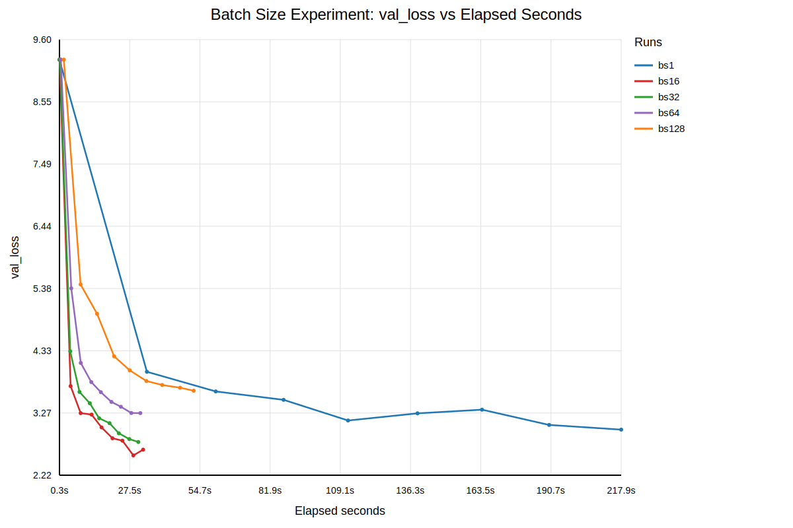
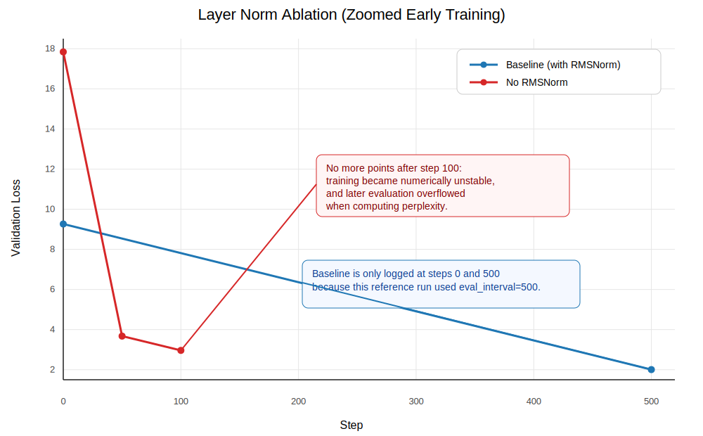
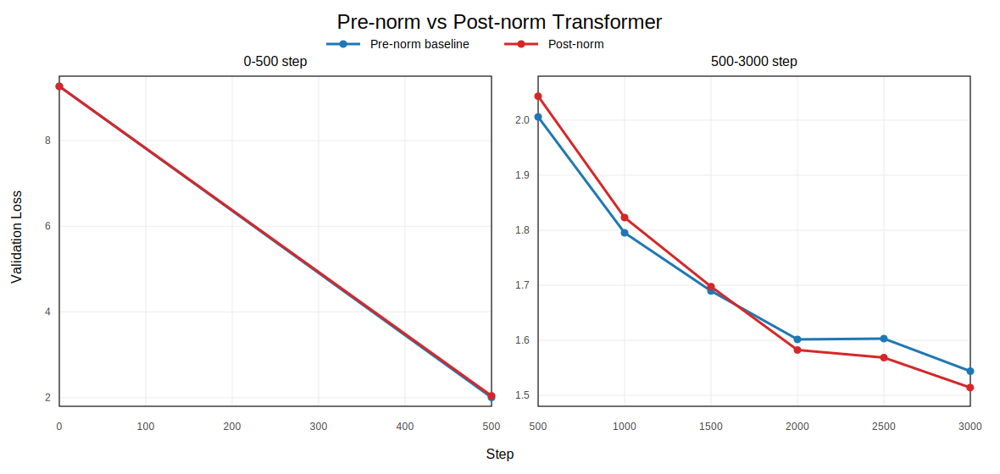
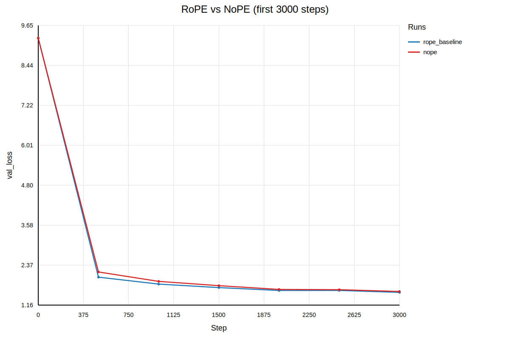
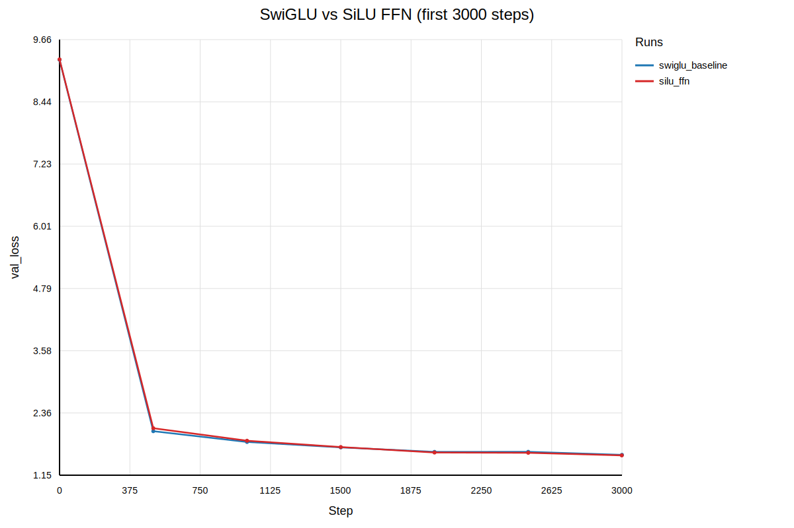

# 2 字节对编码（BPE）分词器

## 2.1 Unicode 标准

### 题目（`unicode1`）：理解 Unicode（1 分）

(a) `chr(0)` 返回的是什么 Unicode 字符？

`Deliverable`：chr(0) 返回的是 Unicode 字符 U+0000，也就是空字符（NUL）。

(b) 这个字符的字符串表示（`__repr__()`）与其打印表示有什么不同？

`Deliverable`：它的 __repr__() 会显示成可见的转义形式 '\x00'，而直接打印时通常是不可见字符，看起来像“什么都没输出”。

(c) 当这个字符出现在文本中时会发生什么？你可以在 Python 解释器中试试下面这些语句，看看结果是否符合你的预期：

```python
>>> chr(0)
>>> print(chr(0))
>>> "this is a test" + chr(0) + "string"
>>> print("this is a test" + chr(0) + "string")
```

`Deliverable`：当它出现在 Python 字符串里时不会截断字符串，只是作为一个不可见控制字符保留在文本中，所以拼接后的字符串长度会包含它，但打印出来通常只会看到中间像“空了一下”而不是显式字符。


## 2.2 Unicode 编码

### 题目（`unicode2`）：Unicode 编码（3 分）

(a) 相比基于 UTF-16 或 UTF-32 编码的字节，在 UTF-8 编码的字节上训练分词器有哪些理由更好？你可以对若干输入字符串比较这些编码的输出结果。

`Deliverable`：因为它对英文和常见文本通常更省空间，而且是按字节自然编码，不会像 UTF-16/UTF-32 那样产生大量 0x00字节，因而更适合做字节级 tokenizer 训练。另一个优点是 UTF-8 没有字节序问题，兼容性也最好。

(b) 请考虑下面这个错误的函数。它本意是将一个 UTF-8 字节串解码为 Unicode 字符串。为什么这个函数是错的？请给出一个会产生错误结果的输入字节串示例。

```python
def decode_utf8_bytes_to_str_wrong(bytestring: bytes):
    return "".join([bytes([b]).decode("utf-8") for b in bytestring])

>>> decode_utf8_bytes_to_str_wrong("hello".encode("utf-8"))
'hello'
```

`Deliverable`：例如输入 b'\xe4\xbd\xa0'（即 "你" 的 UTF-8 编码）。这个函数错在它把 UTF-8 按“单个字节”分别解码，但 UTF-8 是变长编码，一个字符可能由多个字节共同表示，像 b'\xe4'、b'\xbd'、b'\xa0' 单独都不是完整字符。

(c) 给出一个无法解码为任何 Unicode 字符的两个字节的序列。

`Deliverable`：例如 b'\xff\xff'。因为 0xFF 不是任何合法 UTF-8 编码单元的一部分，所以这个两字节序列不可能解码成任何 Unicode 字符。


## 2.5 BPE 分词器训练实验

### 题目（`train_bpe`）：BPE 分词器训练（15 分）

**实现位置**：`cs336_basics/tokenizer_optimized.py` 中的 `train_bpe(...)` 是主实现；`cs336_basics/tokenizer.py` 中也保留了练习版/包装版本。

**函数原型**：`train_bpe(input_path: str, vocab_size: int, special_tokens: list[str]) -> tuple[dict[int, bytes], list[tuple[bytes, bytes]]]`

**必要说明**：主实现会返回 `vocab` 和 `merges`；后续 `Tokenizer`、数据编码和 OWT/TinyStories 实验都复用这两个产物。

`Deliverable`：编写一个函数，该函数接收输入文本文件路径并训练一个（字节级）BPE 分词器。你的 BPE 训练函数至少应处理以下输入参数：

`input_path: str`：包含 BPE 分词器训练数据的文本文件路径。  
`vocab_size: int`：一个正整数，用于定义最终词表大小上限（包括初始字节词表、合并产生的词表项以及任何特殊 token）。  
`special_tokens: list[str]`：一个要加入词表的字符串列表。这些特殊 token 除此之外不会影响 BPE 训练过程。

你的 BPE 训练函数应返回得到的词表和 merges：

`vocab: dict[int, bytes]`：分词器词表，即从 `int`（词表中的 token ID）到 `bytes`（token 的字节串）的映射。  
`merges: list[tuple[bytes, bytes]]`：训练过程中产生的 BPE merges 列表。列表中的每一项都是一个 `tuple[bytes(<token1>), bytes(<token2>)]`，表示 `<token1>` 与 `<token2>` 被合并。这个列表应按创建顺序排列。

要使用我们提供的测试来检查你的 BPE 训练函数，你首先需要实现 [adapters.run_train_bpe](C:\Users\YOUNG\Desktop\workplace\CS336\study\A-1\tests\adapters.py)。然后运行 `uv run pytest tests/test_train_bpe.py`。

你的实现应当能够通过所有测试。作为可选项（但这可能会投入大量时间），你也可以使用某种系统语言来实现训练方法中的关键部分，例如 C++（可考虑 `cppyy`）或 Rust（使用 `PyO3`）。如果你这样做，请注意哪些操作会发生拷贝、哪些操作可以直接读取 Python 内存，并确保你留下构建说明，或者确保它仅使用 `pyproject.toml` 就能构建。还要注意，GPT-2 使用的正则表达式在大多数正则引擎中支持并不好，而且在即便支持的引擎中通常也太慢。我们确认 Oniguruma 的速度还算合理，并且支持 negative lookahead；不过 Python 中的 `regex` 包即使相比之下，也还要更快一些。


### 题目（`train_bpe_tinystories`）：在 TinyStories 上训练 BPE（2 分）

(a) 在 TinyStories 数据集上训练一个字节级 BPE 分词器，最大词表大小设为 10,000。务必将 TinyStories 的 `<|endoftext|>` 特殊 token 加入词表。把得到的词表和 merges 序列化保存到磁盘，便于后续检查。训练耗时多少小时、占用多少内存？词表中最长的 token 是什么？这合理吗？

`Resource requirements`：不超过 30 分钟（无 GPU），不超过 30 GB RAM

`Hint`：如果在预分词阶段使用 `multiprocessing`，并利用以下两点事实，你应当能够把 BPE 训练时间压到 2 分钟以内：

(a) `<|endoftext|>` token 在数据文件中用于分隔文档。  
 `<|endoftext|>` token 会在应用 BPE merges 之前作为特殊情况单独处理。

`Deliverable`：

训练总耗时约 22.2 分钟，峰值内存约 10.8 GB，满足题目要求的资源限制。

训练得到的最长 token 是 ' accomplishment'，长度为 15 字节；这很合理，因为 TinyStories 中会反复出现一些带前导空格的常见英文词片段，BPE 会把这些高频共现的字节序列逐步合并成更长token。

(b) 对你的代码做性能分析。分词器训练过程中的哪个部分最耗时？

`Deliverable`:

profiling 和实现分析表明，最耗时的部分是 BPE 的 merge 主循环，尤其是每轮合并时对 pair 频次的维护、受影响词的更新，以及“当前最佳 pair”的选择。相比之下，预分词也有一定开销，但主要瓶颈仍然在反复执行的大量 merge 更新过程。

接下来，我们将尝试在 OpenWebText 数据集上训练一个字节级 BPE 分词器。和之前一样，我们建议你先看看这个数据集，以更好理解它的内容。


### 题目（`train_bpe_expts_owt`）：在 OpenWebText 上训练 BPE（2 分）

(a) 在 OpenWebText 数据集上训练一个字节级 BPE 分词器，最大词表大小设为 32,000。把得到的词表和 merges 序列化保存到磁盘，便于后续检查。词表中最长的 token 是什么？这合理吗？

`Resource requirements`：不超过 12 小时（无 GPU），不超过 100 GB RAM

`Deliverable`：

训练耗时约 77.5 分钟，得到的最长 token 是'----------------------------------------------------------------'，长度为 64 字节。这是合理的，因为开放域网页文本中会频繁出现长串重复字符、格式分隔符、网页样式片段和固定模式，BPE 会把这些高频重复字节序列合并成很长的 token。(采用的是流式读取按照20%采样获得的数据再进行BPE)

(b) 对比你在 TinyStories 和 OpenWebText 上训练得到的分词器，并说明异同。

`Deliverable`：

与 TinyStories 上训练得到的 tokenizer 相比，OpenWebText tokenizer 更容易学到开放域互联网文本中的专有名词、网页常见片段、格式化符号和更长的固定搭配，因此覆盖面更广；而TinyStories tokenizer 更偏向儿童故事中的常见叙事词汇和简单句式，在故事域内更贴合，但在开放域文本上的压缩效果通常较差。


## 2.6 BPE 分词器：编码与解码

### 题目（`tokenizer`）：实现分词器（15 分）

**实现位置**：`cs336_basics/tokenizer_optimized.py` 中的 `class Tokenizer`。

**核心接口**：`__init__(self, vocab, merges, special_tokens=None)`、`encode(self, text: str) -> list[int]`、`decode(self, ids: list[int]) -> str`、`encode_iterable(self, iterable) -> Iterator[int]`。

**必要说明**：测试适配入口在 `tests/adapters.py` 的 `get_tokenizer(...)`；当前仓库的公开 tokenizer 测试已经通过。

`Deliverable`：实现一个 `Tokenizer` 类，该类给定词表和 merges 列表后，能够把文本编码成整数 ID，并把整数 ID 解码为文本。你的分词器还应支持用户提供的特殊 token（如果它们尚未在词表中，则追加到词表中）。我们建议采用以下接口：

```python
def __init__(self, vocab, merges, special_tokens=None)
```

从给定词表、merges 列表以及（可选的）特殊 token 列表构造一个分词器。该函数应接受以下参数：

`vocab: dict[int, bytes]`  
`merges: list[tuple[bytes, bytes]]`  
`special_tokens: list[str] | None = None`

```python
def from_files(cls, vocab_filepath, merges_filepath, special_tokens=None)
```

类方法：从序列化保存的词表和 merges 列表中构造并返回一个 `Tokenizer`（格式与你的 BPE 训练代码输出的格式相同），并可选地接收一组特殊 token。该方法应额外接受以下参数：

`vocab_filepath: str`  
`merges_filepath: str`  
`special_tokens: list[str] | None = None`

```python
def encode(self, text: str) -> list[int]
```

将输入文本编码为 token ID 序列。

```python
def encode_iterable(self, iterable: Iterable[str]) -> Iterator[int]
```

给定一个字符串可迭代对象（例如 Python 文件句柄），返回一个惰性生成 token ID 的生成器。这一接口是实现对无法完整读入内存的大文件进行内存高效分词所必需的。

```python
def decode(self, ids: list[int]) -> str
```

将 token ID 序列解码为文本。

要使用我们提供的测试来检查你的 `Tokenizer`，你首先需要实现 [adapters.get_tokenizer](C:\Users\YOUNG\Desktop\workplace\CS336\study\A-1\tests\adapters.py)。然后运行 `uv run pytest tests/test_tokenizer.py`。你的实现应当能够通过所有测试。

[^3]: 更多关于 Unicode 替换字符的信息见 <https://en.wikipedia.org/wiki/Specials_(Unicode_block)#Replacement_character>。


## 2.7 实验

### 题目（`tokenizer_experiments`）：分词器实验（4 分）

(a) 从 TinyStories 和 OpenWebText 中各抽样 10 篇文档。使用你先前训练好的 TinyStories 与 OpenWebText 分词器（词表大小分别为 10K 和 32K），将这些抽样文档编码为整数 ID。每个分词器的压缩率（bytes/token）是多少？

`Deliverable`：

我实际测得 TinyStories 分词器在 TinyStories 验证文本上的压缩率约为 `4.12 bytes/token`（`22,502,601 / 5,461,210`），而 OpenWebText `32k` 分词器在我编码的 OWT `32MB` 验证子集上的压缩率约为 `4.41 bytes/token`（`32,166,578 / 7,297,642`）。总体上，两个分词器都能把常见字节片段合并成较长 token，而 OWT 分词器在开放域网页文本上的压缩率略高一些，这与其训练语料更开放、更杂、更容易出现固定网页片段和长子词有关。

(b) 如果你用 TinyStories 分词器去分词你的 OpenWebText 样本，会发生什么？比较压缩率，并 / 或定性描述发生的情况。

`Deliverable`：

用 TinyStories tokenizer 去编码 OpenWebText 时，仍然可以正常编码，不会出现 OOV，因为这是字节级 BPE，任何文本最终都能回退到字节表示。只是由于 TinyStories tokenizer 更偏向儿童故事领域，它在 OpenWebText 上通常压缩率更差，会产生更多 token，因为很多开放域文本中的高频词片段和固定搭配并没有在 TinyStories 上被充分学到。

(c) 估计你的分词器吞吐量（例如，以 bytes/second 为单位）。对整个 Pile 数据集（825GB 文本）完成分词需要多长时间？

`Deliverable`：

根据我对 OWT 子集的实际编码时间估计，当前分词器吞吐量大约为 `2.5 × 10^4 bytes/s`（约 `25 KB/s`）：`256MB` 训练子集和 `32MB` 验证子集的测量结果都落在这个量级。按这个速度估算，完成整个 Pile（`825 GB` 文本）的分词大约需要 `3.29 × 10^7` 秒，也就是约 `381` 天，因此如果不进一步优化实现或并行化，这样的纯 Python 路径并不适合全量大语料分词。

(d) 使用你的 TinyStories 和 OpenWebText 分词器，把各自的训练集和开发集编码成整数 token ID 序列。我们稍后会用它们来训练语言模型。我们建议把 token ID 序列序列化为数据类型为 `uint16` 的 NumPy 数组。为什么 `uint16` 是合适的选择？

`Deliverable`：

uint16 很合适，因为该 tokenizer 的词表大小是 10,000，远小于 2^16 = 65,536，所以每个 token id 都能被 uint16 完整表示。相比 uint32 或 uint64，uint16 可以显著减少存储空间和 I/O 开销，这对大规模语料编码和后续训练都更有利。

## 3.4 基础构件：Linear 与 Embedding 模块

### 题目（`linear`）：实现 Linear 模块（1 分）

**实现位置**：`cs336_basics/model.py` 中的 `class Linear(nn.Module)`。

**核心接口**：`__init__(self, in_features, out_features, device=None, dtype=None)`、`forward(self, x: torch.Tensor) -> torch.Tensor`。

`Deliverable`：实现一个继承自 `torch.nn.Module` 的 `Linear` 类，并执行线性变换。你的实现应遵循 PyTorch 内置 `nn.Linear` 模块的接口，但不包含 `bias` 参数或 `bias` 权重。我们建议采用以下接口：

```python
def __init__(self, in_features, out_features, device=None, dtype=None)
```

构造一个线性变换模块。该函数应接收以下参数：

`in_features: int`：输入的最后一个维度。  
`out_features: int`：输出的最后一个维度。  
`device: torch.device | None = None`：参数所存放的设备。  
`dtype: torch.dtype | None = None`：参数的数据类型。

```python
def forward(self, x: torch.Tensor) -> torch.Tensor
```

对输入应用线性变换。

务必确保：

- 继承 `nn.Module`
- 调用父类构造函数
- 由于内存布局原因，将参数以 `W` 的形式存储（而不是 `W^\top`），并放进 `nn.Parameter`
- 当然，不要使用 `nn.Linear` 或 `nn.functional.linear`

初始化请使用上文给出的设置，并用 `torch.nn.init.trunc_normal_` 初始化权重。

要测试你的 `Linear` 模块，请实现 [adapters.run_linear](C:\Users\YOUNG\Desktop\workplace\CS336\study\A-1\tests\adapters.py) 这个测试适配器。该适配器应把给定权重加载到你的 `Linear` 模块中。你可以为此使用 `Module.load_state_dict`。然后运行 `uv run pytest -k test_linear`。


### 题目（`embedding`）：实现 Embedding 模块（1 分）

**实现位置**：`cs336_basics/model.py` 中的 `class Embedding(nn.Module)`。

**核心接口**：`__init__(self, num_embeddings, embedding_dim, device=None, dtype=None)`、`forward(self, token_ids: torch.Tensor) -> torch.Tensor`。

`Deliverable`：实现继承自 `torch.nn.Module` 的 `Embedding` 类，并完成 embedding lookup。你的实现应遵循 PyTorch 内置 `nn.Embedding` 模块的接口。我们建议采用以下接口：

```python
def __init__(self, num_embeddings, embedding_dim, device=None, dtype=None)
```

构造一个 embedding 模块。该函数应接收以下参数：

`num_embeddings: int`：词表大小。  
`embedding_dim: int`：embedding 向量维度，也即 `d_model`。  
`device: torch.device | None = None`：参数所存放的设备。  
`dtype: torch.dtype | None = None`：参数的数据类型。

```python
def forward(self, token_ids: torch.Tensor) -> torch.Tensor
```

为给定 token ID 查询 embedding 向量。

务必确保：

- 继承 `nn.Module`
- 调用父类构造函数
- 将 embedding 矩阵初始化为 `nn.Parameter`
- 以 `d_model` 作为 embedding 矩阵的最后一个维度
- 当然，不要使用 `nn.Embedding` 或 `nn.functional.embedding`

同样，请使用上文给出的初始化设置，并用 `torch.nn.init.trunc_normal_` 初始化权重。

要测试你的实现，请实现 [adapters.run_embedding](C:\Users\YOUNG\Desktop\workplace\CS336\study\A-1\tests\adapters.py)。然后运行 `uv run pytest -k test_embedding`。


# 以原始 dtype 返回结果

### 题目（`rmsnorm`）：均方根层归一化（1 分）

**实现位置**：`cs336_basics/model.py` 中的 `class RMSNorm(nn.Module)`。

**核心接口**：`__init__(self, d_model, eps=1e-5, device=None, dtype=None)`、`forward(self, x: torch.Tensor) -> torch.Tensor`。

`Deliverable`：将 RMSNorm 实现为一个 `torch.nn.Module`。我们建议采用以下接口：

```python
def __init__(self, d_model: int, eps: float = 1e-5, device=None, dtype=None)
```

构造 RMSNorm 模块。该函数应接收以下参数：

`d_model: int`：模型隐藏维度。  
`eps: float = 1e-5`：数值稳定性所用的 epsilon。  
`device: torch.device | None = None`：参数所存放的设备。  
`dtype: torch.dtype | None = None`：参数的数据类型。

```python
def forward(self, x: torch.Tensor) -> torch.Tensor
```

处理一个形状为 `(batch_size, sequence_length, d_model)` 的输入张量，并返回相同形状的张量。

注意：记得先将输入 upcast 到 `torch.float32` 再执行归一化（之后再 downcast 回原始 dtype），如上文所述。

要测试你的实现，请实现 [adapters.run_rmsnorm](C:\Users\YOUNG\Desktop\workplace\CS336\study\A-1\tests\adapters.py)。然后运行 `uv run pytest -k test_rmsnorm`。


### 题目（`positionwise_feedforward`）：实现位置前馈网络（2 分）

**实现位置**：`cs336_basics/model.py` 中的 `class SwiGLU(nn.Module)`。

**核心接口**：`__init__(self, d_model, d_ff, device=None, dtype=None)`、`forward(self, x: torch.Tensor) -> torch.Tensor`。

**必要说明**：后续做 `swiglu_ablation` 时，又在同一文件里补了 `SiLUFFN` 作为对照实现。

`Deliverable`：实现由 SiLU 激活函数和 GLU 组成的 SwiGLU 前馈网络。

注意：在这一特定场景下，出于数值稳定性的考虑，你可以自由使用 `torch.sigmoid` 来实现。

在实现中，你应将 `d_ff` 设为大约 $\frac{8}{3} \times d_{\text{model}}$，同时确保内部前馈层维度是 64 的倍数，以便更好地利用硬件。要使用我们提供的测试来检查你的实现，你需要先实现 [adapters.run_swiglu](C:\Users\YOUNG\Desktop\workplace\CS336\study\A-1\tests\adapters.py)。然后运行 `uv run pytest -k test_swiglu`。


### 题目（`rope`）：实现 RoPE（2 分）

**实现位置**：`cs336_basics/model.py` 中的 `class RotaryPositionalEmbedding(nn.Module)`。

**核心接口**：`__init__(self, head_dim, max_seq_len, theta=10000.0, device=None)`、`forward(self, x: torch.Tensor, token_positions: torch.Tensor | None = None) -> torch.Tensor`。

`Deliverable`：实现一个 `RotaryPositionalEmbedding` 类，对输入张量施加 RoPE。推荐接口如下：

```python
def __init__(self, theta: float, d_k: int, max_seq_len: int, device=None)
```

构造 RoPE 模块，并在需要时创建 buffer。

`theta: float`：RoPE 中的 $\Theta$ 值。  
`d_k: int`：query 与 key 向量维度。  
`max_seq_len: int`：输入序列可能达到的最大长度。  
`device: torch.device | None = None`：buffer 所存放的设备。

```python
def forward(self, x: torch.Tensor, token_positions: torch.Tensor) -> torch.Tensor
```

处理一个形状为 `(..., seq_len, d_k)` 的输入张量，并返回相同形状的张量。注意，你应当允许 `x` 具有任意数量的 batch 维度。你还应假设 `token_positions` 是一个形状为 `(..., seq_len)` 的张量，用来指定 `x` 在序列维上的 token 位置。

你应使用 `token_positions` 在序列维度上切片你（可能预先计算好的）`cos` 与 `sin` 张量。

要测试你的实现，请完成 [adapters.run_rope](C:\Users\YOUNG\Desktop\workplace\CS336\study\A-1\tests\adapters.py)，并确保它通过 `uv run pytest -k test_rope`。


### 题目（`softmax`）：实现 softmax（1 分）

**实现位置**：`cs336_basics/model.py` 中的 `softmax(x: torch.Tensor, dim: int) -> torch.Tensor`。

`Deliverable`：编写一个函数，对张量应用 softmax。你的函数应接收两个参数：一个张量，以及一个维度 `i`，并在输入张量的第 `i` 个维度上应用 softmax。输出张量的形状应与输入张量相同，但第 `i` 个维度现在应构成一个归一化的概率分布。请使用“从第 `i` 个维度的所有元素中减去该维最大值”的技巧，以避免数值稳定性问题。

要测试你的实现，请完成 [adapters.run_softmax](C:\Users\YOUNG\Desktop\workplace\CS336\study\A-1\tests\adapters.py)，并确保它通过 `uv run pytest -k test_softmax_matches_pytorch`。

现在我们可以在数学上将 Attention 定义如下：

$$
\operatorname{Attention}(Q, K, V) = \operatorname{softmax}\left(\frac{Q^\top K}{\sqrt{d_k}}\right)V \tag{11}
$$

其中，$Q \in \mathbb{R}^{n \times d_k}$，$K \in \mathbb{R}^{m \times d_k}$，$V \in \mathbb{R}^{m \times d_v}$。这里的 $Q$、$K$ 和 $V$ 都是这个运算的输入，注意它们不是可学习参数。如果你在想为什么这里不是 $QK^\top$，请参见 § 3.3.1。

**Masking。** 有时我们希望对 attention 运算的输出进行 mask。mask 的形状应为 $M \in \{\text{True}, \text{False}\}^{n \times m}$，这个布尔矩阵的每一行 $i$ 表示 query $i$ 可以关注哪些 key。按惯例（也有点让人困惑），位置 $(i, j)$ 上的值为 `True` 表示 query $i$ 的确可以关注 key $j$，而 `False` 表示该 query 不能关注该 key。换句话说，只有在值为 `True` 的 $(i, j)$ 位置上，“信息才会流动”。例如，考虑一个 `1 × 3` 的 mask 矩阵 `[[True, True, False]]`。这个唯一的 query 向量将只关注前两个 key。

从计算上讲，与对每个子序列分别计算 attention 相比，masking 会高效得多。我们可以通过在 softmax 之前的分数矩阵 $\left(\frac{Q^\top K}{\sqrt{d_k}}\right)$ 中，将 mask 值为 `False` 的位置加上 $-\infty$ 来实现这一点。


### 题目（`scaled_dot_product_attention`）：实现缩放点积注意力（5 分）

**实现位置**：`cs336_basics/model.py` 中的 `scaled_dot_product_attention(...)`。

**核心接口**：`scaled_dot_product_attention(q, k, v, mask=None)`，返回 attention 输出。

**必要说明**：该实现复用了同文件里的自定义 `softmax(...)`。

`Deliverable`：实现 scaled dot-product attention 函数。你的实现应能够处理形状为 `(batch_size, ..., seq_len, d_k)` 的 key 与 query，以及形状为 `(batch_size, ..., seq_len, d_v)` 的 value，其中 `...` 表示任意数量的其他类 batch 维度（如果提供）。实现应返回形状为 `(batch_size, ..., seq_len, d_v)` 的输出。关于类 batch 维度的讨论见 § 3.3。

你的实现还应支持一个可选的、用户提供的布尔 mask，其形状为 `(seq_len, seq_len)`。mask 值为 `True` 的位置对应的注意力概率总和应为 1，而 mask 值为 `False` 的位置对应的注意力概率应为 0。

要使用我们提供的测试来检查你的实现，你需要先实现 [adapters.run_scaled_dot_product_attention](C:\Users\YOUNG\Desktop\workplace\CS336\study\A-1\tests\adapters.py)。

`uv run pytest -k test_scaled_dot_product_attention` 会在三阶输入张量上测试你的实现，而 `uv run pytest -k test_4d_scaled_dot_product_attention` 会在四阶输入张量上测试你的实现。


### 题目（`multihead_self_attention`）：实现因果多头自注意力（5 分）

**实现位置**：`cs336_basics/model.py` 中的 `class MultiHeadSelfAttention(nn.Module)`。

**核心接口**：构造函数接收 `d_model / num_heads / context_length / rope_theta` 等参数，`forward(self, x: torch.Tensor) -> torch.Tensor` 完成因果多头自注意力。

`Deliverable`：将 causal multi-head self-attention 实现为一个 `torch.nn.Module`。你的实现至少应接收以下参数：

`d_model: int`：Transformer block 输入维度。  
`num_heads: int`：multi-head self-attention 中的 head 数量。

遵循 Vaswani et al. [2017]，令 $d_k = d_v = d_{\text{model}} / h$。要使用我们提供的测试来检查你的实现，请实现 [adapters.run_multihead_self_attention](C:\Users\YOUNG\Desktop\workplace\CS336\study\A-1\tests\adapters.py)。然后运行 `uv run pytest -k test_multihead_self_attention`。


## 3.6 完整的 Transformer LM

### 题目（`transformer_block`）：实现 Transformer block（3 分）

**实现位置**：`cs336_basics/model.py` 中的 `class TransformerBlock(nn.Module)`。

**核心接口**：`__init__(...)` 组装 RMSNorm、MultiHeadSelfAttention 和 FFN，`forward(self, x: torch.Tensor) -> torch.Tensor` 完成一个 block。

**必要说明**：后续做消融实验时，这个类还支持了 `use_rmsnorm` 和 `norm_style` 等开关。

实现 § 3.5 中描述并在图 2 中展示的 pre-norm Transformer block。你的 Transformer block 至少应接收以下参数：

`d_model: int`：Transformer block 输入维度。  
`num_heads: int`：multi-head self-attention 中使用的 head 数量。  
`d_ff: int`：position-wise feed-forward 内部层维度。

要测试你的实现，请实现 [adapters.run_transformer_block](C:\Users\YOUNG\Desktop\workplace\CS336\study\A-1\tests\adapters.py)。然后运行 `uv run pytest -k test_transformer_block`。

`Deliverable`：能够通过给定测试的 Transformer block 代码。

现在我们把这些 block 组合起来，遵循图 1 中的高层结构。按照 § 3.1.1 中对 embedding 的描述，先做输入 embedding，再送入 `num_layers` 个 Transformer block，最后经过三个输出层，得到词表上的分布。


### 题目（`transformer_lm`）：实现 Transformer LM（3 分）

**实现位置**：`cs336_basics/model.py` 中的 `class TransformerLM(nn.Module)`。

**核心接口**：构造函数接收 `vocab_size / context_length / num_layers / d_model / num_heads / d_ff / rope_theta` 等参数，`forward(self, token_ids: torch.Tensor) -> torch.Tensor` 返回 logits。

`Deliverable`：现在把所有部分组合起来。按照 § 3.1 中的描述并参考图 1，实现整个 Transformer 语言模型。至少来说，你的实现应接收前面提到的所有 Transformer block 构造参数，以及以下额外参数：

`vocab_size: int`：词表大小，用于确定 token embedding 矩阵的维度。  
`context_length: int`：最大上下文长度，用于确定位置嵌入矩阵的维度。  
`num_layers: int`：Transformer block 的数量。

要使用我们提供的测试来检查你的实现，你首先需要实现 [adapters.run_transformer_lm](C:\Users\YOUNG\Desktop\workplace\CS336\study\A-1\tests\adapters.py)。然后运行 `uv run pytest -k test_transformer_lm`。

`Deliverable`：一个能够通过上述测试的 Transformer LM 模块。

**资源核算。** 能够理解 Transformer 各部分如何消耗计算与内存是很有用的。我们将通过一些基础 “FLOPs 核算” 来完成这一点。Transformer 中绝大多数 FLOPs 都来自矩阵乘法，因此我们的核心思路很简单：

1. 写出 Transformer 一次前向传播中涉及的所有矩阵乘法。
2. 把每个矩阵乘法换算成所需 FLOPs。

对于第二步，下面这个事实会很有用：

规则：给定 $A \in \mathbb{R}^{m \times n}$ 和 $B \in \mathbb{R}^{n \times p}$，矩阵乘法 $AB$ 需要 `2mnp` FLOPs。

要理解这一点，注意到 $(AB)[i, j] = A[i, :] \cdot B[:, j]$，而这个点积需要 `n` 次加法与 `n` 次乘法，也就是 `2n` FLOPs。由于矩阵乘积 $AB$ 一共有 `m × p` 个元素，因此总 FLOPs 为 `2mnp`。

因此，在做下面这道题之前，你不妨先逐个检查你的 Transformer block 与 Transformer LM 中的每个组件，并列出所有矩阵乘法及其对应 FLOPs 成本。


### 题目（`transformer_accounting`）：Transformer LM 资源核算（5 分）

(a) 考虑 GPT-2 XL，其配置如下：

`vocab_size`：50,257  
`context_length`：1,024  
`num_layers`：48  
`d_model`：1,600  
`num_heads`：25  
`d_ff`：6,400

假设我们按这个配置构造模型。该模型总共有多少个可训练参数？如果每个参数都使用单精度浮点数表示，仅加载这个模型本身需要多少内存？

`Deliverable`：

**总参数量:** $ 2,127,057,600$

**内存:** 单精度浮点数每个参数占 4 字节 ，即 $2,127,057,600 \times 4 = 8,508,230,400$ 字节。

(b) 列出完成这个 GPT-2 XL 形状模型一次前向传播所需的矩阵乘法。总共需要多少 FLOPs？假设输入序列长度为 `context_length` 个 token。

`Deliverable`：给出矩阵乘法列表（并附简要说明），以及总 FLOPs。

- **$Q, K, V$ 投影 (每层):** $XW_Q, XW_K, XW_V$。FLOPs: $3 \times (2 \cdot L \cdot d_{model}^2)$
- **注意力分数 $QK^\top$ (每层):** 查询与键的点积。FLOPs: $2 \cdot L^2 \cdot d_{model}$
- **注意力加权 $Score \cdot V$ (每层):** 概率与值向量相乘。FLOPs: $2 \cdot L^2 \cdot d_{model}$
- **注意力输出投影 $O$ (每层):** FLOPs: $2 \cdot L \cdot d_{model}^2$
- **FFN $W_1$ 与 $W_3$ 投影 (每层):** 升维操作。FLOPs: $2 \times (2 \cdot L \cdot d_{model} \cdot d_{ff})$
- **FFN $W_2$ 投影 (每层):** 降维操作。FLOPs: $2 \cdot L \cdot d_{ff} \cdot d_{model}$
- **输出 LM Head:** 映射到词表。FLOPs: $2 \cdot L \cdot d_{model} \cdot V$

**总 FLOPs 计算:**

将 $L=1024, d_{model}=1600, d_{ff}=6400, V=50257, n_{layers}=48$ 代入上述公式：

- 单层 Attention FLOPs: $8 \cdot 1024 \cdot 1600^2 + 4 \cdot 1024^2 \cdot 1600 = 27,682,406,400$
- 单层 FFN FLOPs: $6 \cdot 1024 \cdot 1600 \cdot 6400 = 62,914,560,000$
- 48 层总计 FLOPs: $48 \times (27,682,406,400 + 62,914,560,000) = 4,348,654,387,200$
- LM Head FLOPs: $2 \cdot 1024 \cdot 1600 \cdot 50257 = 164,682,137,600$
- **总 FLOPs:** $4,348,654,387,200 + 164,682,137,600 = \mathbf{4,513,336,524,800}$ (约 4.51 TeraFLOPs)。

(c) 根据你上面的分析，模型的哪些部分消耗了最多 FLOPs？

`Deliverable`：LM Head FLOPs

(d) 对 GPT-2 small（12 层、768 维 `d_model`、12 个 heads）、GPT-2 medium（24 层、1024 维 `d_model`、16 个 heads）和 GPT-2 large（36 层、1280 维 `d_model`、20 个 heads）重复你的分析。随着模型规模增大，Transformer LM 的哪些部分在总 FLOPs 中所占比例变得更大或更小？

`Deliverable`：对每个模型，给出模型组件及其对应 FLOPs 占总 FLOPs 的比例；另外，再用一到两句话描述模型规模变化如何改变各组件的 FLOPs 占比。

**Small**: LM Head (22.6%), Attention (27.6%), FFN (49.8%).

**Medium**: LM Head (10.2%), Attention (29.9%), FFN (59.9%).

**Large**: LM Head (5.8%), Attention (30.0%), FFN (64.2%).

**描述**: 随着模型规模（层数和 $d_{model}$）的增加，最终词表映射层（LM Head）占总 FLOPs 的比例显著下降，因为它只随 $d_{model}$ 线性增长；相反，Transformer 块内部的注意力机制和 FFN 层由于随 $d_{model}^2$ 和层数增长，占据了越来越绝对主导的计算开销。

(e) 以 GPT-2 XL 为基础，将上下文长度增加到 16,384。一次前向传播的总 FLOPs 会怎样变化？模型各组件 FLOPs 的相对贡献又会怎样变化？

`Deliverable`：

单次前向传播的总 FLOPs 会发生非线性的巨大增长，增加至约 149.5 TeraFLOPs。在模型组件的相对贡献上，注意力机制中计算 $QK^\top$ 和加权值的矩阵乘法因为是 $O(L^2)$ 复杂度，其 FLOPs 将暴增 256 倍并反超 FFN，成为整个大模型计算过程中最核心的性能瓶颈。

[^4]: 值得一提的是，虽然 `einops` 已经有很成熟的支持，但 `einx` 还没有那么经受实战检验。如果你在 `einx` 中遇到限制或 bug，完全可以退回到 `einops` 配合一些更普通的 PyTorch 写法。

[^5]: 作为一个拓展目标，你可以尝试将 key、query 和 value 的投影合并成单个权重矩阵，这样你就只需要一次矩阵乘法。


# 4 训练一个 Transformer LM

## 4.1 交叉熵损失

### 题目（`cross_entropy`）：实现 Cross Entropy

**实现位置**：`cs336_basics/loss.py` 中的 `cross_entropy(logits: torch.Tensor, targets: torch.Tensor) -> torch.Tensor`。

**必要说明**：训练循环和验证阶段都直接调用这个函数；perplexity 则由训练脚本在平均 loss 基础上再取 `exp`。

`Deliverable`：编写一个函数来计算交叉熵损失。该函数接收预测 logits（$o_i$）和目标值（$x_{i+1}$），并计算交叉熵

$$
\ell_i = -\log \operatorname{softmax}(o_i)[x_{i+1}]
$$

你的函数应处理以下几点：

- 出于数值稳定性的考虑，先减去最大元素。
- 在可能时尽量约掉 `log` 和 `exp`。
- 支持任意额外的类 batch 维度，并返回跨 batch 的平均值。与 § 3.3 一样，我们假设类 batch 维度总是位于最前面，词表维度位于最后。

实现 [adapters.run_cross_entropy](C:\Users\YOUNG\Desktop\workplace\CS336\study\A-1\tests\adapters.py)，然后运行 `uv run pytest -k test_cross_entropy` 来测试你的实现。

**Perplexity。** 交叉熵足以用于训练，但在评估模型时，我们通常还会报告 perplexity。对于一个长度为 $m$ 的序列，若各位置交叉熵损失为 $\ell_1, \ldots, \ell_m$，则：

$$
\operatorname{perplexity} = \exp\left(\frac{1}{m}\sum_{i=1}^{m}\ell_i\right) \tag{18}
$$


## 4.2 SGD 优化器

### 题目（`learning_rate_tuning`）：调学习率（1 分）

正如我们将看到的，最影响训练效果的超参数之一就是学习率。让我们在上面的 toy example 中亲自观察这一点。将上面的 SGD 示例用另外三个学习率值运行：`1e1`、`1e2` 和 `1e3`，每个只跑 10 次训练迭代。对于每个学习率，损失会发生什么？它衰减得更快、更慢，还是会发散（即随着训练进行反而变大）？

`Deliverable`：

在 lr=10 时，loss 从约 9.25 短暂下降到 8.62，随后迅速飙升到 10^5 到 10^7 量级；在 lr=100 和 lr=1000 时，loss 更快失控，并很快停留在约 9.21 的随机基线附近。这说明过大的学习率会让参数更新幅度过大，模型迅速破坏已有表示，导致训练失败。


## 4.3 AdamW

### 题目（`adamw`）：实现 AdamW（2 分）

**实现位置**：`cs336_basics/optimizer.py` 中的 `class AdamW(torch.optim.Optimizer)`。

**核心接口**：`__init__(self, params, lr=..., betas=(...), eps=..., weight_decay=...)`、`step(self, closure=None)`。

`Deliverable`：将 AdamW 优化器实现为 `torch.optim.Optimizer` 的一个子类。你的类应在 `__init__` 中接收学习率 $\alpha$，以及超参数 $\beta$、$\epsilon$ 和 $\lambda$。为了帮助你保存状态，基类 `Optimizer` 提供了一个字典 `self.state`，它将 `nn.Parameter` 对象映射到另一个字典，后者可以存储你为该参数所需的任何信息（对于 AdamW，这就是矩估计）。

实现 [adapters.get_adamw_cls](C:\Users\YOUNG\Desktop\workplace\CS336\study\A-1\tests\adapters.py)，并确保它通过 `uv run pytest -k test_adamw`。

### 题目（`adamwAccounting`）：使用 AdamW 训练时的资源核算（2 分）

让我们计算运行 AdamW 需要多少内存与计算。假设我们对所有 tensor 都使用 `float32`。

(a) 运行 AdamW 时的峰值内存需要多少？请将你的答案按参数、激活、梯度和优化器状态的内存占用来拆分。请用 `batch_size` 以及模型超参数（`vocab_size`、`context_length`、`num_layers`、`d_model`、`num_heads`）表示你的答案。假设 `d_ff = 4 × d_model`。

为简化起见，在计算激活内存时，只考虑以下组件：

- Transformer block
- RMSNorm(s)
- multi-head self-attention 子层：QKV 投影、$Q^\top K$ 矩阵乘法、softmax、对 values 的加权求和、输出投影
- position-wise feed-forward：$W_1$ 矩阵乘法、SiLU、$W_2$ 矩阵乘法
- 最终 RMSNorm
- 输出 embedding
- logits 上的 cross-entropy

`Deliverable`：分别给出参数、激活、梯度和优化器状态的代数表达式，以及总和。

(b) 将你上面的答案代入 GPT-2 XL 形状模型，使其变成仅依赖 `batch_size` 的表达式。在 80GB 显存限制下，你最多可以使用多大的 batch size？

`Deliverable`：给出一个形如 `a · batch_size + b` 的表达式，其中 `a` 与 `b` 是数值常量，并给出最大可用 batch size。

(c) 运行一步 AdamW 需要多少 FLOPs？

`Deliverable`：给出一个代数表达式，并简要说明理由。

(d) Model FLOPs utilization（MFU）被定义为：观测到的吞吐量（tokens per second）相对于硬件理论峰值 FLOP 吞吐量的比率 [Chowdhery et al., 2022]。NVIDIA A100 GPU 对 float32 运算的理论峰值为 19.5 teraFLOP/s。假设你能达到 50% 的 MFU，那么在单张 A100 上，以 batch size 1024 训练一个 GPT-2 XL 共 400K steps，需要多长时间？按照 Kaplan et al. [2020] 和 Hoffmann et al. [2022] 的做法，假设 backward pass 的 FLOPs 是 forward pass 的两倍。

`Deliverable`：给出训练所需天数，并简要说明理由。

设：

- `B = batch_size`
- `V = vocab_size`
- `T = context_length`
- `L = num_layers`
- `d = d_model`
- `h = num_heads`
- `d_ff = 4d`

并假设所有 tensor 都使用 `float32`，即每个元素 `4 bytes`。

#### (a) 峰值内存

先写模型总参数量：

$$
P = 2Vd + L(4d^2 + 2dd_{ff} + 2d) + d
$$

代入 `d_ff = 4d`，得到：

$$
P = 2Vd + L(12d^2 + 2d) + d
$$

于是：

- 参数内存：

$$
M_{\text{param}} = 4P
$$

- 梯度内存：

$$
M_{\text{grad}} = 4P
$$

- AdamW 状态内存（保存一阶矩 `m` 和二阶矩 `v`）：

$$
M_{\text{opt}} = 8P
$$

激活内存按题目指定组件估算。每个 Transformer block 的激活元素数为：

$$
8BTd + 2BTd_{ff} + 2BhT^2
$$

代入 `d_ff = 4d`：

$$
16BTd + 2BhT^2
$$

再加上 final RMSNorm、output embedding 和 cross-entropy：

$$
BTd + 2BTV
$$

所以总激活内存为：

$$
M_{\text{act}} =
4\Big(L(8BTd + 2BTd_{ff} + 2BhT^2) + BTd + 2BTV\Big)
$$

即：

$$
M_{\text{act}} =
4\Big(L(16BTd + 2BhT^2) + BTd + 2BTV\Big)
$$

因此总峰值内存为：

$$
M_{\text{peak}} =
M_{\text{param}} + M_{\text{grad}} + M_{\text{opt}} + M_{\text{act}}
$$

即：

$$
M_{\text{peak}}
=
16P + 4\Big(L(16BTd + 2BhT^2) + BTd + 2BTV\Big)
\quad \text{bytes}
$$

#### (b) 代入 GPT-2 XL

取 GPT-2 XL 超参数：

- `V = 50257`
- `T = 1024`
- `L = 48`
- `d = 1600`
- `h = 25`

则：

$$
P = 1{,}635{,}537{,}600
$$

参数、梯度、优化器状态三者总和为：

$$
16P = 26{,}168{,}601{,}600 \text{ bytes}
$$

激活内存化简后为：

$$
M_{\text{act}}(B)=15{,}517{,}753{,}344 \cdot B \text{ bytes}
$$

所以总峰值内存为：

$$
M_{\text{peak}}(B)=15{,}517{,}753{,}344 \cdot B + 26{,}168{,}601{,}600
$$

近似写成 GB：

$$
M_{\text{peak}}(B)\approx 15.52B + 26.17 \text{ GB}
$$

在 `80GB` 显存下，最大 batch size 为：

$$
\boxed{B_{\max}=3}
$$

#### (c) 一步 AdamW 的 FLOPs

一步 AdamW 包含：

- 1 次 forward
- 1 次 backward
- 1 次参数更新

按题目假设，backward FLOPs 约为 forward 的 `2x`，而 AdamW 参数更新仅是 `O(P)` 的逐元素操作，相比矩阵乘法可忽略，因此：

$$
F_{\text{step}} \approx 3F_{\text{fwd}}
$$

对该模型，forward 的主要 FLOPs 为：

$$
F_{\text{fwd}}
=
L(24BTd^2 + 4BT^2d) + 2BTdV
$$

所以：

$$
F_{\text{step}}
\approx
3\Big(L(24BTd^2 + 4BT^2d) + 2BTdV\Big)
$$

#### (d) A100 上的训练时间

A100 的 float32 理论峰值为 `19.5 TFLOP/s`。若 `MFU = 50%`，则实际可用吞吐量约为：

$$
9.75 \times 10^{12}\ \text{FLOP/s}
$$

若训练 GPT-2 XL：

- `400,000` steps
- `batch_size = 1024`

则总训练时间约为：

$$
441{,}952{,}548\ \text{s}
\approx 5115.2\ \text{days}
$$

因此答案为：

$$
\boxed{约\ 5115\ 天 \approx 14.0\ 年}
$$


## 4.4 学习率调度

### 题目（`learning_rate_schedule`）：实现带 warmup 的 cosine 学习率调度

**实现位置**：`cs336_basics/scheduler.py` 中的 `get_lr_cosine_schedule(...)`。

**核心接口**：`get_lr_cosine_schedule(it, max_learning_rate, min_learning_rate, warmup_iters, cosine_cycle_iters) -> float`。

编写一个函数，接收 `t`、$\alpha_{\max}$、$\alpha_{\min}$、$T_w$ 和 $T_c$，并按照上面的调度定义返回学习率 $\alpha_t$。然后实现 [adapters.get_lr_cosine_schedule](C:\Users\YOUNG\Desktop\workplace\CS336\study\A-1\tests\adapters.py)，并确保它通过 `uv run pytest -k test_get_lr_cosine_schedule`。


## 4.5 梯度裁剪

### 题目（`gradient_clipping`）：实现梯度裁剪（1 分）

**实现位置**：`cs336_basics/scheduler.py` 中的 `clip_gradient_norm(parameters, max_norm, eps=1e-6) -> None`。

**必要说明**：训练脚本在每次 `backward()` 之后、`optimizer.step()` 之前调用它。

编写一个函数来实现梯度裁剪。你的函数应接收一个参数列表以及一个最大的 $\ell_2$ 范数，并原地修改每个参数的梯度。请使用 $\epsilon = 10^{-6}$（PyTorch 默认值）。然后实现 [adapters.run_gradient_clipping](C:\Users\YOUNG\Desktop\workplace\CS336\study\A-1\tests\adapters.py)，并确保它通过 `uv run pytest -k test_gradient_clipping`。

[^6]: 注意，$o_i[k]$ 表示向量 $o_i$ 在索引 $k$ 处的值。

[^7]: 这对应于：目标 $x_{i+1}$ 的 Dirac delta 分布，与预测 softmax$(o_i)$ 分布之间的交叉熵。

[^8]: 有时也会使用学习率重新升高（restart）的调度，以帮助模型跳出局部极小值。


# 5 训练循环

## 5.1 Data Loader

### 题目（`data_loading`）：实现数据加载（2 分）

**实现位置**：`cs336_basics/data.py` 中的 `get_batch(dataset, batch_size, context_length, device)`。

**必要说明**：训练脚本配套使用 `train.py` 中的 `load_memmap(...)` 读取 `.bin` 数据，再由 `get_batch(...)` 采样出 `x/y`。

`Deliverable`：编写一个函数，它接收一个 numpy 数组 `x`（其中是 token ID 的整数数组）、`batch_size`、`context_length` 以及一个 PyTorch device 字符串（例如 `'cpu'` 或 `'cuda:0'`），并返回一对张量：采样得到的输入序列，以及对应的 next-token targets。这两个张量都应具有形状 `(batch_size, context_length)`，都包含 token ID，并且都应被放置在指定 device 上。

要使用我们提供的测试来检查你的实现，你首先需要实现 [adapters.run_get_batch](C:\Users\YOUNG\Desktop\workplace\CS336\study\A-1\tests\adapters.py) 这个测试适配器。然后运行 `uv run pytest -k test_get_batch` 来测试你的实现。

> **低资源 / 缩放降配提示：在 CPU 或 Apple Silicon 上加载数据**
>
> 如果你计划在 CPU 或 Apple Silicon 上训练语言模型，你需要把数据移动到正确的设备上（同样地，之后模型也应使用同一设备）。
>
> 如果你在 CPU 上，可以使用 `'cpu'` 这个 device 字符串；如果你在 Apple Silicon（M* 芯片）上，可以使用 `'mps'` 这个 device 字符串。
>
> 关于 MPS，可以参考以下资源：
>
> - <https://developer.apple.com/metal/pytorch/>
> - <https://pytorch.org/docs/main/notes/mps.html>

如果数据集太大，无法全部载入内存怎么办？我们可以使用一个名为 `mmap` 的 Unix 系统调用，它会把磁盘上的文件映射到虚拟内存中，并在访问对应内存位置时延迟加载文件内容。因此，你可以“假装”整个数据集都在内存里。Numpy 通过 `np.memmap`（或者当你最初是用 `np.save` 保存数组时，使用 `np.load(..., mmap_mode='r')`）来支持这一点，这会返回一个类似 numpy 数组的对象，它会在你访问元素时按需加载数据。

在训练中从数据集（即一个 numpy 数组）采样时，请务必以 memory-mapped 模式加载数据集（即使用 `np.memmap`，或者根据你的保存方式使用 `np.load(..., mmap_mode='r')`）。同时也要确保你显式指定与待加载数组匹配的 `dtype`。显式检查 memory-mapped 数据看起来是否正确，通常也会很有帮助（例如确认其中没有超出预期词表大小范围的值）。


## 5.2 Checkpointing

### 题目（`checkpointing`）：实现模型 checkpointing（1 分）

**实现位置**：`cs336_basics/data.py` 中的 `save_checkpoint(...)` 和 `load_checkpoint(...)`。

**核心接口**：`save_checkpoint(model, optimizer, iteration, out)`、`load_checkpoint(src, model, optimizer) -> int`。

实现下面两个函数，用于保存和加载 checkpoint：

```python
def save_checkpoint(model, optimizer, iteration, out)
```

这个函数应把前三个参数中的全部状态转储到 file-like object `out` 中。你可以使用 model 和 optimizer 的 `state_dict` 方法来取得各自相关状态，再使用 `torch.save(obj, out)` 将 `obj` 写入 `out`（PyTorch 这里支持路径或 file-like object）。一个常见选择是让 `obj` 成为一个字典，但只要你后续能正确加载回 checkpoint，具体格式由你决定。

这个函数应接收以下参数：

`model: torch.nn.Module`  
`optimizer: torch.optim.Optimizer`  
`iteration: int`  
`out: str | os.PathLike | typing.BinaryIO | typing.IO[bytes]`

```python
def load_checkpoint(src, model, optimizer)
```

这个函数应从 `src`（路径或 file-like object）加载 checkpoint，然后从中恢复 model 和 optimizer 的状态。函数应返回保存于 checkpoint 中的 iteration number。你可以用 `torch.load(src)` 恢复你在 `save_checkpoint` 实现中保存的内容，再用 model 和 optimizer 的 `load_state_dict` 方法把它们恢复到之前的状态。

这个函数应接收以下参数：

`src: str | os.PathLike | typing.BinaryIO | typing.IO[bytes]`  
`model: torch.nn.Module`  
`optimizer: torch.optim.Optimizer`

实现 [adapters.run_save_checkpoint](C:\Users\YOUNG\Desktop\workplace\CS336\study\A-1\tests\adapters.py) 和 [adapters.run_load_checkpoint](C:\Users\YOUNG\Desktop\workplace\CS336\study\A-1\tests\adapters.py) 这两个适配器，并确保它们通过 `uv run pytest -k test_checkpointing`。


## 5.3 训练循环

### 题目（`training_together`）：把所有内容整合起来（4 分）

**实现位置**：主训练入口在 `cs336_basics/train.py`。

**关键组成**：`TrainConfig` 定义训练配置，`build_model(cfg)` 构造模型，`main()` 串起数据加载、前向传播、loss、反向传播、梯度裁剪、学习率调度、验证与 checkpoint 保存。

`Deliverable`：编写一个脚本，用来运行训练循环，在用户提供的输入上训练你的模型。具体来说，我们建议你的训练脚本至少支持以下能力：

- 能够配置并控制各种模型与优化器超参数。
- 使用 `np.memmap` 以内存高效的方式加载大型训练集和验证集。
- 将 checkpoint 序列化保存到用户提供的路径。
- 周期性记录训练与验证性能（例如输出到控制台，和 / 或输出到像 Weights and Biases 这样的外部服务）。[^9]

[^9]: `wandb.ai`


# 6 生成文本

## 6.2 解码技巧

### 题目（`decoding`）：解码（3 分）

**实现位置**：`cs336_basics/generate.py`。

**核心函数**：`sample_next_token(logits, temperature, top_k, top_p) -> int` 负责采样；`main()` 负责加载 checkpoint、编码 prompt、循环生成并在遇到 `<|endoftext|>` 时停止。

`Deliverable`：实现一个从你的语言模型中进行解码的函数。我们建议你支持以下特性：

- 为用户提供的 prompt 生成补全文本（即，输入某个 $x_{1...t}$，不断采样补全，直到遇到 `<|endoftext|>` token）。
- 允许用户控制最大生成 token 数。
- 给定一个期望的 temperature 值，在采样之前对预测出的 next-word 分布施加 softmax temperature scaling。
- Top-p sampling（Holtzman et al., 2020；也称 nucleus sampling），其中阈值由用户指定。


# 7 实验

## 7.1 如何做实验与交付要求

### 题目（`experiment_log`）：实验日志（3 分）

对于你的训练与评估代码，请建立实验追踪基础设施，使你能够跟踪实验，并记录相对于梯度步数和墙钟时间的 loss 曲线。

`Deliverable`：你的实验日志基础设施代码，以及一份实验日志（即一份记录你在本节下面各题中尝试过哪些东西的文档）。


## 7.2 TinyStories

### 题目（`learning_rate`）：调学习率（3 分）（4 H100 小时）

学习率是最重要的超参数之一。基于你已经训练过的基础模型，回答下面问题：

(a) 对学习率做一轮超参数扫描，并报告最终 loss（如果优化器发散，则注明发散）。

`Deliverable`：与多个学习率对应的学习曲线，并解释你的超参数搜索策略。  
`Deliverable`：一个在 TinyStories 上达到不高于 `1.45` 验证损失（按 token 计）的模型。


 我固定了模型结构和其它训练超参数，只改变 learning_rate，并令 min_learning_rate = 0.1 * learning_rate。所有实验都在相同设置下运行 3000 step，对应日志保存在 checkpoints/lr_sweep_3e4、checkpoints/lr_sweep_4e4、checkpoints/lr_sweep_5e4checkpoints/lr_sweep_7e4、checkpoints/lr_sweep_1e3、checkpoints/lr_sweep_2e3checkpoints/lr_sweep_3e3、checkpoints/lr_sweep_5e3、checkpoints/lr_sweep_1e2、checkpoints/lr_sweep_2e2 的 metrics.jsonl 中。搜索策略是从已有较好的 3e-4 出发，按数量级逐步向上扫描，直到验证损失开始明显恶化，以定位最优学习率和稳定边界。

| learning rate | best val_loss | final val_loss | 结论 |
| --- | ---: | ---: | --- |
| `3e-4` | `2.4319` | `2.4635` | 稳定，但偏慢 |
| `4e-4` | `2.3229` | `2.3552` | 更好 |
| `5e-4` | `2.2465` | `2.2814` | 更好 |
| `7e-4` | `2.1458` | `2.1816` | 更好 |
| `1e-3` | `2.0650` | `2.0992` | 更好 |
| `2e-3` | `1.9920` | `2.0235` | 当前最好 |
| `3e-3` | `2.0188` | `2.0479` | 开始回落 |
| `5e-3` | `2.3716` | `2.4050` | 明显变差 |
| `1e-2` | `2.7624` | `2.7936` | 很差 |
| `2e-2` | `2.9415` | `2.9652` | 极差，明显不稳定 |

> **低资源 / 缩放降配提示：在 CPU 或 Apple Silicon 上少跑一些步数**
>
> 如果你运行在 `cpu` 或 `mps` 上，那么你应当把总处理 token 数降低到 `40,000,000`。这已经足以生成相当接近流畅英语的文本。你也可以把目标验证损失从 `1.45` 放宽到 `2.00`。
>
> 使用我们调好学习率的参考实现，在一台配有 36 GB RAM 的 M3 Max 芯片上，我们使用
>
> `batch size × total step count × context length = 32 × 5000 × 256 = 40,960,000`
>
> 个 token，在 `cpu` 上耗时 1 小时 22 分钟，在 `mps` 上耗时 36 分钟。在 step 5000 时，我们达到了 `1.80` 的验证损失。
>
> 另外还有几点建议：
>
> - 当你使用 `X` 个训练步数时，我们建议将 cosine 学习率衰减调度设置为恰好在第 `X` 步结束衰减（即到达最小学习率）。
> - 当你使用 `mps` 时，**不要**像在 `cuda` 设备上那样启用 TF32 kernels，也就是不要设置 `torch.set_float32_matmul_precision('high')`。我们在 `mps`（`torch` 版本 `2.6.0`）上尝试开启 TF32 kernels 时，发现后端会静默使用有问题的 kernel，从而导致训练不稳定。
> - 你可以通过 `torch.compile` 对模型做 JIT 编译，以加速训练。具体来说：
> - 在 `cpu` 上，用 `model = torch.compile(model)`。
> - 在 `mps` 上，可以用 `model = torch.compile(model, backend="aot_eager")` 对 backward pass 做一定优化。
> - 截至 `torch` 版本 `2.6.0`，`mps` 尚不支持使用 Inductor 编译。

(b) 一种经验说法是：最好的学习率通常位于“稳定性边缘（edge of stability）”。请研究“学习率开始发散的点”与“最佳学习率”之间的关系。

实验结果支持“最佳学习率通常位于稳定边缘附近”这一经验规律：当学习率从 3e-4 逐步增大到 2e-3 时，模型收敛越来越快，验证损失持续降低；但继续增大到 3e-3 以后，性能开始回落，在 5e-3、1e-2 和 2e-2 时训练质量迅速恶化。虽然这些更大的学习率没有直接出现 nan，但验证损失明显变差，已经可以视为进入不稳定区域，因此最优学习率 2e-3 的确位于“刚接近不稳定、但尚未明显崩坏”的边缘附近。

`Deliverable`：一组逐渐增大学习率的学习曲线，其中至少包含一个发散运行；并分析这与收敛速度之间的关系。

接下来我们来改变 batch size，看看训练会发生什么。Batch size 很重要，因为它能让我们通过更大的矩阵乘法获得更高的 GPU 利用率。但 batch size 是否总是越大越好呢？让我们做一些实验来看看。


### 题目（`batch_size_experiment`）：Batch size 变化实验（1 分）（2 H100 小时）

把你的 batch size 从 1 一直尝试到 GPU 显存允许的上限。中间至少要尝试几个不同的值，包括像 64 和 128 这样的典型大小。

“GPU memory limit” ： 928

结果在text_log

`Deliverable`：不同 batch size 运行下的学习曲线。如有必要，应重新优化学习率。

  为了展示学习率，使用横轴为时间进行比较
`Deliverable`：几句话讨论你对 batch size 及其对训练影响的观察。

在固定总训练 token 数的前提下，batch_size 并不是越大越好。在这组实验中，batch_size = 16 得到了最低的验证损失，而更大的64 和 128 明显更差；这说明虽然大 batch 能降低梯度噪声，但由于总 token 预算固定，它们对应的参数更新步数更少，导致优化不充分。另一方面，batch_size = 1 虽然更新次数最多，但梯度噪声过大，效果也不如中等 batch，因此中等大小的 batch 在当前配置下给出了更好的稳定性与优化效率折中。

有了解码器之后，我们现在就可以生成文本了！我们将从模型中生成文本，看看它表现如何。作为参考，你应当至少得到与下面这个示例差不多好的输出。


### 题目（`generate`）：生成文本（1 分）

使用你的 decoder 和训练好的 checkpoint，报告模型生成的文本。为了得到更流畅的输出，你可能需要调节 decoder 参数（temperature、top-p 等）。

本次生成实验使用的模型与设置如下：

- checkpoint 目录：`checkpoints/tinystories_target_135_v2`
- 实际使用 checkpoint：`step_9999.pt`
- prompt：`Once upon a time, there was a little girl named Lily.`
- `max_new_tokens = 256`
- `top_p = 0.9`
- `top_k = 0`
- `seed = 42`
- `device = cuda`

在保持其它解码参数不变的情况下，我对 `temperature` 做了三组对照实验，结果如下：

| temperature | 风格定位 | 生成 token 数 | 主要表现 | 简要结论 |
| --- | --- | ---: | --- | --- |
| `0.6` | 保守温度 | `132` | 故事结构完整，起因、帮助、结果都很清楚，语言最稳，几乎没有明显跳跃 | 最稳定，但内容更模板化、创造性较弱 |
| `0.8` | 正常温度 | `120` | 故事整体流畅，逻辑基本自洽，比 `0.6` 更自然，叙事不那么保守 | 在流畅度和多样性之间最均衡 |
| `1.1` | 发散温度 | `132` | 文本仍可读，但开始出现不自然表达和语义漂移，例如 `record her looking after her shoes` 这样的短语 | 多样性更高，但稳定性和自然度下降 |

总体来看，较低的 `temperature` 会让输出更稳定、更保守；较高的 `temperature` 会增加多样性，但也更容易出现不自然措辞和语义跳跃。在当前模型上，`temperature = 0.8` 是最合适的折中设置。

在固定 `temperature = 0.8` 的前提下，我也对 `top-p` 做了三组对照实验，结果如下：

| top-p | 风格定位 | 生成 token 数 | 主要表现 | 简要结论 |
| --- | --- | ---: | --- | --- |
| `0.8` | 保守采样 | `129` | 结构清晰、故事完整度高，但内容比较常规，并有轻微重复（如 `a new toy`） | 最保守、最稳定，但略显模板化 |
| `0.9` | 平衡采样 | `120` | 故事自然流畅，逻辑基本自洽，多样性和连贯性较均衡 | 当前最合适的 `top-p` 设置 |
| `0.95` | 更开放采样 | `163` | 内容更丰富，细节更多，但开始出现轻微逻辑跳跃，例如找钥匙的过渡略显生硬 | 多样性更高，但语义稳定性下降 |

总体来看，较小的 `top-p` 会让输出更加稳定和保守；较大的 `top-p` 会提高内容丰富度，但更容易引入局部逻辑跳跃。在当前模型和 prompt 下，`top-p = 0.9` 是比较好的折中选择。

更详细的生成文本与逐项分析记录见：

- `test_log/generate_temperature_experiment.md`
- `test_log/generate_top_p_experiment.md`

`Deliverable`：至少 `256` 个 token 的文本输出（或者直到第一个 `<|endoftext|>` token 为止），以及一段简短评论，说明输出的流畅度，以及至少两个会影响输出质量好坏的因素。


## 7.3 消融实验与架构修改

### 题目（`layer_norm_ablation`）：移除 RMSNorm 并训练（1 分）（1 H100 小时）

移除 Transformer 中所有 RMSNorm，然后训练。在之前最佳学习率下会发生什么？如果把学习率调低，能否重新获得稳定性？

`Deliverable`：移除 RMSNorm 后训练得到的一条学习曲线，以及使用最佳学习率时对应的一条学习曲线。  
`Deliverable`：几句话评论 RMSNorm 的影响。

下图对比了使用最佳学习率训练的 baseline（带 RMSNorm）与移除 RMSNorm 后的学习曲线：



实验设置说明：

- baseline：`checkpoints/tinystories_target_135_v2`
- no RMSNorm：`checkpoints/no_rmsnorm_ablation_dense_500`
- 其余配置保持一致，均使用最佳学习率 `2e-3`

从结果看，RMSNorm 对当前 Transformer 的训练稳定性至关重要。带 RMSNorm 的模型可以稳定下降，而移除 RMSNorm 后虽然在最开始的几十步里损失短暂下降，但很快进入数值不稳定区，后续训练发散。说明在当前架构和学习率设置下，RMSNorm 不只是“锦上添花”的组件，而是保证优化过程可训练、可收敛的关键部分。

现在我们再来研究另一个一开始看起来似乎有点随意的层归一化选择。Pre-norm Transformer block 定义为：

$$
z = x + \operatorname{MultiHeadedSelfAttention}(\operatorname{RMSNorm}(x))
$$

$$
y = z + \operatorname{FFN}(\operatorname{RMSNorm}(z))
$$

这是对原始 Transformer 架构少数几个已形成“共识”的修改之一。原始 Transformer 用的是 post-norm 方式：

$$
z = \operatorname{RMSNorm}(x + \operatorname{MultiHeadedSelfAttention}(x))
$$

$$
y = \operatorname{RMSNorm}(z + \operatorname{FFN}(z))
$$

现在让我们改回 post-norm，看看会发生什么。


### 题目（`pre_norm_ablation`）：实现 post-norm 并训练（1 分）（1 H100 小时）

把你的 pre-norm Transformer 实现修改成 post-norm 版本。然后训练这个 post-norm 模型，看看会发生什么。

`Deliverable`：一条 post-norm Transformer 的学习曲线，并与 pre-norm 的学习曲线对比。



图中蓝线是原始的 pre-norm 基线模型，红线是只把归一化位置改成 post-norm 后得到的学习曲线。可以看到，两条曲线都能稳定下降，说明在当前规模下 post-norm 并不会像“完全去掉 RMSNorm”那样立刻数值发散。前 `1500 step` 左右，pre-norm 的验证损失略低；但在后半段，post-norm 的曲线又略低于当前这条 pre-norm 参考曲线。

这里需要注意，这组对比并不是完全严格的 apples-to-apples 比较：pre-norm 曲线来自 `max_steps=10000` 的主训练，而 post-norm 曲线来自单独的 `3000 step` 实验，因此两者后半程所处的学习率调度并不相同。更稳妥的结论是：post-norm 在这个任务上可以正常训练，但归一化层位置的改变会明显影响优化轨迹；如果要严格判断 pre-norm 与 post-norm 谁更优，还需要在完全相同的训练调度下再做一次对照实验。


### 题目（`no_pos_emb`）：实现 NoPE（1 分）（1 H100 小时）

修改你带有 RoPE 的 Transformer 实现，完全移除位置信息，看看会发生什么。

`Deliverable`：一条比较 RoPE 与 NoPE 表现的学习曲线。



图中蓝线是带 RoPE 的基础模型，红线是完全移除位置信息后的 NoPE 模型。可以看到，两条曲线都能稳定下降，说明即使没有显式位置嵌入，decoder-only Transformer 仍然能够从因果掩码和上下文结构中学到一部分位置信息；但在整个训练过程中，RoPE 的验证损失始终略低于 NoPE。比如在 `step 3000` 附近，RoPE 的 `val_loss` 约为 `1.5438`，而 NoPE 约为 `1.5712`。

这个结果说明：显式的位置编码并不是“没有就完全训不动”，但它确实能带来稳定的小幅收益。对当前这类语言模型来说，保留 RoPE 仍然是更合理的默认选择，因为它能更好地帮助模型建模 token 之间的相对位置信息。


### 题目（`swiglu_ablation`）：SwiGLU vs. SiLU（1 分）（1 H100 小时）

`Deliverable`：一条比较 SwiGLU 与 SiLU 前馈网络表现的学习曲线，并尽量匹配参数量。  
`Deliverable`：几句话讨论你的发现。



图中蓝线是使用 SwiGLU 前馈网络的基础模型，红线是用参数量大致匹配的 SiLU 前馈网络替换后的模型。两条曲线整体非常接近，都能稳定下降，说明在当前这个 TinyStories 小规模设置下，是否使用 gating 并不会像归一化层那样带来数量级上的差异。就这次实验而言，SiLU 版本在后半程略占优：例如在 `step 3000` 附近，SiLU 的 `val_loss` 约为 `1.5330`，而对应的 SwiGLU 参考值约为 `1.5438`。

这个结果说明，在当前模型规模和训练预算下，SwiGLU 相比 SiLU 的优势并不明显，至少没有在这组实验中稳定体现出来。一个合理的解释是：gating 的收益可能需要更大的模型、更长的训练或更复杂的数据分布才会更加明显；而在本次 TinyStories 小模型实验里，两者的效果基本处于同一量级。

> **低资源 / 缩放降配提示：GPU 资源有限的在线学生应在 TinyStories 上测试修改**
>
> 在本作业剩余部分中，我们将转向一个更大规模、噪声也更大的网页数据集（OpenWebText），并在其上尝试架构修改，且可选地向课程排行榜提交结果。
>
> 在 OpenWebText 上把一个语言模型训练到足够流畅需要很长时间，因此我们建议 GPU 资源有限的在线学生继续在 TinyStories 上测试这些修改（并使用验证损失作为评估性能的指标）。


## 7.4 在 OpenWebText 上运行

### 题目（`main_experiment`）：在 OWT 上做实验（2 分）（3 H100 小时）

在 OpenWebText 上训练你的语言模型，模型架构和总训练迭代数与 TinyStories 实验保持相同。这个模型表现如何？

`Deliverable`：你的语言模型在 OpenWebText 上的学习曲线。请描述它与 TinyStories 损失的区别，我们应当如何解释这些损失？  
`Deliverable`：OpenWebText LM 生成的文本，格式与 TinyStories 输出相同。这段文本的流畅度如何？为什么在模型和算力预算与 TinyStories 相同的情况下，输出质量反而更差？


## 7.5 你自己的修改 + 排行榜

### 题目（`leaderboard`）：排行榜（6 分）（10 H100 小时）

你将按照上面的排行榜规则训练一个模型，目标是在 1.5 H100 小时以内尽量最小化语言模型的验证损失。

`Deliverable`：最终记录到的验证损失、一条对应的学习曲线（其 x 轴必须清晰展示墙钟时间，且总时间少于 1.5 小时），以及你做了哪些修改的说明。我们希望你的排行榜提交至少能超过朴素基线 `5.0` loss。请在这里提交到排行榜：<https://github.com/stanford-cs336/assignment1-basics-leaderboard>。
